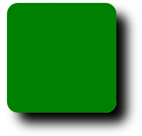
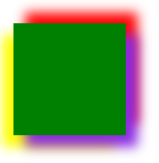
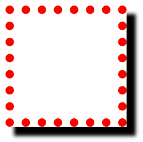
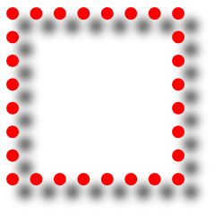

#### 1. 盒子阴影

`box-shadow`属性有4个项：

1. 第一个是水平偏移量（horizontal offset）
2. 第二个是垂直偏移量（vertical offset）
3. 第三个是模糊半径（blur radius）
4. 第四个是阴影颜色（base color）

[box-shadow更多写法](https://developer.mozilla.org/zh-CN/docs/Web/CSS/box-shadow)

```css
div {
    box-shadow: 5px 5px 5px black;
}
```



多个盒子阴影可以叠加

```css
div {
	box-shadow: 5px 5px 5px blueviolet,
            	5px -5px 5px red,
            	-5px 5px 5px yellow;
}
```



`box-shadow`与`text-shadow`有一点不同，`box-shadow`有一个`inset`关键字，可以让阴影变为内部阴影，在样式化按钮的时候很有效（可以样式成按下状态）

```css
div {
    box-shadow: inset 2px 2px 1px black,
            	inset 2px 3px 5px rgba(0,0,0,0.3),
            	inset -2px -3px 5px rgba(255,255,255,0.5);
}
```


#### 2. 滤镜

滤镜就类似PS中滤镜效果，比如给box添加一个阴影，看看和普通阴影区别。普通`box-shadow`：



```css
div {
    filter: drop-shadow(5px 5px 2px black);
}
```

滤镜效果：



使用`filter`是一个比较新的属性，要注意浏览器兼容性

```css
div {
    -webkit-filter: drop-shadow(5px 5px 2px black);
    filter: drop-shadow(5px 5px 2px black);
}
```

[更多滤镜效果-MDN](https://developer.mozilla.org/zh-CN/docs/Web/CSS/filter)

#### 3. 混合模式

[Blend mode](https://developer.mozilla.org/zh-CN/docs/Web/CSS/blend-mode)允许为元素添加一个混合模式，当两个元素重叠时，指定一个混合效果（类似PS中混合模式）。将用到的属性：

- [`background-blend-mode`](https://developer.mozilla.org/zh-CN/docs/Web/CSS/background-blend-mode)，将元素的多重背景图片和背景颜色设置混合在一起
- [`mix-blend-mode`](https://developer.mozilla.org/zh-CN/docs/Web/CSS/mix-blend-mode)，用来将一个元素与它覆盖的那些元素各自所设置的背景（background）和内容(content)混合在一起。

注意：这个特性比较新，IE没有支持的，Safari也仅支持部分

#### 4. CSS形状

设置的是图片或box对外显示的形状，而不是自身的形状。比如文字环绕一个圆形（正常的话圆外面会有一个方形box包裹，文字会方形环绕；使用形状改变后，文字可以以圆形的方式环绕它）。具体见[MDN CSS Shape](https://developer.mozilla.org/en-US/docs/Web/CSS/CSS_Shapes/Overview_of_CSS_Shapes)

#### 5. 背景剪裁

背景剪裁可以剪裁到`border`，`padding`，`content`，`text`。[MDN示例](https://developer.mozilla.org/zh-CN/docs/Web/CSS/background-clip)

```css
background-clip: border-box;
background-clip: padding-box;
background-clip: content-box;
background-clip: text-box;
```

为了兼容性，最好加上对应浏览器厂商名字，例如`-webkit-`

[`-webkit-text-fill-color`](https://developer.mozilla.org/zh-CN/docs/Web/CSS/-webkit-text-fill-color)

