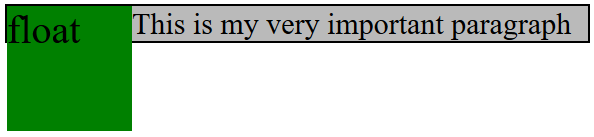
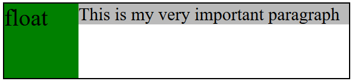
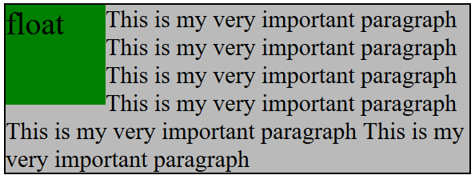
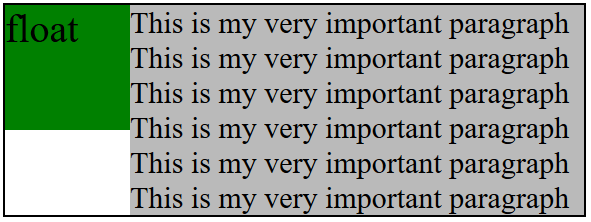
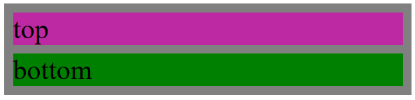

#### 1. 创建BFC

BFC( Block Formatting Context )

- 浮动（除`float: left/right`）
- 绝对定位（`position: absolute/fixed`）
- 行内块元素（`display: inline-block`）
- 表格（`display: table-cell`）
- `overflow: auto/hidden/scroll`
- flex布局
- grid布局

#### 2. BFC常见作用

##### 2.1 清除浮动

当元素使用`float`之后，父元素高度会塌陷

```html
<div class="container">
    <div class="float">float</div>
    <div class="content">This is my very important paragraph</div>
</div>
```

```css
.float {
    float: left;
}
```



为了避免这个问题，可以将父元素设置为BFC

```css
.container {
    overflow: hidden;
}
```



##### 2.2 不被浮动元素覆盖

元素浮动，会导致兄弟元素被遮盖（文本不会被覆盖）

```html
<div class="container">
    <div class="float">float</div>
    <div class="content">
        This is my very important paragraph
        This is my very important paragraph
        This is my very important paragraph
        This is my very important paragraph
        This is my very important paragraph
        This is my very important paragraph
    </div>
</div>
```

```css
.float {
    float: left;
}
```



为了避免这个问题，将兄弟元素设为BFC

```css
.content {
	overflow: hidden;
}
```



##### 2.3 解决上下margin折叠

```html
<div class="container">
    <div class="top">top</div>
    <div class="bottom">bottom</div>
</div>
```


为了避免这个问题，将父元素设为BFC

```css
.container {
    overflow: hidden;
}
```

