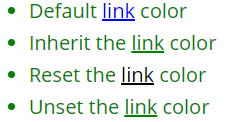

#### 1. 层叠

同一元素确定使用哪个属性，需要考虑一下三个因素，重要性排序如下：

1. 重要程度（`!important`）
2. 优先级
3. 规则顺序

##### 1.1 规则顺序

 简单来说就是两条权重相同的规则，后面的覆盖前面的

```css
h1 { 
    color: red; 
}
h1 { 
    color: blue; 
}
/* 此时字体颜色为blue */
```

##### 1.2 优先级

若排在前面的选择器优先级更高，则不会被后面的相同元素的选择器规则覆盖，例

```html
<div class="container" id="c1">
    test page
</div>
```

```css
#c1 {
    font-size: 20px;
}
.container {
    color: red;
    font-size: 10px;
    margin: 0 auto;
}
div {
    color: blue;
}
/* 此时字体颜色为red,大小为20px */
```

可以这么理解，通常选择范围更小的，它的优先级更高（好比一个集合里挑出一个子集来单独样式）。下面可以详细计算选择器权重

|       选择器中每个ID选择器        | 100  |
| :-------------------------------: | :--: |
|              选择器               | 分数 |
| 声明在`style`中的属性（内联样式） | 1000 |
|  每个类选择器、属性选择器或伪类   |  10  |
|         每个元素、伪元素          |  1   |

?> 通用选择器（`*`）,组合符（`+`,`>`,`~`）和否定伪类（`:not`）不会影响优先级

简单的例子：

| 选择器                                    | 千位 | 百位 | 十位 | 个位 | 优先级 |
| ----------------------------------------- | ---- | ---- | ---- | ---- | ------ |
| `h1`                                      | 0    | 0    | 0    | 1    | 0001   |
| `h1 + p::first-letter`                    | 0    | 0    | 0    | 3    | 0003   |
| `li > a[href*="en-US"] > .inline-warning` | 0    | 0    | 2    | 2    | 0022   |
| `#identifier`                             | 0    | 1    | 0    | 0    | 0100   |
| 内联样式                                  | 1    | 0    | 0    | 0    | 1000   |

##### 1.3 !important

属性值后面加`!important`表示优先级最高，覆盖上述所有优先级。由于其特殊性，谨慎使用（比它优先级还高的就是它后面的`!important`）

```css
div {
    color: red !important;
}
```

#### 2. 继承

##### 2.1 理解继承

一个元素是否继承可由常识判断，如`border`,`padding`肯定不能继承，否则会造成混乱；而`font-family`,`color`是可以继承的

##### 2.2 控制继承

CSS提供了四个特殊的属性来控制继承

|   属性    |                       作用                       |
| :-------: | :----------------------------------------------: |
| `inherit` |                使属性继承父级属性                |
| `initial` |            使属性恢复到浏览器默认属性            |
|  `unset`  | 重置属性（之前默认继承还继承，不继承的仍不继承） |
|  revert   |               （很少的浏览器支持）               |

```css
body {
    color: green;
}
.my-class-1 a {
    color: inherit;
}
.my-class-2 a {
    color: initial;
}
.my-class-3 a {
    color: unset;
}
```

```html
<ul>
    <li>Default <a href="#">link</a> color</li>
    <li class="my-class-1">Inherit the <a href="#">link</a> color</li>
    <li class="my-class-2">Reset the <a href="#">link</a> color</li>
    <li class="my-class-3">Unset the <a href="#">link</a> color</li>
</ul>
```

如下是上述代码的结果：



##### 2.3 重设所有属性

`all`选择此元素上所有属性，重置所有属性

```css
div {
	all: unset;
}
```

**Reference**：

不可继承的：`display`、`margin`、`border`、`padding`、`background`、`height`、`min-height`、`max- height`、`width`、`min-width`、`max-width`、`overflow`、`position`、`left`、`right`、`top`、 `bottom`、`z-index`、`float`、`clear`、`table-layout`、`vertical-align`、`page-break-after`、 `page-bread-before`和`unicode-bidi`

所有元素可继承：`visibility`和`cursor`

内联元素可继承：`letter-spacing`、`word-spacing`、`white-space`、`line-height`、`color`、`font`、 `font-family`、`font-size`、`font-style`、`font-variant`、`font-weight`、`text-  decoration`、`text-transform`、`direction`

块状元素可继承：`text-indent`和`text-align`

列表元素可继承：`list-style`、`list-style-type`、`list-style-position`、`list-style-image`

表格元素可继承：`border-collapse`