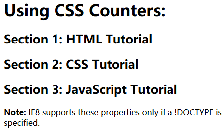
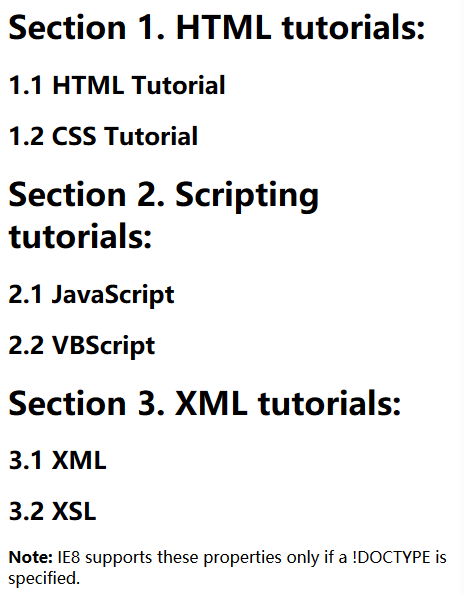

#### 1. 计数器

通常用来给项目添加序号，类似word中的序号

- `counter-reset` - Creates or resets a counter
- `counter-increment` - Increments a counter value
- `content` - Inserts generated  content
- `counter()` or `counters()` function - Adds the  value of a counter to an element

从几个例子快速理解

```html
<!DOCTYPE html>
<html>
<head>
<style>
body {
  counter-reset: section;
}
h2::before {
  counter-increment: section;
  content: "Section " counter(section) ": ";
}
</style>
</head>
<body>
<h1>Using CSS Counters:</h1>
<h2>HTML Tutorial</h2>
<h2>CSS Tutorial</h2>
<h2>JavaScript Tutorial</h2>
<p><b>Note:</b> IE8 supports these properties only if a !DOCTYPE is specified.</p>
</body>
</html>
```



可以看到，`counter`通常和`::before`或者`::after`使用；父元素设置`counter-reset:命名`，`::before`设置序号增加`counter-increment`，内容`content`设置你想要的内容格式，用空格隔开，`counter`函数则负责计数

```html
<!DOCTYPE html>
<html>
<head>
<style>
body {
  counter-reset: section;
}
h1 {
  counter-reset: subsection;
}
h1::before {
  counter-increment: section;
  content: "Section " counter(section) ". ";
}
h2::before {
  counter-increment: subsection;
  content: counter(section) "." counter(subsection) " ";
}
</style>
</head>
<body>
<h1>HTML tutorials:</h1>
<h2>HTML Tutorial</h2>
<h2>CSS Tutorial</h2>
<h1>Scripting tutorials:</h1>
<h2>JavaScript</h2>
<h2>VBScript</h2>
<h1>XML tutorials:</h1>
<h2>XML</h2>
<h2>XSL</h2>
<p><b>Note:</b> IE8 supports these properties only if a !DOCTYPE is specified.</p>
</body>
</html>
```



更多例子详见[w3school](https://www.w3schools.com/css/css_counters.asp)