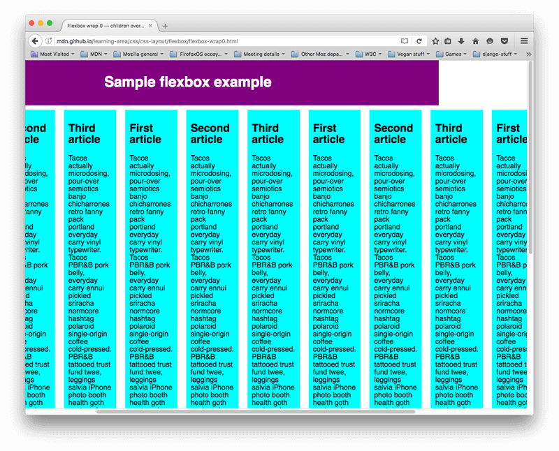
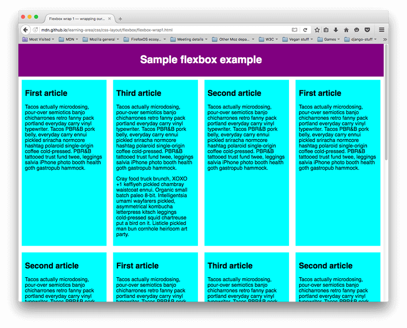
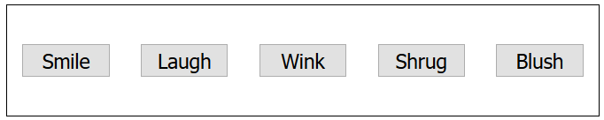

#### 1. 为什么使用Flexbox

以前CSS的复杂布局都是通过floats和positioning来实现的，但是有些布局他们很难实现，例如

- 让一个content中的block垂直居中
- 无论父元素的高度/宽度是多少，让每个子元素等高/等宽
- 在多列布局中，不管每列内容多少，让每列等高

#### 2. 应用flex

当我们确定某些元素要使用`flex`布局时，就在它们的**父元素**上使用。此时子元素会变成等高（`align-items`默认值`stretch`），等宽

```css
.parent {
    display: flex;
}
```

#### 3. flex模型

 

#### 4. flex布局属性

##### 4.1 flex-direction

`flex-direction`可以设置flex布局的方向，默认值是`row`（横向排列）。可选值有`column` `row-reverse` (横向反向排列)`column-reverse`(纵向反向排列)

```css
.parent {
    display: flex;
    flex-direction: column;
}
```

##### 4.2 flex-wrap

当元素设置了宽度，总宽度超过父容器宽度就会溢出

```css
.parent {
    display: flex;
}
.child {
    width: 200px;
}
```

 

解决办法父元素上用`flex-wrap`，并使用`flex`宽度；使溢出的内容到下一行（假如多余两个，两个会占据整个宽度）

```css
.parent {
    display: flex;
    flex-wrap: wrap;
}
.child {
    /* 表示元素最小宽度为200px,如果这里为width:200px,右边可能会留白*/
    flex: 200px;
}
```

 

注意：如果设置了`flex-wrap`没有设置子元素尺寸，默认为100%，每个子元素会占据一行

##### 4.3 flex-flow简写

上述`flex-direction`和`flex-wrap`可以简写为`flex-flow`

```css
flex-direction: row;
flex-wrap: wrap;
/* 等效于 */
flex-flow: row wrap;
```

##### 4.4 子代占比

假如有3个子代，那每个子代的宽(高)为`1/3`（可用宽度除去每个子代的`margin`和`padding`）

```css
.child {
    /* 这里值为多少无所谓,因为是用比例的形式 */
    flex: 1;
}
```

可以为某个子代单独设置，此时第三个子代宽(高)为`2/4`可用宽(高)

```css
.child:nth-of-type(3) {
    flex: 2;
}
```

还可以设置最小宽度

```css
.child {
    flex: 1 200px;
}
.child:nth-of-type(3) {
    flex: 2 200px;
}
```

?> 注意：先给每个子代`200px`宽(高)，然后再将剩余的可用宽(高)按比例分配

##### 4.5 flex简写

`flex`简写代表值如下：

- `flex-grow`：单位占比值（0表示不会有剩余空间也不会占据）
- `flex-shrink`：当元素溢出时，指定每个元素减少多少尺寸（0表示不缩小这个元素的尺寸）
- `flex-basis`：用来设置元素最小尺寸

##### 4.6 水平和垂直对齐

`align-items`控制flex元素在cross axis上位置（纵轴）[MDN示例](https://developer.mozilla.org/en-US/docs/Web/CSS/align-items)

- `stretch`：默认值，如果元素没有设置高度，则会填满父元素高度
- `center`：保证原有的高度让其在cross axis上居中（垂直居中）
- `flex-start`：让元素垂直居上
- `flex-end`：让元素垂直居下

```css
.parent {
    display: flex;
    align-items: center;
}
```

`align-self`可以单独设置某个元素的纵轴位置，覆盖`align-items`值

```css
.child {
    align-self: flex-start;
}
```

`justify-cotent`控制flex元素在main axis上的位置（横轴）

- `flex-start`：默认值，处于横轴左边
- `flex-end`：处于横轴右边
- `center`：在横轴中间
- `space-around`：沿着横轴均匀分布，两端也会留有空间
- `space-between`：和前者类似，只是两端不会留有空间

```css
.parent {
    display: flex;
    align-items: center;
    justify-content: space-around;
}
```



##### 4.7 flex项排序

flex布局使用`order`对单独元素排列而不影响DOM的元素顺序

- 所有fle项默认的`order`值是0
- `order`从小到大排列
- 相同的`order`值则按照与按顺序排列
- 可以使用负值让某元素排最前面

```css
button:last-child {
    order: -1;
}
```

##### 4.8 flex嵌套

[示例源代码](https://github.com/mdn/learning-area/blob/master/css/css-layout/flexbox/complex-flexbox.html)

DOM图如下

```
section - article
          article
          article - div - button   
                    div   button
                    div   button
                          button
                          button
```

CSS代码

```css
section {
  display: flex;
}

article {
  flex: 1 200px;
}
article:nth-of-type(3) {
  flex: 3 200px;
  display: flex;
  flex-flow: column;
}

article:nth-of-type(3) div:first-child {
  flex: 1 100px;
  display: flex;
  flex-flow: row wrap;
  align-items: center;
  justify-content: space-around;
}

button {
  flex: 1;
  margin: 5px;
  font-size: 18px;
  line-height: 1.5;
}
```