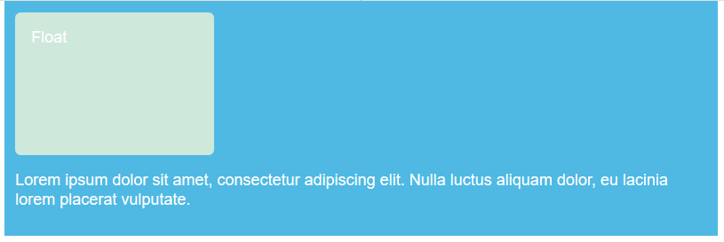

#### 1. Float

浮动的初衷是为了实现文字环绕效果，例如在需要浮动的元素上使用`float: left`


我们可以在`float`元素上添加`margin`将其他元素推开，我们在文字上添加`margin`并不能将`float`元素推开，因为它已经脱离了normal flow

进一步了解float，在其上添加`margin`并在段落上添加背景，可以清楚的看到`float`元素在容器上方


float一些特性：

- 破坏性：造成父元素高度坍塌
- 包裹性：元素显示为block ，设置 `float` 后，宽度将不再是100%，而变成了内容的宽度，包裹着内容。其他具有包裹性的属性`inline-block`,`table-cell`,`absolute`等
- 清空格：空格会被清除

#### 2. 清除浮动

当我们不想让其他元素包裹`float`就要用`clear`属性来清除浮动了

`clear`可以接受以下值：

- `left`：清除左浮动
- `right`：清除右浮动
- `both`：清除所有浮动

```html
<!-- HTML结构 -->
<div class="float"></div>
<p class="special"></p>
<p class="cleared"></p>
<p></p>
```

```css
.cleared {
    clear: left;
}
```


#### 3. 父容器塌陷

与上述不同（上述是并列的，并且背景色是`<p>`），现在我们将浮动和文字放在一个`wrapper`中（背景色是`wrapper`），看看当`float`元素高度大于`<p>`元素会发生什么

```html
<div class="wrapper">
	<div class="box">Float</div>
	<p>short paragraph</p>
</div>
```

```css
.wrapper {
    background-color: rgb(79,185,227);
    padding: 10px;
    color: #fff;
}
.box {
    margin-right: 15px;
    width: 150px;
    height: 100px;
    border-radius: 5px;
    background-color: rgb(207, 232, 220);
    padding: 1em;
}
```

未浮动前



浮动后

```css
.box {
	float: left;
}
```


可以看到，`wrapper`高度容器塌陷了，因为其`float`元素脱离了文档流（如果`<p>`内容高度大于`float`高度，还看不出来，反过来就很明显塌陷了）。想要解决父容器高度塌陷问题，用`clear`没用，有以下几种办法：

##### 3.1 使用::after伪元素

在容器`wrapper`上末尾用伪类添加一个块，然后清除浮动

```css
.wrapper::after {
    content: "";
    display: block;
    clear: both;
}
```


##### 3.2 使用overflow

使用`overflow`原理就是创建BFC，最常用的就是父容器设置`overflow:auto/hidden/scroll`（有副作用，比如滚动条啦，隐藏之类的）

```css
.wrapper {
    overflow: auto;
}
```

##### 3.3 使用display:flow-root

原理也是创建BFC，只是这个不像`overflow`，它没有副作用，只是兼容性一般

```css
.wrapper {
    display: flow-root;
}
```

由于浮动会脱离了normal flow，会造成父容器高度塌陷（如果其他内容高度大于浮动内容的高度不会有什么影响，如果浮动的内容高度大于其他内容高度就会有问题）

#### 4. 多列浮动布局

使用float来完成两列布局，由于float包裹性，使用float布局时最好指定宽度，否则会随内容增加而增加。三列布局和这类似；浮动后宽度难以计算，最好加上`box-sizing:border-box;`

```html
<div>
    <h2></h2>
    <p></p>
</div>

<div>
    <h2></h2>
    <p></p>
</div>
```

```css
body {
  width: 90%;
  max-width: 900px;
  margin: 0 auto;
}

div:nth-of-type(1) {
  /* 设置百分比可以响应式布局 */
  width: 48%;
  float: left;
}
div:nth-of-type(2) {
  width: 48%;
  float: right;
}
```


多列浮动后如何保持高度一致是个问题，固定高度的话内容过多就会溢出，用`flex`布局可以解决这个问题

            
