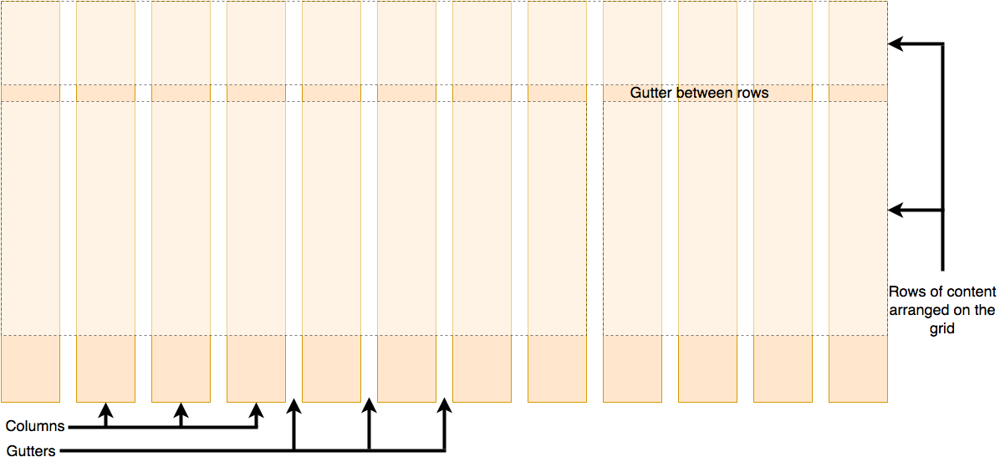
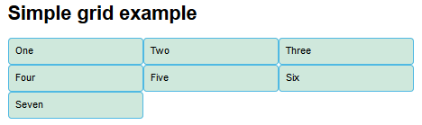
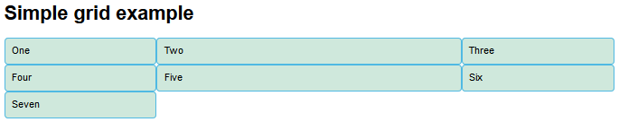
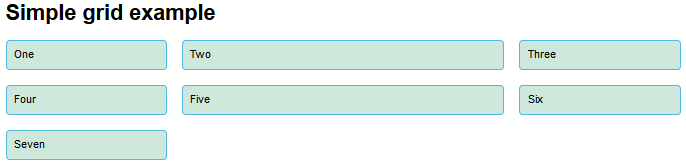
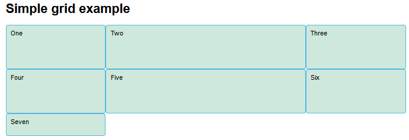
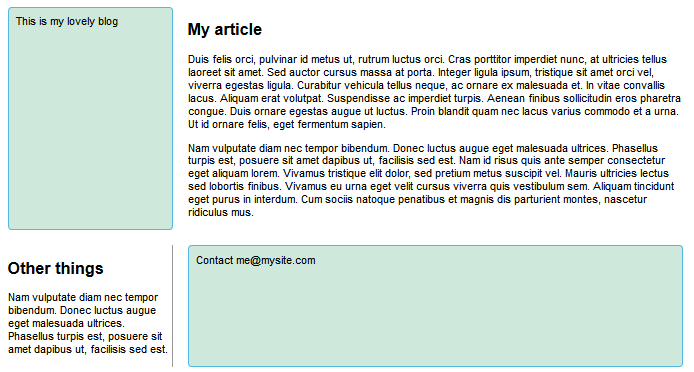
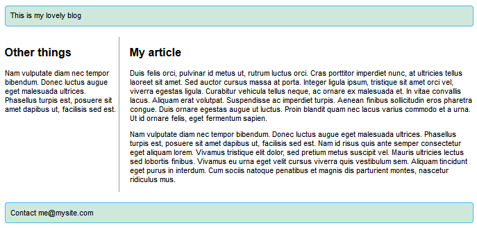
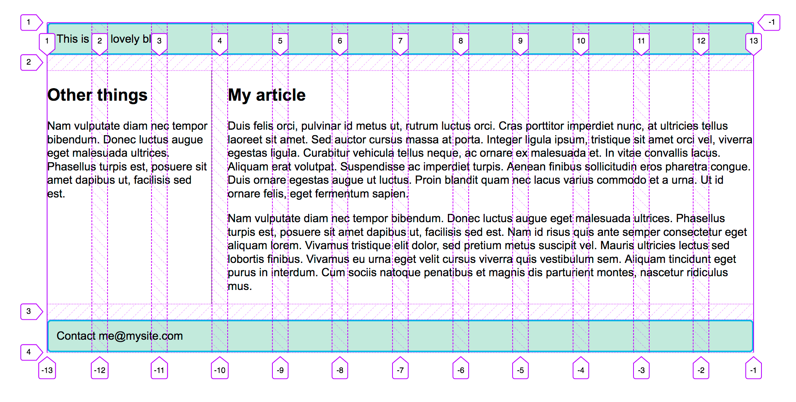

#### 1. grid模型

一个典型的grid布局有**colums**,**rows**和**gutters**

 

#### 2. 应用grid

```html
<!DOCTYPE html>
<html>

<head>
    <meta charset="utf-8">
    <title>CSS Grid starting point</title>
    <style>
        body {
            width: 90%;
            max-width: 900px;
            margin: 2em auto;
            font: .9em/1.2 Arial, Helvetica, sans-serif;
        }

        .container>div {
            border-radius: 5px;
            padding: 10px;
            background-color: rgb(207, 232, 220);
            border: 2px solid rgb(79, 185, 227);
        }
    </style>
</head>

<body>
    <h1>Simple grid example</h1>

    <div class="container">
        <div>One</div>
        <div>Two</div>
        <div>Three</div>
        <div>Four</div>
        <div>Five</div>
        <div>Six</div>
        <div>Seven</div>
    </div>

</body>

</html>
```

像flex一样在其父容器上设置`grid`，它不像`flex`，应用后不会发生变化，因为grid默认是一列，和normal flow没什么区别

```css
.container {
    display: grid;
}
```


为了让其看起来像grid布局，我们需要添加一些列，并指定单位（可以是具体数值或者百分比等）

```css
.container {
    display: grid;
    grid-template-columns: 200px 200px 200px;
}
```



#### 3. grid布局属性

##### 3.1 grid单位

类似flex布局中无单位数值，grid也有类似单位`1fr`。表示**可用空间**的一部分（除去了`gutter`等之后的，而百分比会把`gutter`算进去）

```css
grid-template-columns: 1fr 2fr 1fr;
```



##### 3.2 grid-gap

列之间的间隙使用`grid-column-gap`，行之间的间隙用`grid-row-gap`，用`grid-gap`可以同时设置两者（`grid-gap`是兼容性写法，已经有部分浏览器支持`gap`属性了）

```css
.container {
    display: grid;
    grid-template-columns: 2fr 1fr 1fr;
    grid-gap: 20px;
}
```



##### 3.3 repeat()函数

使用`repeat()`函数重复创造所有东西，例如

```css
.container {
    display: grid;
    grid-template-column: 2fr repeat(3, 1fr);
    /* 等效2fr 1fr 1fr 1fr */
    grid-gap: 20px;
}
```

##### 3.4 显式和隐式网格

显示网格创建使用`grid-template-columns`,`grid-template-rows`；隐式网格创建使用[`grid-auto-columns`](https://developer.mozilla.org/en-US/docs/Web/CSS/grid-auto-columns),[`grid-auto-rows`](https://developer.mozilla.org/en-US/docs/Web/CSS/grid-auto-rows)（隐式相当于默认值设置，要是没显示设置，或者超出显示设置范围都会应用默认值）

```css
.container {
    display: grid;
    grid-template-columns: 1fr 2fr 1fr;
    /* 第一行高100px,第二行高100px */
    grid-template-rows: 100px 100px;
    /* 后续的行高自动设为50px */
    grid-auto-rows: 50px;
}
```



##### 3.5 minmax()函数

如果用`grid-auto-rows`指定数值高度的话，内容过多的时候就会溢出，可用`minmax()`解决，`minmax()`第一个为最小值，第二个为最大值

```css
.container {
    display: grid;
	grid-template-columns: repeat(3, 1fr);
    /*第一个为最小值,第二个为最大值;auto表示自适应*/
	grid-auto-rows: minmax(200px,auto);
	grid-gap: 20px;

}
```

##### 3.6 自适应

结合上述方法，并使用`auto-fill`关键字（根据父元素宽度而自定列数）创造自适应布局，窗口减小，列数量减少，高度也会随内容增加而增加，不会出现溢出情况

```css
.container {
    display: grid;
    grid-template-columns: repeat(auto-fill, minmax(200px, 1fr));
    grid-auto-rows: minmax(100px, auto);
    grid-gap: 20px;
}
```

##### 3.7 网格基线位置

- `grid-column-start`：列起始位置
- `grid-column-end`：列终止位置
- `grid-row-start`：行起始位置
- `grid-row-end`：行终止位置

通常使用其缩写形式，`grid-column`和`grid-row`，用`/`隔开起止位置。示例如下：

```html
<!DOCTYPE html>
<html>
<head>
    <meta charset="utf-8">
    <title>CSS Grid - line-based placement starting point</title>
    <style>
        body {
            width: 90%;
            max-width: 900px;
            margin: 2em auto;
            font: .9em/1.2 Arial, Helvetica, sans-serif;
        }
        .container {
            display: grid;
            grid-template-columns: 1fr 3fr;
            grid-gap: 20px;
        }
        header,
        footer {
            border-radius: 5px;
            padding: 10px;
            background-color: rgb(207, 232, 220);
            border: 2px solid rgb(79, 185, 227);
        }
        aside {
            border-right: 1px solid #999;
        }
    </style>
</head>
<body>
    <div class="container">
        <header>This is my lovely blog</header>
        <article>
            <h1>My article</h1>
            <p>Duis felis orci</p>
            <p>Nam vulputate diam nec tempor bibendum</p>
        </article>
        <aside>
            <h2>Other things</h2>
            <p>Nam vulputate diam nec tempor bibendum</p>
        </aside>
        <footer>Contact me@mysite.com</footer>
    </div>

</body>
</html>
```



更变网格位置，进行布局。用`grid-column`设置列起止位置，`grid-row`设置行起止位置

```css
header {
  grid-column: 1 / 3;
  grid-row: 1;
}
article {
  grid-column: 2;
  grid-row: 2;
}
aside {
  grid-column: 1;
  grid-row: 2;
}
footer {
  grid-column: 1 / 3;
  grid-row: 3;
}
```



##### 3.8 grid-template-areas

用`grid-template-areas`同样可以实现上述布局，并且更加明了。首先在父元素中用`grid-template-areas`构造基本结构，然后再把元素对应每个命名

```css
.container {
    display: grid;
    grid-template-areas: 
        "header header"
        "sidebar content"
        "footer footer";
    grid-template-columns: 1fr 3fr;
    grid-gap: 20px;
}
header {
    grid-area: header;
}
article {
    grid-area: content;
}
aside {
    grid-area: sidebar;
}
footer {
    grid-area: footer;
}
```

注意：

- 需要填充每个网格
- 想要占N个网格，重复N次
- 用`.`填充可以让网格空着
- 网格区域必须是矩形（例如不能是L形）
- 区域不能在不同的地点重复

#### 4.grid框架

grid框架通常由12列或16列组成，这个已经存在规范中，不需要第三方工具。CSS设置如下：

```css
.container {
    display: grid;
    grid-template-columns: repeat(12, minmax(0, 1fr));
    grid-gap: 20px;
}
header {
    grid-column: 1 / 13;
    grid-row: 1;
}
article {
    grid-column: 4 / 13;
    grid-row: 2;
}
aside {
    grid-column: 1 / 4;
    grid-row: 2;
}
footer {
    grid-column: 1 / 13;
    grid-row: 3;
}
```

使用浏览器中网格检测工具可以看到

