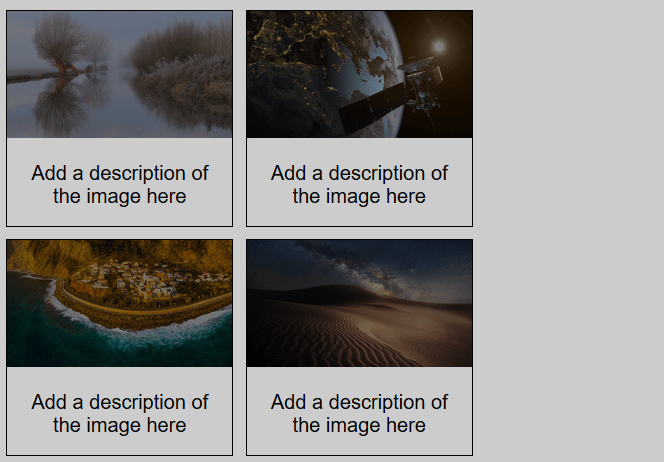
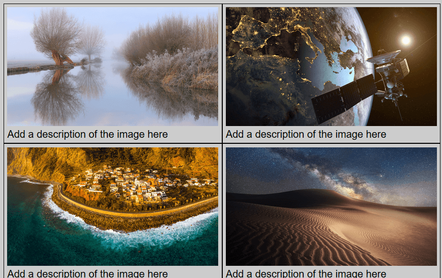

#### 1. 普通的Image Gallery

没什么特别的，主要是熟悉下这个模式。在窗口缩小时候，当一行放不下两个图片时候，另一张就会换行，但是会留下空白（用响应式解决）



```html
<!-- 重复这个结构几次 -->
<div class="gallery">
    <a></a>
    <div class="desc">Add a description of the image here</div>
</div>
```

```css
div.gallery {
    margin: 5px;
    border: 1px solid #ccc;
    float: left;
    width: 180px;
}
div.gallery:hover img {
    filter: brightness(1);
}
img {
    width: 100%;
    height: auto;
    filter: brightness(0.5);
}
div.desc {
    padding: 15px;
    text-align: center;
}
```

#### 2. 响应式Image Gallery

`flex`和`@media`结合使用

```html
<div class="container">
    <div class="gallery">
        <a></a>
        <div class="desc">Add a description of the image here</div>
    <!-- 一些重复结构 -->
    </div>
</div>
```

```css
* {
    box-sizing: border-box;
}
div.container {
    display: flex;
    flex-flow: row wrap;
}
div.gallery {
    padding: 5px;
    border: 1px solid #ccc;
    flex: 25%;
}
div.gallery:last-child {
    flex-grow: 1;
}
img {
    width: 100%;
    height: auto;
}
@media screen and (max-width: 800px) {
    div.gallery {
        flex: 50%;
    }
}
@media screen and (max-width: 600px) {
    div.gallery {
        flex: 100%;
    }
}
```



还有一种是利用`float`布局，结合`@media`来使用不同百分比。参考[菜鸟教程](https://www.runoob.com/try/try.php?filename=trycss_image_gallery_responsive)（里面的`24.9999%`等是为了防止IE的bug）