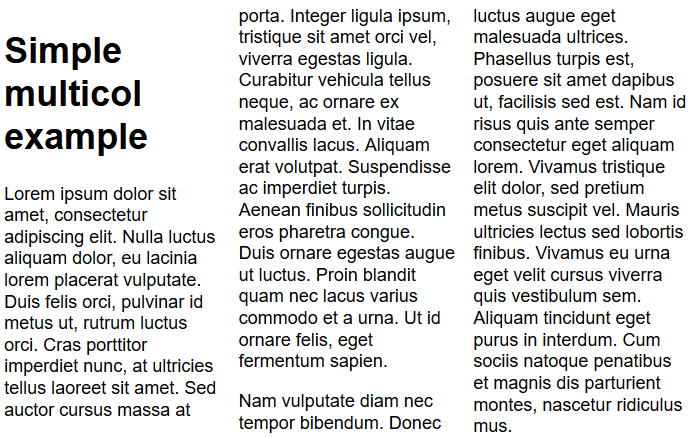

#### 1. 多列布局

多列布局的效果类似报纸中那样，从一个简单的例子开始多列布局

##### 1.1 column-count

`column-count`指定列的数量，`column-width`指定宽度

```html
<!-- 基本结构 -->
<div class="container">
    <h1></h1>
    <p></p>
    <p></p>
</div>
```

```css
.container {
    column-count: 3;
}
```



##### 1.2 column-width

`column-width`按照指定宽度尽可能多的创造列，多余的空间会平均分给各列，这里是最小宽度（可以使任意值，百分比等等）

```css
.container {
    column-width: 200px;
}
```


##### 1.3 column-gap,column-rule

Multicol 创建的列无法单独的设定样式。 不存在让单独某一列比其他列更大的方法，同样无法为某一特定的列设置独特的背景色、文本颜色，有两个改变样式的属性

- `column-gap`：改变列之间的间隙
- `column-rule`：在列之间加一条分割线，和`border`类似，它不占用宽度，置于`column-gap`之间

```css
.container {
  column-count: 3;
  column-gap: 20px;
  column-rule: 4px dotted rgb(79, 185, 227);
}
```


更多信息查看[MDN](https://developer.mozilla.org/zh-CN/docs/Learn/CSS/CSS_layout/Multiple-column_Layout), [w3school](https://www.w3schools.com/css/css3_multiple_columns.asp)

