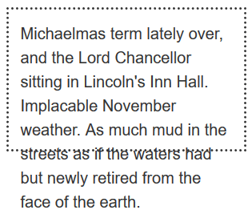

#### 1. 内容溢出

当设置了宽高后，元素内容过多就会发生溢出（overflowing）

##### 1.1 横向溢出

当限制了容器的`width`，一个单词过长就会发生溢出（多个单词的内容会自动换行）

解决：对于文本内容，可以使用[word-break](https://developer.mozilla.org/zh-CN/docs/Web/CSS/word-break)属性。但是如果是block，那就要用`overflow`属性

##### 1.2 纵向溢出

当限制了容器的`height`，内容过多就会发生溢出

##### 1.3 overflow

`overflow`值可以是以下（查看[MDN示例](https://developer.mozilla.org/zh-CN/docs/Web/CSS/overflow)）

- `visible`：默认值，溢出
- `hidden`：隐藏溢出的内容
- `scroll`：增加滚动条查看溢出的内容
- `auto`：让浏览器自行判断，没有则正常显示，有则增加滚动条

还可以单独设置`overflow-x`或者`overflow-y`横向和纵向溢出方式

