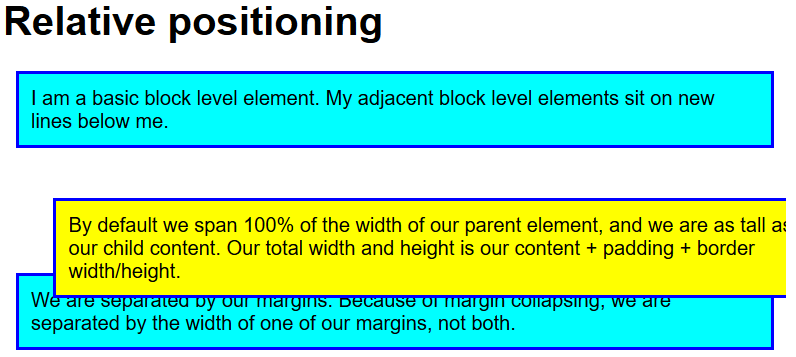
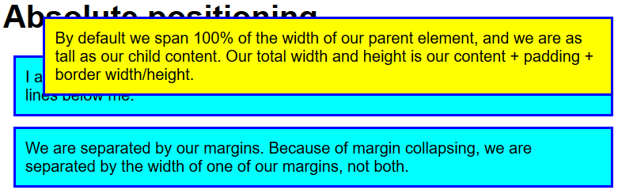

#### 1. static

`position:static`是默认值

#### 2. relative

相对定位，`relative`相对于未移动前的状态定位，**不会脱离文档流，仍然占据着没偏移前的空间**。使用`top`,`bottom`,`left`,`right`来确定偏移量

```css
.relative {
    position: relative;
    top: 30px;
    left: 30px;
}
```



#### 3. absolute

绝对定位，`absolute`相对于**具有定位属性**的最近的父元素定位（定位属性可以使`relative`，也可以是`absolute`和`fixed`）。如果都没有，那就相对于视图口（不是`body`，也不是`html`）定位。**元素会脱离文档流，在文档流中占据的空间会被删除**

```css
.absolute {
	position: absolute;
	top: 30px;
	left: 30px;
}
```



`absolute`经常和`relative`结合使用，在`absolute`定位的父元素上使用`relative`。`absolute`的`margin`是相对于偏移后的基线位置，例如，`left:30px`,`margin-left:20px`，那么相对于定位元素移动了`50px`

```css
.container {
	position: relative;
}
.absolute {
	position: absolute;
	top: 30px;
	left: 30px;
}
```

技巧：当`absolute`元素没有设置`width`和`height`时，使用如下代码，可使得`absolute`宽高占满父元素（和`width:100%`,`height:100%`效果相同）

```css
.absolute {
    position: absolute;
    top: 0;
    left: 0;
    bottom: 0;
    right: 0;
}
```

#### 4. z-index

`z-index`用来处理多个`absolute`元素层叠顺序的问题，所有`absolute`元素默认`z-index`默认为`0`，你为某个元素设置`z-index: 1`让它处在最上方。`z-index`数值大的在上方

#### 5. fixed

固定定位，`fixed`和`absolute`类似，只是它是相对浏览器窗口定位，滚条滚动，它不会移动，类似那种广告

#### 6. sticky

和`fixed`类似，需要滚动到它所处的位置，才会开始固定[示例](https://codepen.io/pen/?&editable=true)