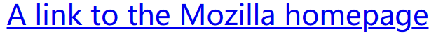
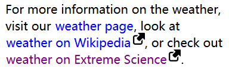
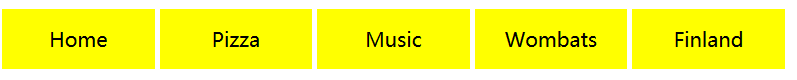

#### 1. 链接状态

链接每个状态都可以用对应的伪类来表示：

- `:link`：链接的默认状态（没有访问过的）
- `:visited`：已经被访问过的链接（存在于历史记录中）
- `:focus`：链接被选中时（比如通过键盘<kbd>Tab</kbd>选中时，或者用`HTMLElement.focus()`选中）
- `:hover`：单用户鼠标停在链接上时
- `:active`：一个链接被激活时（比如被点击时）

#### 2. 默认样式



通常浏览器的样式如上图，有如下特征：

- 链接具有下划线
- 未访问过的（`:link`）链接是蓝色的
- 访问过的（`:visited`）链接是紫色的
- 悬停（`:hover`）在链接上光标会变成小手图标
- 选中（`:focus`）链接的时候，链接周围会有一个轮廓（`outline`）
- 激活（`:active`）时链接会变成红色

#### 3. 更改默认样式

在更改默认样式时，要注意规则的顺序（因为一个链接处于`:active`状态，那它肯定也处于`:hover`状态）。帮助记忆：**L**o**V**e **F**ears **HA**te

```css
body {
  width: 300px;
  margin: 0 auto;
  font-size: 1.2rem;
  font-family: sans-serif;
}
p {
  line-height: 1.4;
}
a {
  outline: none;
  text-decoration: none;
  padding: 2px 1px 0;
}
a:link {
  color: #265301;
}
a:visited {
  color: #437A16;
}
a:focus {
  border-bottom: 1px solid;
  background: #BAE498;
}
a:hover {
  border-bottom: 1px solid;     
  background: #CDFEAA;
}
a:active {
  background: #265301;
  color: #CDFEAA;
}
```

[MDN示例](https://mdn.mozillademos.org/zh-CN/docs/Learn/CSS/%E4%B8%BA%E6%96%87%E6%9C%AC%E6%B7%BB%E5%8A%A0%E6%A0%B7%E5%BC%8F/Styling_links$samples/%E5%B0%86%E6%A0%B7%E5%BC%8F%E5%BA%94%E7%94%A8%E5%88%B0%E4%B8%80%E4%BA%9B%E9%93%BE%E6%8E%A5?revision=1548738)

#### 4. 链接中包含图标

在外链中包含图标，核心两点

1. 用属性选择器，选择外链`a[href*="http"]`
2. 用`padding-right`空出背景图标的位置

```css
body {
  width: 300px;
  margin: 0 auto;
  font-family: sans-serif;
}
p {
  line-height: 1.4;
}
a {
  outline: none;
  text-decoration: none;
  padding: 2px 1px 0;
}
a:link {
  color: blue;
}
a:visited {
  color: purple;
}
a:focus, a:hover {
  border-bottom: 1px solid;
}
a:active {
  color: red;
}
a[href*="http"] {
  background: url('test.png') no-repeat 100% 0;
  background-size: 16px 16px;
  padding-right: 19px;
}
```



#### 5. 样式化链接为按钮

将链接样式化为按钮，通常用于网站导航菜单等

```html
<ul>
    <li><a href="#">Home</a></li>
    <li><a href="#">Pizza</a></li>
    <li><a href="#">Music</a></li>
    <li><a href="#">Wombats</a></li>
    <li><a href="#">Finland</a></li>
</ul>
```

```css
body,html {
  margin: 0;
  font-family: sans-serif;
}
ul {
  padding: 0;
  width: 100%;
}
li {
  display: inline;
}
a {
  outline: none;
  text-decoration: none;
  display: inline-block;
  width: 19.5%;
  margin-right: 0.625%;
  text-align: center;
  line-height: 3;
  color: black;
}
li:last-child a {
  margin-right: 0;
}
a:link, a:visited, a:focus {
  background: yellow;
}
a:hover {     
  background: orange;
}
a:active {
  background: red;
  color: white;
}
```



由于HTML之间的空格，会导致按钮之间的有多余空隙，[解决方案](https://css-tricks.com/fighting-the-space-between-inline-block-elements/)