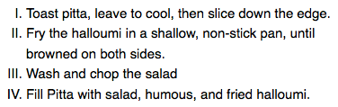
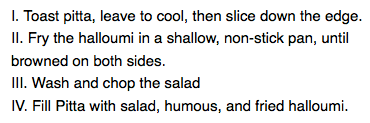
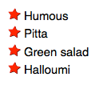
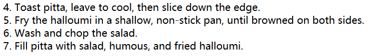
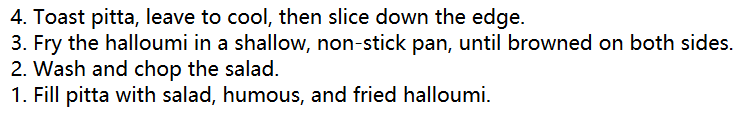
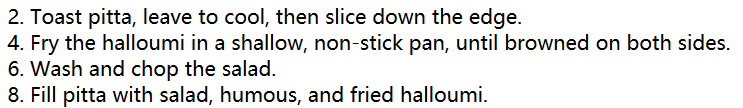

#### 1. 列表默认样式

`<ul>`和`<ol>`元素默认`margin: 16px(1em) 0`，`padding-left: 40px(2.5em) `。`<li>`默认没有间距。

#### 2. 列表特定样式

- [`list-style-type`](https://developer.mozilla.org/zh-CN/docs/Web/CSS/list-style-type) ：设置项目符号的样式，罗马数字啊，字母之类的
- [`list-style-position`](https://developer.mozilla.org/zh-CN/docs/Web/CSS/list-style-position) ：设置项目符号是否包含在列表内容内
- [`list-style-image`](https://developer.mozilla.org/zh-CN/docs/Web/CSS/list-style-image) ：为项目符号自定图片，而不是简单的圆形

##### 2.1 项目符号样式

```css
ol {
      list-style-type: upper-roman;
}
```

  

##### 2.2 项目符号位置

注意在内部和外部的区别

```css
ol {
      list-style-type: upper-roman;
      list-style-position: inside;
}
```

  

##### 2.3 项目符号图片

```css
ul {
      list-style-image: url('star.svg');
}
```

这个属性控制项目符号的位置，大小反面有限。比较好的做法是使用`background`

```css
li {
    padding-left: 2rem;
    background-image: url(star.svg);
    background-position: 0 0;
    background-size: 1.6rem 1.6rem;
    background-repeat: no-repeat;
}
```

这里使用`padding-left`为图片空出位置，再用`background`设置图片位置和大小

  

##### 2.4 list-style简写

上述属性可以用`list-style`简写，顺序随意，值可以一个或两个或三个

```css
ul {
    list-style-type: square;
    list-style-image: url(example.png);
    list-style-position: inside;
}
/* 等效 */
ul {
	list-style: square url(example.png) inside;
}
```

#### 3. 列表计数

有时候改变列表的计数方式，比如想让其从`3`开始，或者倒过来计数等

##### 3.1 start

`start`设置开始计数的数字

```html
<ol start="4">
    <li>Toast pitta, leave to cool, then slice down the edge.</li>
    <li>Fry the halloumi in a shallow, non-stick pan, until browned on both sides.</li>
    <li>Wash and chop the salad.</li>
    <li>Fill pitta with salad, humous, and fried halloumi.</li>
</ol>
```



##### 3.2 reversed

`reversed`将开启列表倒计数

```html
<ol start="4" reversed>
    <li>Toast pitta, leave to cool, then slice down the edge.</li>
    <li>Fry the halloumi in a shallow, non-stick pan, until browned on both sides.</li>
    <li>Wash and chop the salad.</li>
    <li>Fill pitta with salad, humous, and fried halloumi.</li>
</ol>
```



##### 3.3 value

`value`设置列表项制定数值

```html
<ol>
    <li value="2">Toast pitta, leave to cool, then slice down the edge.</li>
    <li value="4">Fry the halloumi in a shallow, non-stick pan</li>
    <li value="6">Wash and chop the salad.</li>
    <li value="8">Fill pitta with salad, humous, and fried halloumi.</li>
</ol>
```



