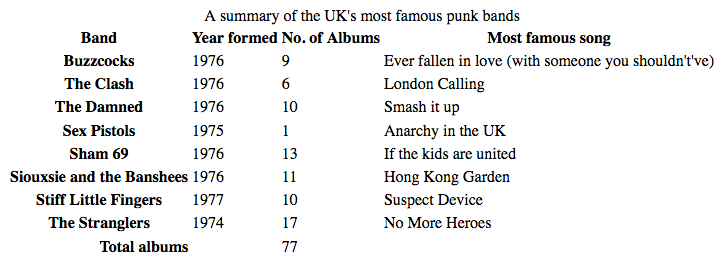
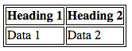
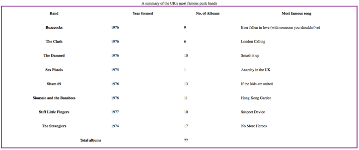
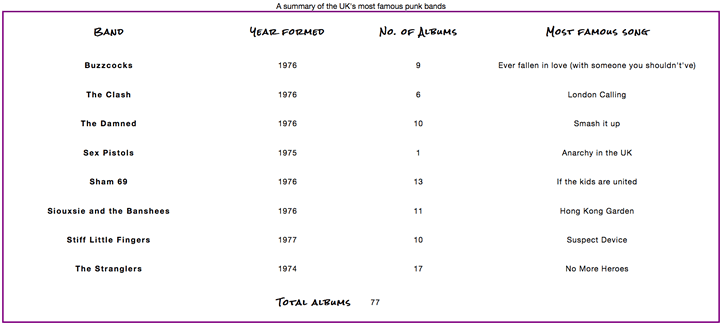
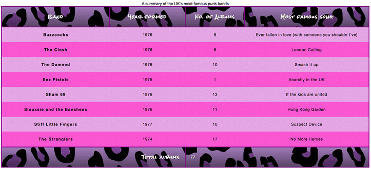

#### 1. 样式化表格

从一个简单的例子学习样式化表格的一些方法。一个表格基本格式如下：

```html
<table>
  <caption>A summary of the UK's most famous punk bands</caption>
  <thead>
    <tr>
      <th scope="col">Band</th>
      <th scope="col">Year formed</th>
      <th scope="col">No. of Albums</th>
      <th scope="col">Most famous song</th>
    </tr>
  </thead>
  <tbody>
    <tr>
      <th scope="row">Buzzcocks</th>
      <td>1976</td>
      <td>9</td>
      <td>Ever fallen in love (with someone you shouldn't've)</td>
    </tr>
    <tr>
      <th scope="row">The Clash</th>
      <td>1976</td>
      <td>6</td>
      <td>London Calling</td>
    </tr>
      <table>
  <caption>A summary of the UK's most famous punk bands</caption>
  <thead>
    <tr>
      <th scope="col">Band</th>
      <th scope="col">Year formed</th>
      <th scope="col">No. of Albums</th>
      <th scope="col">Most famous song</th>
    </tr>
  </thead>
  <tbody>
    <tr>
      <th scope="row">Buzzcocks</th>
      <td>1976</td>
      <td>9</td>
      <td>Ever fallen in love (with someone you shouldn't've)</td>
    </tr>
    <tr>
      <th scope="row">The Clash</th>
      <td>1976</td>
      <td>6</td>
      <td>London Calling</td>
    </tr>
       
      ... some rows removed for brevity

    <tr>
      <th scope="row">The Stranglers</th>
      <td>1974</td>
      <td>17</td>
      <td>No More Heroes</td>
    </tr>
  </tbody>
  <tfoot>
    <tr>
      <th scope="row" colspan="2">Total albums</th>
      <td colspan="2">77</td>
    </tr>
  </tfoot>
</table>
    <tr>
      <th scope="row">The Stranglers</th>
      <td>1974</td>
      <td>17</td>
      <td>No More Heroes</td>
    </tr>
  </tbody>
  <tfoot>
    <tr>
      <th scope="row" colspan="2">Total albums</th>
      <td colspan="2">77</td>
    </tr>
  </tfoot>
</table>
```

未样式化的表格如下：

  

##### 1.1 间距和布局

```css
table {
  table-layout: fixed;
  width: 100%;
  border-collapse: collapse;
  border: 3px solid purple;
}
thead th:nth-child(1) {
  width: 30%;
}
thead th:nth-child(2) {
  width: 20%;
}
thead th:nth-child(3) {
  width: 15%;
}
thead th:nth-child(4) {
  width: 35%;
}
th, td {
  padding: 20px;
}
```

`table-layout: fixed`表示你可以固定表格宽度和高度（默认表格宽高随内容宽高变化）；

`border-collapse`表示让表格边框合并，默认如下  合并后  

简单排版后如下

 

##### 1.2 文字排版

```css
html {
  font-family: 'helvetica neue', helvetica, arial, sans-serif;
}
thead th, tfoot th {
  font-family: 'Rock Salt', cursive;
}
th {
  letter-spacing: 2px;
}
td {
  letter-spacing: 1px;
}
tbody td {
  text-align: center;
}
tfoot th {
  text-align: right;
}
```

 

##### 1.3 背景

```css
/* 图形和颜色 */
thead, tfoot {
  background: url(leopardskin.jpg);
  color: white;
  text-shadow: 1px 1px 1px black;
}
thead th, tfoot th, tfoot td {
  background: linear-gradient(to bottom, rgba(0,0,0,0.1), rgba(0,0,0,0.5));
  border: 3px solid purple;
}

/* 斑马条纹 */
tbody tr:nth-child(odd) {
  background-color: #ff33cc;
}
tbody tr:nth-child(even) {
  background-color: #e495e4;
}
tbody tr {
  background-image: url(noise.png);
}
table {
  background-color: #ff33cc;
}
```

 

[更多技巧参考](https://css-tricks.com/fixing-tables-long-strings/)

