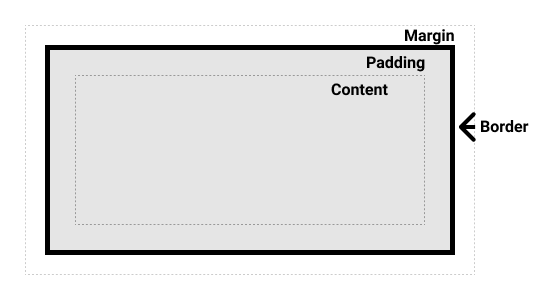
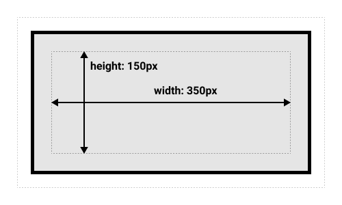
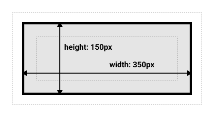
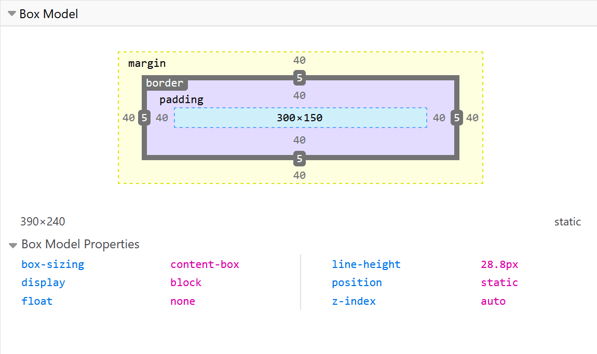

#### 1. Block和Inline盒子

block盒子（block boxes）有以下特点：

1. 通常block盒子宽度是父容器（container）可用宽度的100%
2. 一个block盒子占据一行（导致换行）
3. 可以设置盒子`width`和`height`
4. 设置`padding`,`margin`或`border`会将其他元素推离block盒子

inline盒子（inline boxes）有以下特点：

1. 多个inline盒子可以占据一行（不会导致换行）
2. 设置`width`和`height`不会生效
3. 设置设置`padding`,`margin`或`border`会生效，但只有左右有效（这么想，因为是inline，所以只能占据一行），上下不会生效

[codepen例子](https://codepen.io/xuliang-github/pen/KKwvwzK)

CSS还提供一个介于block和inline之间的值

`inline-block`：表现和block一样，只是多个可以在一行

```css
display: inline-block;
```

**补充说明：inner and outer display types**

`block`和`inline`是对外显示类型（outer），在盒模型内部也有自己的布局方式，默认是normal flow（流布局）。可以用`display`来改变内部的显示类型。例如：我在一个盒子上设置`display: flex`那这个盒子外部显示类型是`block`，内部显示类型修改为`flex`，其所有子代（不是后代）都会变成flex元素，布局就变成了Flexbox。类似的还有`grid`

#### 2. 盒模型

##### 2.1 标准盒模型

CSS中一个盒子需要：

- **content box**：这个区域用来显示内容（block也是放这里，这里就是容器可用空间），大小可以通过`width`和`height`设置
- **padding box**：包围在content外部的空白区域，大小可以通过`padding`设置
- **border box**：边框包裹content和padding，大小通过`border`设置
- **margin box**：盒子和其它元素间的空白区域，大小通过`margin`设置

  

你设置的盒子`height`和`width`是content的高度和宽度，而盒模型总宽度要加上`padding`和`border`

  

说明：这里content不仅是文本，block元素也是放在里面的，block `width:100%`表示content的`width`；content里的block的`margin`是**相对于content的边界线**而言，不是`border`。

##### 2.2 替代盒模型

有时候，这样计算盒子宽度比较麻烦，可以用`box-sizing:border-box`，这样盒模型的`width`和`height`就会变成盒子的总宽和总高

```css
div {
    box-sizing: border-box;
}
```

  

若希望所有元素都使用替代模型（默认不继承），可以在`<html>`元素上设置`box-sizing`

```css
html {
  box-sizing: border-box;
}
*, *::before, *::after {
  box-sizing: inherit;
}
/* 或者 */
* {
    box-sizing: border-box;
}
```

##### 2.3 使用调试工具

可以使用调试工具查看盒模型具体属性

  

#### 3. margin，padding，border

##### 3.1 margin

`margin`是盒子周围的空白区域，值可以为负值（这个在一些布局里经常会用到）。每个`margin`可以用单独的属性控制

- `margin-top`
- `margin-right`
- `margin-bottom`
- `margin-left`

用的比较多的是简写，简写顺序和上面一样

```css
/* 四个值时对应:上,右,下,左 */
margin: 1px 2px 3px 4px;
/* 三个值时对应:上,左右,下 */
margin: 1em auto 2rem;
/* 二个值时对应:上下,左右 */
margin: 0 auto;
```

##### 3.2 外边距折叠（margin collapsing）

margin collapsing就是**垂直方向**的`margin`值不叠加，而取较大的那个（可能是父元素或兄弟元素）。**只有上下`margin`才会折叠，左右`margin`不会**（因为CSS模型就是排版，上下边距合并接解决的是上下段落之间的`margin`问题）。这个只存在于流布局中，flex布局就没有这种情况

?> `float`和`position:absolute`元素不会发生折叠

产生折叠的情况：

- 上面盒子的`margin-bottom`和下面盒子的`margin-top`方向会产生折叠

- 一个元素嵌套在另外一个元素里的情况下, 并且**外面**的元素没有边框和内边距

  

- 一个空元素，只有外边距没有边框或者内边距，此时上下边距接触也会折叠

- 折叠后的外边距遇到其他的外边距还会继续折叠

解决办法：

- 设置`display:inline-block`
- 使元素称为BFC，例如`overflow: ;`
- 通过`padding`,`border`来制造间隙，例如`border:1px solid transparent`

[参考博客](http://blog.doyoe.com/2013/12/04/css/margin%E7%B3%BB%E5%88%97%E4%B9%8B%E5%A4%96%E8%BE%B9%E8%B7%9D%E6%8A%98%E5%8F%A0/)

##### 3.3 border

`border`通常使用简写

```css
border: 1px solid red;
/* 分别代表border-width,border-style,border-color */
```

设置单边属性

```css
border-top-width: 2px;
```

##### 3.4 padding

用法和简写和`margin`一样

