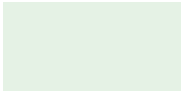

#### 1. 单位

|  单位  |             相对于              |
| :----: | :-----------------------------: |
|  `em`  |  `1em`表示1倍父元素字体大小值   |
| `rem`  | `1rem`表示1倍`<html>`字体大小值 |
|  `vw`  |   视窗宽度的1%（包含滚动条）    |
|  `vh`  |   视窗高度的1%（包含滚动条）    |
| `vmin` |        视窗较小尺寸的1%         |
| `vmax` |         视图大尺寸的1%          |
|  `ex`  |          字符“x”的高度          |
|  `ch`  |          数字“0”的宽度          |
|  `lh`  |        元素的line-height        |

百分比、`em`和`rem`常用于响应式布局

#### 2. 百分比

元素值为百分比时候，通常是以父元素值为基准的。

- 以父元素宽度为基准的：`margin`,`padding`,`left`,`right`,`width`,`max/min-width`
- 以父元素高度为基准的：`top`,`bottom`,`height`,`max/min-height`

特别注意的一点就是，`margin`和`padding`的百分比基准是基于父元素的宽度。`margin-top`，`padding-bottom`也是哦。所以我们可以通过这个设置宽高等比的元素

```css
/* 窗口大小变化，div始终保持2:1的比例 */
div {
    width: 60%;
    padding-top: 30%;
}
```


#### 3. 颜色

颜色的值可以是[关键字](https://developer.mozilla.org/zh-CN/docs/Web/CSS/color_value#Color_keywords)、RGB、RGBA(可以设置透明度)、HSL(色调,饱和度,亮度)、HSLA

```css
/* 设置透明 */
background: rgba(1, 123, 1, 0.1)
```



[颜色名称-菜鸟教程](https://www.runoob.com/cssref/css-colornames.html)

#### 4. 函数

`rgb()`，`linear-gradient()`、`url()`这些都是函数，而更像传统意义的函数是`calc()`

```css
/* 设置元素宽度 */
div {
    width: calc(30% - 20px);
}
```

[参考MDN](https://developer.mozilla.org/zh-CN/docs/Learn/CSS/Building_blocks/Values_and_units)

#### 5. 一些会用到的sizing

`max-width`，`min-width`常常用来在`<body>`中使用

```css
body {
    width: 80%;
    min-width: 960px;
}
/* 通常这么使用，确保不因为页面放太大而破坏页面布局 */
img {
    max-width: 100%;
}
/* 这么设置确保图片不会溢出盒子 */
```

[参考MDN](https://developer.mozilla.org/zh-CN/docs/Learn/CSS/Building_blocks/Sizing_items_in_CSS)