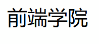
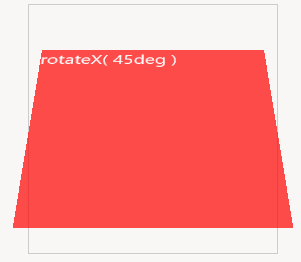

#### 简单下划线

[参考链接](http://www.htmleaf.com/ziliaoku/qianduanjiaocheng/201601203048.html)



基本思路：`::after`添加空内容，`display:block`，并用`position`下划线放到文字下面；用`transform:scaleX()`实现效果最好。类似还有改变`width:0` -->`width:100%`，还有`visibility:hidden` -->`visible`。（`scaleX()`默认从中心发散，可以使用`transform-origin`改变位置）

```html
<!-- 用span就省的设置宽度了，包裹性 -->
<div class="wrap">
    <span class="link">前端学院</span>
</div>
```

```css
/* 思路: 1.width从0-->100; 2.visibility:hidden-->visible
3.transform:scaleX(0)-->scaleX(1),注意用scaleX*/
.link {
    position: relative;
}
.link::after {
    transition: all 1s;
    position: absolute;
    content: "";
    width: 100%;
    height: 2px;
    background-color: blue;
    display: block;
    transform: scaleX(0);
    /* transform-origin: 0 0; */
}
.link:hover::after {
    transform: scaleX(1);
}
```


#### perspective

[参考链接](http://www.htmleaf.com/ziliaoku/qianduanjiaocheng/201502011313.html)

要将一个元素制成3D立体效果，需要在元素上使用`perspective`，有两种方式添加此属性

```css
transform:perspective(600px);
```

```css
perspective: 600px;
```

第一种适合给单个元素引用3D `transform`，每一个元素都有自己的消失点。若想要他们拥有共同消失点，可以在父元素上面设置`perspective`属性。

`perspective`的值越大，观察者于物体距离越远，反之越近；默认情况消失点在3D空间的中心位置，可以通过设置`perspective-origin`属性来改变消失点的位置  `perspective-origin:25% 75%;` [(例子)](http://www.htmleaf.com/pins/1412/201502012157/perspective-03.html)

#### transform

3D transform使用和2D transform属性非常像

- `rotateX( angle )`
- `rotateY( angle )`
- `rotateZ( angle )`
- `translateZ( tz )`
- `scaleZ( sz )`

 注意一点，`rotate`远离你的一端会变小，靠近你的会变大

#### transform卡片翻转

实现卡片翻转效果基本步骤：

1. 用`position`将两个图片重叠在一起
2. 将图片的翻转面`backface-visibility`设置为`hidden`
3. 设置对应动画及过渡：`transform: rotateY()` `transition`
4. 需要注意的几个地方：`img-wrap`设置宽高，否则由于包裹属性，其区域会一直变化（可能转动至一般无法转动）；正面翻转`0-180`，反面翻转`180-360`；伪类`:hover`设置在容器上，不要设置在图片上；父元素设置`perpective`可让子元素具有透视效果，更加真实

```html
<!-- div命名技巧 -->
<div class="container">
    <div class="img-wrap">
        
        
    </div>
</div>
```

```css
/* div+css命名，container,eye-wrap */
/* 还有，要设置div的宽高，不然在当鼠标放在边缘时候可能会bug */
.img-wrap {
    width: 250px;
    height: 350px;
    position: relative;
    margin: 100px;
    /* 父元素上设置perspective可以让子元素具有透视效果，更加真实 */
    perspective: 800px;
    /* 用perspective最好设置宽高，变形时候不能让wrap跟着变化 */
}
img {
    transition: all 0.3s;
    position: absolute;
    /* 这个作用暂时位置 */
    transform-style: preserve-3d;
}
/* 不能在front上面设置hover,当图片旋转的时候，选择的面积也在发生变化 */
.img-wrap:hover .front {
    transform: rotateY(180deg);
    transition: all 0.8s;
    backface-visibility: hidden;
}
.back {
    transform: rotateY(180deg);
    backface-visibility: hidden;
}
.img-wrap:hover .back {
    transform: rotateY(360deg);
    transition:all 0.8s;
```

下面是相对标准的格式，而且也解释清楚了`transform-style: preserve-3d`含义（让子元素保留3d效果）

```html
<!DOCTYPE html>
<html lang="en">
<head>
    <meta charset="UTF-8">
    <meta name="viewport" content="width=device-width, initial-scale=1.0">
    <meta http-equiv="X-UA-Compatible" content="ie=edge">
    <title>卡片翻转</title>
    <style>
        .container {
            width: 100px;
            height: 140px;
            position: relative;
            perspective: 800px;
        }
        .card-wrap {
            position: absolute;
            /* 子元素高度继承父元素，这里要设置具体高度 */
            width: 100%;
            height: 100%;
            /* 这里是为了让其子元素继承persepective,否则没有立体效果
            也可以把perspective放到这里，但不建议 */
            transform-style: preserve-3d;
            border: 1px solid black;
        }
        .card-wrap img {
            position: absolute;
            width: 100%;
            height: 100%;
            backface-visibility: hidden;
            transition: transform 1s;
        }
        .card-wrap .back {
            transform: rotateY(180deg);
        }
        .card-wrap:hover .front {
            transform: rotateY(180deg);
        }
        .card-wrap:hover .back {
            transform: rotateY(360deg);
        }
    </style>
</head>
<body>
    <div class="container">
        <div class="card-wrap">
            
            
        </div>
    </div>
</body>
</html>
```

#### transform立方体

仍然使用上述HTML构造

```css
<div class="container">
    <div class="wrap">
        <div class="front"></div>
        <div class="back"></div>
        <div class="right"></div>
        <div class="left"></div>
        <div class="top"></div>
        <div class="bottom"></div>
    </div>
</div>
```

```css
.container {
    width: 150px;
    height: 150px;
    margin: 100px;
    position: relative;
    perspective: 400px;
}
.wrap {
    width: 100%;
    height: 100%;
    position: absolute;
    transform-style: preserve-3d;
}
.wrap div {
    width: 100%;
    height: 100%;
    border: 1px solid black;
    position: absolute;
}
.front {
    transform: rotateY(0deg) translateZ(75px);
}
.back {
    transform: rotateY(180deg) translateZ(75px);
}
.right {
    transform: rotateY(90deg) translateZ(75px);
}
.left {
    transform: rotateY(-90deg) translateZ(75px);
}
.top {
    transform: rotateX(90deg) translateZ(75px);
}
.bottom {
    transform: rotateX(-90deg) translateZ(75px);
}
```

关于视距，`perspective`，想让立方体更具有立体感，可以设置的小一点。关于不同视距，可查看[例子]( http://www.htmleaf.com/pins/1412/201502012157/perspective-03.html)

旋转木马特效和上述类似。

一些有用的[参考链接](https://zhuanlan.zhihu.com/p/34815524)

#### 轮播图

可以用CSS伪类`:target`来实现，这样就可以不用JS了。参考[MDN](https://developer.mozilla.org/zh-CN/docs/Web/CSS/:target)

