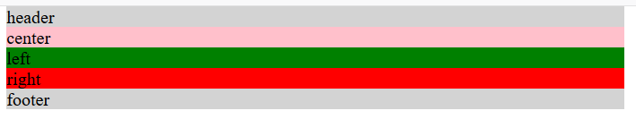
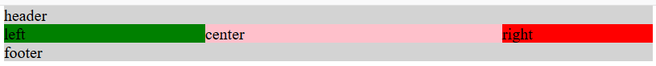

#### 1. 圣杯布局

此结构有以下优点：

- 侧边栏固定，中间栏自适应
- 在HTML中可让center元素在第一位（可优先加载，提升性能）
- 允许任何列最高
- 只需要一个额外的`<div>`标签
- CSS简洁

```html
<div id="header">header</div>
<div id="container">
	<div id="center" class="column">center</div>
	<div id="left" class="column">left</div>
	<div id="right" class="column">right</div>
</div>
<div id="footer">footer</div>
```

            

CSS代码

```css
#container {
	padding-left:200px;
	padding-right: 150px;
}
.column {
	float: left;
	position: relative;
}
#footer {
	clear: both;
}
#center {
	width: 100%;
}
#left {
	width: 200px;
	margin-left: -100%;
	right: 200px;
}
#right {
	width: 150px;
	margin-right: -150px;
}
```

            

基本思路如下：（主要是利用`float`、负边距和`relative`）

设置left和rigth宽度，center宽度设置为100%，父元素container设置左右`padding`为left和right宽度；将left、center和right均设置`float:left`，footer清除浮动，现在他们名义上是在一行上的（实际left和right被center挤下来了，注意此时container已经塌陷）；现在就是要让left占据`padding-left`预留的空间，right占据`padding-right`预留空间（如果元素顺序是left center right那么很好设置，只需`left{margin-left:-200px} right{margin-right:-150px}`），设置left和right为`relative`，然后设置`left{right:200px;margin-left:-100%}` （`-100%`是相当于container的content宽度，因为center宽度为`100%`，设置后left和center就左对齐了，再设置`relative`偏移`200px`即可）即可，`right{margin-right:-150px}`

还有就是要设置`body{min-width:550px}`，防止布局破坏（`2*200+150`），这么计算是因为left原来的位置还在，只是显示向左偏移了`200px`

container设置`padding`后，left和right应该都在content内的，只是他们通过设置负边距出来了。

注：另一种方法就是在 right 这里有所不同，`right{margin-left:-190px;position:relative;left:190px}`

若要添加`padding`，直接添加后，要注意 left的 `width` 要等于content+padding。在偏移的时候要考虑到中间栏的`padding`影响

#### 2. 双飞翼布局

和圣杯布局实现的功能相同，只是在 `<main>` 内容上添加一个包裹 `<div>` ，设置 `div` 的左右`margin`值来代替父元素左右`padding`值带来的效果

