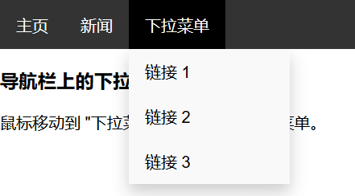

#### 1. 垂直导航栏

```html
<ul>
    <li><a href="#home" class="active">主页</a></li>
    <li><a href="#news">新闻</a></li>
    <li><a href="#contact">联系</a></li>
    <li><a href="#about">关于</a></li>
</ul>
<!-- 测试文字 -->
<div>
    <!-- some paragraph -->
</div>
```

```css
body {
    margin: 0;
}
ul {
    margin: 0;
    padding: 0;
    list-style-type: none;
    background: #f1f1f1;
    width: 25%;
    position: fixed;
    height: 100%;
    overflow: auto;
}
li a {
    /* 让整个块变为链接 */
    display: block;
    text-align: center;
    color: #000;
    padding: 8px 16px;
    text-decoration: none;
}
li a:hover:not(.active) {
    /* not排除当前所处的位置 */
    color: white;
    background: #555;
}
li a.active {
    background: #4CAF50;
    color: white;
}
/* 测试文字样式 */
div {
    margin-left: 25%;
    /* 这里1px是解决margin合并到body的问题 */
    padding: 1px 16px;
    height: 1000px;
}
```

 

要点如下：

- 设置`<ul>`的`width`为固定值，并且`position:fixed`，高度为`100%`
- 让`<a>`显示为block，这样整个块就可以点击了；`<a>`的宽度为`<li>`的宽度
- 设置`.active`样式，当处于当前导航时其`class`为`.active`
- 当前已经`active`的样式不再受`hover`影响，`:not(.active)`

#### 2. 水平导航栏

HTML和上述一样，下面是CSS代码

```css
body {
    margin: 0;
}
ul {
    background: #333;
    overflow: hidden;
    margin: 0;
    padding: 0;
    list-style-type: none;
    /* 固定导航栏 */
    position: fixed;
    /* 设置fixed之后，具有包裹性，所以要设置width */
    width: 100%;
    top: 0;
}
li {
    float: left;
}
li a {
    display: block;
    text-decoration: none;
    color: white;
    /* 靠padding撑起nav高度 */
    padding: 14px 16px;
}
li a:hover:not(.active) {
    background: #111;
}
.active {
    background-color: #4CAF50;
}
li:last-child {
    float: right;
}
```


要点如下：

- 和垂直一样的要点就不说了
- 这里水平使用的是`float`方法，的确方便左右摆（`inline-block`也可以，只是让一个块在右边不好弄）
- 使用了`float`就要清除浮动，这里用的是`overflow:hidden`
- 使用`fixed`后，具有包裹性，所以要设置`width:100%`

#### 3. @media响应式导航

[在线示例](https://c.runoob.com/codedemo/3514)

```html
<ul class="sidenav">
    <li><a class="active" href="#home">主页</a></li>
    <li><a href="#news">新闻</a></li>
    <li><a href="#contact">联系</a></li>
    <li><a href="#about">关于</a></li>
</ul>
<div class="content">
    <h2>响应式边栏导航实例</h2>
    <p>该实例在屏幕宽度小于 900px 时导航栏为顶部水平导航栏，
        如果大于 900px 导航栏会在左边，且是固定的。</p>
    <p>如果屏幕宽度小于 400px 会变为垂直导航栏。</p>
    <h3>重置浏览器窗口大小，查看效果。</h3>
</div>
```

```css
body {
    margin: 0;
}
ul.sidenav {
    list-style-type: none;
    margin: 0;
    padding: 0;
    width: 25%;
    background-color: #f1f1f1;
    position: fixed;
    height: 100%;
    overflow: auto;
}
ul.sidenav li a {
    display: block;
    color: #000;
    padding: 8px 16px;
    text-decoration: none;
}
ul.sidenav li a.active {
    background-color: #4CAF50;
    color: white;
}
ul.sidenav li a:hover:not(.active) {
    background-color: #555;
    color: white;
}
div.content {
    margin-left: 25%;
    padding: 1px 16px;
    height: 1000px;
}
@media screen and (max-width: 900px) {
    ul.sidenav {
        width: 100%;
        height: auto;
        position: relative;
    }
    ul.sidenav li a {
        float: left;
        padding: 15px;
    }
    div.content {
        margin-left: 0;
    }
}
@media screen and (max-width: 400px) {
    ul.sidenav li a {
        text-align: center;
        float: none;
    }
}
```

要点如下：

- 先将大于`900px`的CSS样式写完，然后在`@media`内写`<900px`的CSS
- `<900px`的CSS主要内容就是将`>900px`的不能用的CSS重置，例如：`height:100%`、`margin-left:0`；添加需要的CSS
- `<400px`部分，是继承`<900px`的内容的，所以它可能需要重置、修改和添加`>900px`和`<900px`的部分CSS（有点像局部变量和全局变量）

#### 4. 导航下拉菜单

[在线示例](https://c.runoob.com/codedemo/452)

```html
<ul>
    <li><a class="active" href="#home">主页</a></li>
    <li><a href="#news">新闻</a></li>
    <!-- 布局:要把下拉选项和菜单一个div里,
            这样移到下拉选项上业是在hover内,不会消失 -->
    <div class="dropdown">
        <a href="#" class="dropbtn">下拉菜单</a>
        <div class="dropdown-content">
            <a href="#">链接 1</a>
            <a href="#">链接 2</a>
            <a href="#">链接 3</a>
        </div>
    </div>
</ul>
<h3>导航栏上的下拉菜单</h3>
<p>鼠标移动到 "下拉菜单" 链接先显示下拉菜单。</p>
```

```css
ul {
    margin: 0;
    padding: 0;
    list-style-type: none;
    background: #333;
    overflow: hidden;
}
ul li {
    float: left;
}

/* 观察代码 */
/* ul li, .dropbtn {
    outline: 1px solid lime;
} */

li a,
.dropbtn {
    text-align: center;
    display: block;
    color: white;
    text-decoration: none;
    padding: 14px 16px;
}

/* 关键,.dropdown是一个整体选项,这样.dropbtn就可以设置padding了 */
.dropdown {
    display: inline-block;
    position: relative;
}
li a:hover,
.dropdown:hover {
    background: black;
}
.dropdown:hover .dropdown-content {
    display: block;
}
/* 样式化下拉菜单 */
.dropdown-content {
    position: absolute;
    display: none;
    min-width: 160px;
    background-color: #f9f9f9;
    box-shadow: 0px 8px 16px rgba(0, 0, 0, 0.2);
}
.dropdown-content a {
    color: black;
    display: block;
    text-decoration: none;
    padding: 12px 16px;
}
.dropdown-content a:hover {
    background: #f1f1f1;
}
```



要点：

- 和之前相同的地方就不说了
- 第一是布局把"下拉菜单"和下拉选项放一个`<div>`里面
- 第二就是为了设置"下拉菜单"的`margin`和`padding`，需要将上面的`<div>`设置为`inline-block`，详见随笔一36条
- `absolute`脱离文档流后，若不设置位置属性，**其位置还是在原来的位置**，并不会定位到原点（`top:0,left:0`）

[参考链接](https://www.runoob.com/css/css-navbar.html)