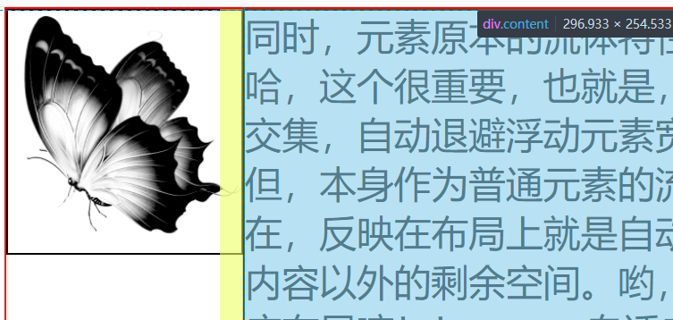

基本格式如下

```html
<div class="wrapper" id="wrapper">
  <div class="left">
    左边固定宽度，高度不固定</br></br></br></br>高度有可能会很小，也可能很大。
  </div>
  <div class="right">
    这里的内容可能比左侧高，也可能比左侧低。宽度需要自适应。</br>
    基本的样式是，两个div相距20px, 左侧div宽 120px
  </div>
</div>

.wrapper {
    padding: 15px 20px;
    border: 1px dashed #ff6c60;
}
.left {
    width: 120px;
    border: 5px solid #ddd;
}
.right {
    margin-left: 20px;
    border: 5px solid #ddd;
}
```

##### 1. 双inlin-block方案

```css
.wrapper-inline-block {
    box-sizing: content-box;
    font-size: 0;    /* 消除 div 之间空格字符的影响 */
}
.wrapper .left, .wrapper .right {
    display: inline-block;
    vertical-align: top;    /* 顶端对齐 */
    font-size: 16px;
    box-sizing: border-box;
}
.wrapper .right {
    width: calc(100% - 140px); /* 书写时运算符两边要空格 */
}
```

缺点：需要知道左侧盒子的宽度，两个盒子的距离，还要设置各个元素`box-sizing`；需要消除空格字符串影响；需要设置`vertical-align:top`满足顶端对齐 

##### 2. 双float方案

使用 float 无需考虑空格字符和顶端对齐影响，因为浮动的block会紧密排成一行

```css
.wrapper {
    overflow: auto;        /* 清除浮动 */
    box-sizing: content-box;
}
.wrapper .left, .wrapper .right {
    float: left;
    box-sizing: border-box;
}
.wrapper .right {
    width: calc(100% - 140px);
}
```

缺点：需要知道左侧盒子的宽度，两个盒子的距离，还要设置各个元素`box-sizing`父元素需要清除浮动

上面的方法都是利用CSS的`calc()`函数计算宽度，下面的采用的是`block`填满父元素并跟随父元素宽度自适应和流动特性（简单来讲就是`margin-left`给左边腾出空间）

##### 3. float + margin-left方案

```css
.wrapper {
	overflow: auto;
}
.left {
	float: left;
}
.right {
	margin-left: 150px;
/* 这里没有设置box-sizing:border-box，所以要加上两个边框的宽度 */
}
```

缺点：需要清除浮动；需要计算右侧盒子的`margin-left`

##### 4. absolute + margin-left方案

```css
.wrapper .left {
    position: absolute;
}
.wrapper .right {
    margin-left: 150px;
}
```

缺点：不太适用，使用了绝对定位，若是用在某个`div`中，需要更改父容器的`position`；没有清除浮动的方法，若左侧盒子高于右侧盒子，就会超出父容器的高度。因此只能通过设置父容器的`min-height`来放置这种情况。

上面的方法都需要通过左侧宽度计算某个值，下面的则不需要计算

##### 5. float + BFC方案

右侧盒子通过 overflow:auto 形成了BFC，因此右侧盒子不会和浮动元素重叠（设置两栏之间的间距设置 float 的 margin-right，如果设置内容的 margin-left比较麻烦，因为margin-left设置为左边元素宽度+实际margin距离才行）图中黄色部分为margin-left:10px，可以看到必须要撑满左边图像的距离才行，因为float已经脱离元素，这里的margin相对于父元素，但是float的margin却又作用。

            

```css
.wrapper {
	overflow: auto;
}
.left {
	float: left;
	margin-right: 20px;
}
.right {
	overflow: auto;
}
```

缺点：父元素需要清除浮动

##### 6. flex方案

由于`align-items`默认值为stretch会导致左右等高，需要设置为顶部对齐 `flex-start`。flex是目前比较完美的解决方案，就是不支持老旧浏览器

```css
.wrapper {
	display: flex;
	align-items: flex-start;
}
.left {
	flex: 0 0 auto;
}
.right {
	flex: 1 1 auto;
}
```

##### 7. grid方案

这不是它发挥真正长处的地方。grid布局也有列等高的默认效果。需要设置`align-items:start`。grid布局还有一个值得注意的小地方和flex不同:在使用`margin-left`的时候，grid布局默认是`box-sizing`设置的盒宽度之间的位置。而flex则是使用两个`div`的`border`或者`padding`外侧之间的距离

```css
.wrapper {
    display: grid;
    grid-template-columns: 120px 1fr;
    align-items: start;
}
.left, .right {
    box-sizing: border-box;
}
.left {
    grid-column: 1;
}
.right {
    grid-column: 2;
}
```

[参考博客](https://segmentfault.com/a/1190000010698609)