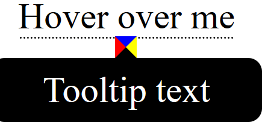
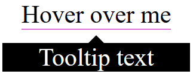

#### 1. Tooltips

实现两个要点

- 如何`hover`上去出现文字？
- 如何画三角形？

实现第一点简单，主文字`position:relative`，tooltip文字`absolute`，再就是利用`display:hidden`，居中的问题用`left`和`margin-left`解决

实现第二点，就是利用相邻`border`产生的斜线，画出三角形，其定位基于tooltip



```html
<!-- tooltiptext包含在tooltip里面 -->
<div class="tooltip">Hover over me
  <span class="tooltiptext">Tooltip text</span>
</div>
```

```css
/* CSS核心代码 */
.tooltip {
    border-bottom: 1px solid orchid;
    display: inline-block;
    position: relative;
}
.tooltiptext {
    position: absolute;
    color: #fff;
    background: black;
    /* 不定宽没法居中啊 */
    width: 120px;
    left: 50%;
    top: 150%;
    margin-left: -60px;
}
.tooltiptext::before {
    /* 空字符,且float,其width为0 */
    content: "";
    border-bottom: 5px solid black;
    border-left: 5px solid transparent;
    border-right: 5px solid transparent;
    /* 这里的文字节点父元素是div,可以相对其定位 */
    position: absolute;
    top: -5px;
    /* 居中 */
    left: 50%;
    margin-left: -5px;
}
```



其他一些`padding`、`border-radius`之类的代码没写，举一反三，其他方向的tooltips实现方法类似

?> `::before`选中的是文字节点，其父元素是`<div>`，当`<div>`有`position:absolute`时候，其就是相对于`<div>`定位

[w3school tooltips](https://www.w3schools.com/css/css_tooltip.asp)