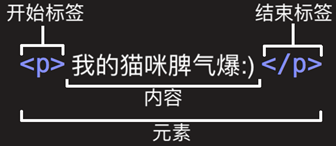

> HTML（hypertext markup language 超文本标记语言）是一门告知浏览器如何组织页面的标记语言，不是编程语言。

#### 元素

1. HTML由一系列元素（element）组成，元素的主要部分有：
   - 开始标签（opening tag）
   
   - 结束标签（closing tag）
   
   - 内容（content）
   
   - 属性（attribute）：属性与元素名称之间空格，属性名称后接等号，引号包围属性值
   



```html
<p style="color:yellow">Hello world!</p>
```

2. 空元素：不包含任何内容的元素称为空元素，如 `` 元素
3. 块级元素和内联元素：
4. 布尔属性：没有值的属性，例`<input type="text" disable>`

#### HTML文档详解

基本格式

```html
<!DOCTYPE html>
<html>
<head>
	<meta charset="utf-8">
	<title>测试页面</title>
</head>
<body>
</body>
</html>
```

`<!DOCTYPE html>`：文档类型，作用就是启动浏览器标准模式

`<html></html>`：根元素，包含了整个页面内容

`<head></head>`：此元素内容不展示给用户，而是包含例如面向搜索引擎的搜索关键字（keywords）、页面描述、CSS 样式表和字符编码声明以及浏览器兼容和视图缩放等

`<meta charset="utf-8"> `：指定当前文档使用UTF-8字符编码

`<title></title>`：设置显示在浏览器标签上的标题，同时作为收藏网页的描述文字

`<body></body>`：包含用户访问页面时看到的内容，可以是文本、图像、视频、音频等 

#### 空白

HTML解释器会将连续的空白符解释为一个，以下代码等价：

```html
<p>狗 狗 很 呆 萌</p>
```

```html
<p>狗 狗     很
      呆 萌</p>
```

#### 字符转义

在HTML中，字符 <, >,",' 和 & 是特殊字符，必须通过字符引用包含进文本；每个字符引用以符号&开始, 以分号(;)结束  