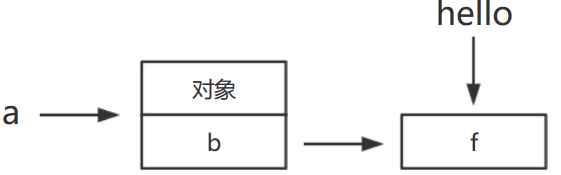

#### 1. 含义

`this`关键字是一个非常重要的语法点，之前说过，`this`在构造函数中表示实例对象，此外，`this`还可以用在别的场合。但都有一个共同点：**`this`总返回一个对象**

简单来说，**`this`就是属性或方法“当前”所在的对象（或函数所运行的环境，注意是普通函数，不是构造函数）**

由于对象的属性可以赋给另一个对象，所以属性所在的当前对象是可变的，即`this`的指向是可变的

```js
var A = {
  name: '张三',
  describe: function () {
    return '姓名：'+ this.name;
  }
};
var B = {
  name: '李四'
};
B.describe = A.describe;
B.describe()
// "姓名：李四"
```

重构这个例子，`this`的动态指向就能看得更清楚

```js
function f() {
  return '姓名：'+ this.name;
}
var A = {
  name: '张三',
  describe: f
};
var B = {
  name: '李四',
  describe: f
};
A.describe() // "姓名：张三"
B.describe() // "姓名：李四"
```

只要函数被赋给另一个变量，`this`的指向就会变。

```js
var A = {
  name: '张三',
  describe: function () {
    return '姓名：'+ this.name;
  }
};
var name = '李四';
var f = A.describe;
f() // "姓名：李四"
```

上面代码中，`A.describe`被赋值给变量`f`，**内部的`this`就会指向`f`运行时所在的对象**（本例是顶层对象）

再看一个网页编程的例子。

```html
<input type="text" name="age" size=3 onChange="validate(this, 18, 99);">
<script>
function validate(obj, lowval, hival){
  if ((obj.value < lowval) || (obj.value > hival))
    console.log('Invalid Value!');
}
</script>
```

上面代码是一个文本输入框，每当用户输入一个值，就会调用`onChange`回调函数，验证这个值是否在指定范围内。浏览器会向回调函数传入当前对象，因此`this`就代表当前对象（即文本框），然后可以从`this.value`上读到用户的输入值

总结：JS语言中，一切皆对象，运行环境也是对象，所以函数都是在某个对象之中运行，**`this`就是函数运行时所在的对象（环境）**。而且JS支持运行环境动态切换，**所以`this`指向是动态的**

#### 2. 实质

JavaScript 语言之所以有 this 的设计，跟内存里面的数据结构有关系。

```js
var obj = { foo:  5 };
```

上面的代码将一个对象赋值给变量`obj`。JavaScript 引擎会先在内存里面，生成一个对象`{ foo: 5 }`，然后把这个对象的内存地址赋值给变量`obj`。**也就是说，变量`obj`是一个地址（reference）**。后面如果要读取`obj.foo`，引擎先从`obj`拿到内存地址，然后再从该地址读出原始的对象，返回它的`foo`属性。

原始的对象以字典结构保存，每一个属性名都对应一个属性描述对象。举例来说，上面例子的`foo`属性，实际上是以下面的形式保存的。

```js
{
  foo: {
    [[value]]: 5
    [[writable]]: true
    [[enumerable]]: true
    [[configurable]]: true
  }
}
```

注意，`foo`属性的值保存在属性描述对象的`value`属性里面。

这样的结构是很清晰的，问题在于属性的值可能是一个函数。

```js
var obj = { foo: function () {} };
```

这时，引擎会将函数单独保存在内存中，然后再将函数的地址赋值给`foo`属性的`value`属性。

```js
{
  foo: {
    [[value]]: 函数的地址
    ...
  }
}
```

由于函数是一个单独的值，所以它可以在不同的环境（上下文）执行。

```js
var f = function () {};
var obj = { f: f };
// 单独执行
f()
// obj 环境执行
obj.f()
```

JavaScript 允许在函数体内部，引用当前环境的其他变量。

```js
var f = function () {
  console.log(x);
};
```

上面代码中，函数体里面使用了变量`x`。该变量由运行环境提供。

现在问题就来了，由于函数可以在不同的运行环境执行，所以需要有一种机制，能够在函数体内部获得当前的运行环境（context）。所以，**`this`就出现了，它的设计目的就是在函数体内部，指代函数当前的运行环境。**

```js
var f = function () {
  console.log(this.x);
}
```

上面代码中，函数体里面的`this.x`就是指当前运行环境的`x`。

```js
var f = function () {
  console.log(this.x);
}
var x = 1;
var obj = {
  f: f,
  x: 2,
};
// 单独执行
f() // 1
// obj 环境执行
obj.f() // 2
```

上面代码中，函数`f`在全局环境执行，`this.x`指向全局环境的`x`；在`obj`环境执行，`this.x`指向`obj.x`。

#### 3. 使用场合

`this`主要有以下几个使用场合

###### （1）全局环境

全局环境中使用`this`，指向的就是顶层对象`window`

```js
this === window // true
function f() {
  console.log(this === window);
}
f() // true
```

上面代码说明，**不管是不是在函数内部，只要是在全局环境下运行，`this`就是指顶层对象`window`** 

###### （2）构造函数

构造函数中的`this`，指的是实例对象

```js
var Obj = function (p) {
  this.p = p;
};
var o = new Obj('Hello World!');
o.p // "Hello World!"
```

###### （3）对象的方法

若对象的方法中包含`this`，**`this`指向的就是方法运行时所在的对象**。该方法赋值给另一个对象，就会改变`this`的指向

```js
var obj ={
  foo: function () {
    console.log(this);
  }
};
obj.foo() // obj
```

但是，以下几种用法，都会改变`this`的指向（就是单独`obj.foo`这样写，然后运算之后再调用，不行）

```js
// 情况一
(obj.foo = obj.foo)() // window
// 情况二
(false || obj.foo)() // window
// 情况三
(1, obj.foo)() // window
```

上面代码中，`obj.foo`就是一个值。这个值真正调用的时候，运行环境已经不是`obj`了，而是全局环境，所以`this`不再指向`obj`

可以这样理解，JavaScript 引擎内部，`obj`和`obj.foo`储存在两个内存地址，称为地址一和地址二。`obj.foo()`这样调用时，是从地址一调用地址二，因此地址二的运行环境是地址一，`this`指向`obj`。但是，上面三种情况，都是直接取出地址二进行调用，这样的话，运行环境就是全局环境，因此`this`指向全局环境。上面三种情况等同于下面的代码。

```js
// 情况一
(obj.foo = function () {
  console.log(this);
})()
// 等同于
(function () {
  console.log(this);
})()
// 情况二
(false || function () {
  console.log(this);
})()
// 情况三
(1, function () {
  console.log(this);
})()
```

**如果`this`所在的方法不在对象的第一层，这时`this`只是指向当前一层的对象，而不会继承更上面的层**。

```js
var a = {
  p: 'Hello',
  b: {
    m: function() {
      console.log(this.p);
    }
  }
};
a.b.m() // undefined
```

上面代码中，`a.b.m`方法在`a`对象的第二层，该方法内部的`this`不是指向`a`，而是指向`a.b`，因为实际执行的是下面的代码

```js
var b = {
  m: function() {
   console.log(this.p);
  }
};
var a = {
  p: 'Hello',
  b: b
};
(a.b).m() // 等同于 b.m()
```

简化一下如下：（`this.a`-->`obj.a`，找不到，所以就是`undefined`。和函数里的全局和局部变量别混淆了，那些都是自由变量，这个是属性）

```js
var a = 4;//相当于window.a = 4;
var obj = {
    b: function() {
        console.log(this.a);
    }
}
obj.b();//undefined
```

如果要达到预期效果，只有写成下面这样。

```js
var a = {
  b: {
    m: function() {
      console.log(this.p);
    },
    p: 'Hello'
  }
};
```

**如果这时将嵌套对象内部的方法赋值给一个变量，`this`依然会指向全局对象**（**这不和上面的一样么`(obj.foo = obj.foo)()`，这样就相当于直接取值了，变成了传值，不是传址了**，**赋给变量的一定要是个对象（地址）**）

```js
var a = {
  b: {
    m: function() {
      console.log(this.p);
    },
    p: 'Hello'
  }
};
var hello = a.b.m;
hello() // undefined

//这样也是不行的
var a = {
    b: function() {
        console.log(this.p);
    },
    p: "Hello"
}
var hello = a.b;
hello()//undefined
```

如图所示，相当于直接把函数`f`给了`hello`（嵌套函数`this`指向也可以用这个图理解）



所以，赋值给变量最好是一个对象

```js
var hello = a.b;
hello.m() // Hello
```

若想调用`hello =  a.b.m`，那就用`bind()`绑定内部`this`

```js
//注意this作用域是a.b
var hello = a.b.m.bind(a.b);
hello()//"Hello"
```


#### 4. 使用注意点

##### 4.1 避免多层 this

由于`this`的指向是不确定的，所以切勿在函数中包含多层的`this`

```js
var o = {
  f1: function () {
    console.log(this);
    var f2 = function () {
      console.log(this);
    }();
  }
}
o.f1()
// Object
// Window
```

上面代码包含两层`this`，结果运行后，第一层指向对象`o`，第二层指向全局对象，因为实际执行的是下面的代码

```js
var temp = function () {
  console.log(this);
};
var o = {
  f1: function () {
    console.log(this);
    var f2 = temp();
  }
}
```

一个解决方法是在第二层改用一个指向外层`this`的变量

```js
var o = {
  f1: function() {
    console.log(this);
    var that = this;
    var f2 = function() {
      console.log(that);
    }();
  }
}
o.f1()
// Object
// Object
```

上面代码定义了变量`that`，固定指向外层的`this`，然后在内层使用`that`，就不会发生`this`指向的改变

**事实上，使用一个变量固定`this`的值，然后内层函数调用这个变量，是非常常见的做法，请务必掌握**

JavaScript 提供了严格模式，也可以硬性避免这种问题。严格模式下，如果函数内部的`this`指向顶层对象，就会报错

```js
var counter = {
  count: 0
};
counter.inc = function () {
  'use strict';
  this.count++
};
var f = counter.inc;
f()
// TypeError: Cannot read property 'count' of undefined
```

上面代码中，`inc`方法通过`'use strict'`声明采用严格模式，这时内部的`this`一旦指向顶层对象，就会报错

##### 4.2 避免数组处理方法中的 this

数组的`map`和`foreach`方法，允许提供一个函数作为参数。这个函数内部不应该使用`this`。

```js
var o = {
  v: 'hello',
  p: [ 'a1', 'a2' ],
  f: function f() {
    this.p.forEach(function (item) {
      console.log(this.v + ' ' + item);
    });
  }
}
o.f()
// undefined a1
// undefined a2
```

上面代码中，`foreach`方法的回调函数中的`this`，其实是指向`window`对象，因此取不到`o.v`的值。原因跟上一段的多层`this`是一样的，就是**内层的`this`不指向外部，而指向顶层对象**。

解决这个问题的一种方法，就是前面提到的，使用中间变量固定`this`。

```js
var o = {
  v: 'hello',
  p: [ 'a1', 'a2' ],
  f: function f() {
    var that = this;
    this.p.forEach(function (item) {
      console.log(that.v+' '+item);
    });
  }
}
o.f()
// hello a1
// hello a2
```

另一种方法是将`this`当作`foreach`方法的第二个参数，固定它的运行环境。

```js
var o = {
  v: 'hello',
  p: [ 'a1', 'a2' ],
  f: function f() {
    this.p.forEach(function (item) {
      console.log(this.v + ' ' + item);
    }, this);
  }
}
o.f()
// hello a1
// hello a2
```

##### 4.3 避免回调函数中的 this

回调函数中的`this`往往会改变指向，最好避免使用（回调函数：一个被作为参数传递给另一个函数的函数）

```js
var o = new Object();
o.f = function () {
  console.log(this === o);
}
// jQuery 的写法
$('#button').on('click', o.f);
```

上面代码中，点击按钮以后，控制台会显示`false`。原因是此时`this`不再指向`o`对象，而是指向按钮的 DOM 对象，**因为`f`方法是在按钮对象的环境中被调用的**。这种细微的差别，很容易在编程中忽视，导致难以察觉的错误

**典型回调函数（这里由于参数传递，是一种隐式的赋值，相当于拷贝副本（注意之前讲的传值和传址传递））**

```js
function doFoo(fn) {
    fn();//调用位置。这了fn引用foo函数，相当于赋值
}
var obj = {
    a: 2,
    foo: function foo() {
        console.log(this.a);
    }
};
var a = "global";
doFoo(obj.foo)//global
```

为了解决这个问题，可以采用下面的一些方法对`this`进行绑定，也就是使得`this`固定指向某个对象，减少不确定性

#### 5. 绑定 this 的方法

`this`的动态切换，固然为 JavaScript 创造了巨大的灵活性，但也使得编程变得困难和模糊。有时，需要把`this`固定下来，避免出现意想不到的情况。JavaScript 提供了`call`、`apply`、`bind`这三个方法，来切换/固定`this`的指向

##### 5.1 Function.prototype.call()

函数实例的`call`方法，可以指定函数内部`this`的指向（即函数执行时所在的作用域），**然后在所指定的作用域中，调用该函数**（会直接调用）

```js
var obj = {};
var f = function () {
  return this;
};
f() === window // true
f.call(obj) === obj // true
```

上面代码中，全局环境运行函数`f`时，`this`指向全局环境（浏览器为`window`对象）；`call`方法可以改变`this`的指向，指定`this`指向对象`obj`，然后在对象`obj`的作用域中运行函数`f`。

`call`方法的参数，应该是一个对象。如果参数为空、`null`和`undefined`，则默认传入全局对象。

```js
var n = 123;
var obj = { n: 456 };
function a() {
  console.log(this.n);
}
a.call() // 123
a.call(null) // 123
a.call(undefined) // 123
a.call(window) // 123
a.call(obj) // 456
```

如果`call`方法的参数是一个原始值，那么这个原始值会自动转成对应的包装对象，然后传入`call`方法。

```js
var f = function () {
  return this;
};
f.call(5)
// Number {[[PrimitiveValue]]: 5}
```

上面代码中，`call`的参数为`5`，不是对象，会被自动转成包装对象（`Number`的实例），绑定`f`内部的`this`。

`call`方法还可以接受多个参数。

```js
func.call(thisValue, arg1, arg2, ...)
```

`call`的第一个参数就是`this`所要指向的那个对象，后面的参数则是函数调用时所需的参数。

```js
function add(a, b) {
  return a + b;
}
add.call(this, 1, 2) // 3
```

上面代码中，`call`方法指定函数`add`内部的`this`绑定当前环境（对象），并且参数为`1`和`2`，因此函数`add`运行后得到`3`。

`call`方法的一个应用是调用对象的原生方法。

```js
var obj = {};
obj.hasOwnProperty('toString') // false
// 覆盖掉继承的 hasOwnProperty 方法
obj.hasOwnProperty = function () {
  return true;
};
obj.hasOwnProperty('toString') // true
Object.prototype.hasOwnProperty.call(obj, 'toString') // false
```

##### 5.2 Function.prototype.apply()

`apply`方法的作用与`call`方法类似，也是改变`this`指向，**然后再调用该函数**。唯一的区别就是，它接收一个数组作为函数执行时的参数，使用格式如下。

```js
func.apply(thisValue, [arg1, arg2, ...])
```

`apply`方法的第一个参数也是`this`所要指向的那个对象，如果设为`null`或`undefined`，则等同于指定全局对象

利用这一点，可以做一些有趣的应用

###### （1）找出数组最大元素

JavaScript 不提供找出数组最大元素的函数。结合使用`apply`方法和`Math.max`方法，就可以返回数组的最大元素。

```js
var a = [10, 2, 4, 15, 9];
Math.max.apply(null, a) // 15
```

###### （2）将数组的空元素变为`undefined`

通过`apply`方法，利用`Array`构造函数将数组的空元素变成`undefined`。

```js
Array.apply(null, ['a', ,'b'])
// [ 'a', undefined, 'b' ]
```

空元素与`undefined`的差别在于，数组的`forEach`方法会跳过空元素，但是不会跳过`undefined`。因此，遍历内部元素的时候，会得到不同的结果。

```js
var a = ['a', , 'b'];
function print(i) {
  console.log(i);
}
a.forEach(print)
// a
// b
Array.apply(null, a).forEach(print)
// a
// undefined
// b
```

###### （3）转换类似数组的对象

另外，利用数组对象的`slice`方法，可以将一个类似数组的对象（比如`arguments`对象）转为真正的数组。

```js
Array.prototype.slice.apply({0: 1, length: 1}) // [1]
Array.prototype.slice.apply({0: 1}) // []
Array.prototype.slice.apply({0: 1, length: 2}) // [1, undefined]
Array.prototype.slice.apply({length: 1}) // [undefined]
```

用`call`也可以。这个方法起作用的前提是，被处理的对象必须有`length`属性，以及相对应的数字键。

###### （4）绑定回调函数的对象

前面的按钮点击事件的例子，可以改写如下。

```js
var o = new Object();
o.f = function () {
  console.log(this === o);
}
var f = function (){
  o.f.apply(o);
  // 或者 o.f.call(o);
};
// jQuery 的写法
$('#button').on('click', f);
```

上面代码中，点击按钮以后，控制台将会显示`true`。由于`apply`方法（或者`call`方法）不仅绑定函数执行时所在的对象，还会立即执行函数，因此不得不把绑定语句写在一个函数体内。更简洁的写法是采用下面介绍的`bind`方法

##### 5.3 Function.prototype.bind()

`bind`方法用于将函数体内的`this`绑定到某个对象，然后返回一个新函数（不会立即调用）

```js
var d = new Date();
d.getTime() // 1481869925657
var print = d.getTime;
print() // Uncaught TypeError: this is not a Date object.
```

上面代码中，我们将`d.getTime`方法赋给变量`print`，然后调用`print`就报错了。这是因为`getTime`方法内部的`this`，绑定`Date`对象的实例，赋给变量`print`以后，内部的`this`应该是指向`window`

`bind`方法可以解决这个问题。

```js
var print = d.getTime.bind(d);
print() // 1481869925657
```

上面代码中，`bind`方法将`getTime`方法内部的`this`绑定到`d`对象，这时就可以安全地将这个方法赋值给其他变量了。

`bind`方法的参数就是所要绑定`this`的对象，下面是一个更清晰的例子。

```js
var counter = {
  count: 0,
  inc: function () {
    this.count++;
  }
};
var func = counter.inc.bind(counter);
func();
counter.count // 1
```

上面代码中，`counter.inc`方法被赋值给变量`func`。这时必须用`bind`方法将`inc`内部的`this`，绑定到`counter`，否则就会出错。

`this`绑定到其他对象也是可以的。

```js
var counter = {
  count: 0,
  inc: function () {
    this.count++;
  }
};
var obj = {
  count: 100
};
var func = counter.inc.bind(obj);
func();
obj.count // 101
```

`bind`还可以接受更多的参数，将这些参数绑定原函数的参数。

```js
var add = function (x, y) {
  return x * this.m + y * this.n;
}
var obj = {
  m: 2,
  n: 2
};
var newAdd = add.bind(obj, 5);
newAdd(5) // 20
```

上面代码中，`bind`方法除了绑定`this`对象，还将`add`函数的第一个参数`x`绑定成`5`，然后返回一个新函数`newAdd`，这个函数只要再接受一个参数`y`就能运行了。

如果`bind`方法的第一个参数是`null`或`undefined`，等于将`this`绑定到全局对象，函数运行时`this`指向顶层对象（浏览器为`window`）

```js
function add(x, y) {
  return x + y;
}
var plus5 = add.bind(null, 5);
plus5(10) // 15
```

`bind`方法有一些使用注意点。

###### （1）每一次返回一个新函数

`bind`方法每运行一次，就返回一个新函数，这会产生一些问题。比如，监听事件的时候，不能写成下面这样。

```js
element.addEventListener('click', o.m.bind(o));
```

上面代码中，`click`事件绑定`bind`方法生成的一个匿名函数。这样会导致无法取消绑定，所以，下面的代码是无效的。

```js
element.removeEventListener('click', o.m.bind(o));
```

正确的方法是写成下面这样：

```js
var listener = o.m.bind(o);
element.addEventListener('click', listener);
//  ...
element.removeEventListener('click', listener);
```

###### （2）结合回调函数使用

回调函数是 JavaScript 最常用的模式之一，但是一个常见的错误是，将包含`this`的方法直接当作回调函数。解决方法就是使用`bind`方法，将`counter.inc`绑定`counter`。

```js
var counter = {
  count: 0,
  inc: function () {
    'use strict';
    this.count++;
  }
};
function callIt(callback) {
  callback();
}
callIt(counter.inc.bind(counter));
counter.count // 1

//callIt(counter.inc);
```

上面代码中，`callIt`方法会调用回调函数。这时如果直接把`counter.inc`传入，调用时`counter.inc`内部的`this`就会指向全局对象。使用`bind`方法将`counter.inc`绑定`counter`以后，就不会有这个问题，`this`总是指向`counter`（这不和那个嵌套函数类似么）

还有一种情况比较隐蔽，就是某些数组方法可以接受一个函数当作参数。这些函数内部的`this`指向，很可能也会出错。

```js
var obj = {
  name: '张三',
  times: [1, 2, 3],
  print: function () {
    this.times.forEach(function (n) {
      console.log(this.name);
    });
  }
};
obj.print()
// 没有任何输出
```

上面代码和嵌套函数`this`指向一样，都是`window`

解决这个问题，也是通过`bind`方法绑定`this`。

```js
obj.print = function () {
  this.times.forEach(function (n) {
    console.log(this.name);
  }.bind(this));
};
obj.print()
// 张三
// 张三
// 张三
```

###### （3）结合`call`方法使用

利用`bind`方法，可以改写一些 JavaScript 原生方法的使用形式，以数组的`slice`方法为例。

```js
[1, 2, 3].slice(0, 1) // [1]
// 等同于
Array.prototype.slice.call([1, 2, 3], 0, 1) // [1]
```

上面的代码中，数组的`slice`方法从`[1, 2, 3]`里面，按照指定位置和长度切分出另一个数组。这样做的本质是在`[1, 2, 3]`上面调用`Array.prototype.slice`方法，因此可以用`call`方法表达这个过程，得到同样的结果。

`call`方法实质上是调用`Function.prototype.call`方法，因此上面的表达式可以用`bind`方法改写。

```js
var slice = Function.prototype.call.bind(Array.prototype.slice);
slice([1, 2, 3], 0, 1) // [1]
```

上面代码的含义就是，将`Array.prototype.slice`变成`Function.prototype.call`方法所在的对象，调用时就变成了`Array.prototype.slice.call`。类似的写法还可以用于其他数组方法。

```js
var push = Function.prototype.call.bind(Array.prototype.push);
var pop = Function.prototype.call.bind(Array.prototype.pop);
var a = [1 ,2 ,3];
push(a, 4)
a // [1, 2, 3, 4]
pop(a)
a // [1, 2, 3]
```

如果再进一步，将`Function.prototype.call`方法绑定到`Function.prototype.bind`对象，就意味着`bind`的调用形式也可以被改写。

```js
function f() {
  console.log(this.v);
}
var o = { v: 123 };
var bind = Function.prototype.call.bind(Function.prototype.bind);
bind(f, o)() // 123
```

上面代码的含义就是，将`Function.prototype.bind`方法绑定在`Function.prototype.call`上面，所以`bind`方法就可以直接使用，不需要在函数实例上使用