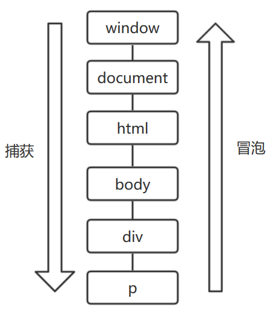

#### 1. 监听函数

浏览器的事件模型，就是通过监听函数（listener）对事件做出反应。事件发生后，浏览器监听到了这个事件，就会执行对应的监听函数

JS有三种方法可以为事件绑定监听函数

##### 1.1 HTML的 on- 属性（HTML事件处理程序）

 HTML 语言允许在元素的属性中，直接定义某些事件的监听代码。 

```html
<body onload="doSomething()">
<div onclick="console.log('触发事件')">
```

?> 注意，这些属性的值是将会执行的代码，而不是一个函数。 

```html
<!-- 正确 -->
<body onload="doSomething()">

<!-- 错误 -->
<body onload="doSomething">
```

使用这个方法指定的监听代码，只会在冒泡阶段触发。下面代码由于只在冒泡阶段触发，所以点击结果先输出`1`，再输出`2`

```html
<div onClick="console.log(2)">
  <button onClick="console.log(1)">点击</button>
</div>
```

也可以用`setAttribute`方法，效果一样

```js
el.setAttribute('onclick', 'doSomething()');
// 等同于
// <Element onclick="doSomething()">
```

##### 1.2 元素节点的事件属性（DOM0事件处理程序）

元素节点对象的事件属性，同样可以指定监听函数。

```
window.onload = doSomething;

div.onclick = function (event) {
  console.log('触发事件');
};
```

使用这个方法指定的监听函数，也是只会在冒泡阶段触发。且只能指定一个监听函数，后面的会覆盖前面的。

注意，这种方法与 HTML 的`on-`属性的差异是，它的值是函数名（`doSomething`），而不像后者，必须给出完整的监听代码（`doSomething()`）。

可通过`btn.onclick = null;`来删除监听函数。

?> IE8及以下均支持

##### 1.3 EventTarget.addEventListener()（DOM2事件处理程序）

所有 DOM 节点实例都有`addEventListener`方法，用来为该节点定义事件的监听函数。详见 `EventTarget`章节 

```
window.addEventListener('load', doSomething, false);
```

?> 注：IE8和IE8以下不支持DOM2，用IE私有事件流代替，详见《JS高级程序设计》

##### 1.4 小结

上面三种方法，第一种“HTML 的 on- 属性”，违反了 HTML 与 JavaScript 代码相分离的原则，将两者写在一起，不利于代码分工，不推荐使用。

第二种“元素节点的事件属性”的缺点在于，同一个事件只能定义一个监听函数，后一次定义会覆盖前一次。因此，也不推荐使用。

第三种`EventTarget.addEventListener`是推荐的指定监听函数的方法。它有如下优点：

- 同一个事件可以添加多个监听函数。
- 能够指定在哪个阶段（捕获阶段还是冒泡阶段）触发监听函数。
- 除了 DOM 节点，其他对象（比如`window`、`XMLHttpRequest`等）也有这个接口，它等于是整个 JavaScript 统一的监听函数接口。

#### 2. this的指向

事件处理程序内部，对象`this` 始终等于`currentTarget` ，就是事件所在节点，而`event.target`指向的是触发事件的最初节点。

```html
<div id="root">
    <div id="first">
        <div id="second">
        </div>
    </div>
</div>

<script>
    var root = document.getElementById("root");
    root.onclick = function () {
        console.log(this.id);
    }
</script>
```

无论点击那个`div`返回的都是`root`

#### 3. 事件的传播

一个事件发生后，会在子元素和父元素之间传播（propagation）。这种传播分成三个阶段。

- **第一阶段**：从`window`对象传导到目标节点（上层传到底层），称为“**捕获**阶段”（capture phase）。
- **第二阶段**：在目标节点上触发，称为“**目标**阶段”（target phase）。
- **第三阶段**：从目标节点传导回`window`对象（从底层传回上层），称为“**冒泡**阶段”（bubbling phase）。

这种三阶段的传播模型，使得同一个事件会在多个节点上触发。例：

```html
<div>
  <p>点击</p>
</div>
```

如果对这两个节点，都设置`click`事件的监听函数（每个节点的捕获阶段和冒泡阶段，各设置一个监听函数），共计设置四个监听函数。然后，对`<p>`点击，`click`事件会触发四次。

```js
var phases = {
  1: 'capture',
  2: 'target',
  3: 'bubble'
};

var div = document.querySelector('div');
var p = document.querySelector('p');

div.addEventListener('click', callback, true);
p.addEventListener('click', callback, true);
div.addEventListener('click', callback, false);
p.addEventListener('click', callback, false);

function callback(event) {
  var tag = event.currentTarget.tagName;
  var phase = phases[event.eventPhase];
  console.log("Tag: '" + tag + "'. EventPhase: '" + phase + "'");
}

// 点击以后的结果
// Tag: 'DIV'. EventPhase: 'capture'
// Tag: 'P'. EventPhase: 'target'
// Tag: 'P'. EventPhase: 'target'
// Tag: 'DIV'. EventPhase: 'bubble'
```

上面代码表示，`click`事件被触发了四次：`<div>`节点的捕获阶段和冒泡阶段各1次，`<p>`节点的目标阶段触发了2次。

事件传播最上层对象是`window`，接着依次是`document`，`html`，`body`，`div`，`p`



?> 注：由于IE8及以下只支持事件冒泡（不支持DOM事件流），事件捕获很少被使用。除非特殊需求，否则一般使用事件冒泡

#### 4. 事件的代理

由于事件会在冒泡阶段向上传播到父节点，因此可以把子节点的监听函数定义在父节点上，由父节点的监听函数统一处理多个子元素的事件。这种方法叫做事件的代理（delegation）。

```js
var ul = document.querySelector('ul');

ul.addEventListener('click', function (event) {
  if (event.target.tagName.toLowerCase() === 'li') {
    // some code
  }
});
//上面的代码很有参考性
```

上面代码中，`click`事件的监听函数定义在`<ul>`节点，但是实际上，它处理的是子节点`<li>`的`click`事件。这样做的好处是，只要定义一个监听函数，就能处理多个子节点的事件，而不用在每个`<li>`节点上定义监听函数。而且以后再添加子节点，监听函数依然有效。

如果希望事件到某个节点为止，不再传播，可以使用事件对象的`stopPropagation`方法。

```js
// 事件传播到 p 元素后，就不再向下传播了
p.addEventListener('click', function (event) {
  event.stopPropagation();
}, true);

// 事件冒泡到 p 元素后，就不再向上冒泡了
p.addEventListener('click', function (event) {
  event.stopPropagation();
}, false);
```

上面代码中，`stopPropagation`方法分别在捕获阶段和冒泡阶段，阻止了事件的传播。

?> 理解：阻止的是你这个`click`动作的传播，监听函数仍在那里，所以同一个节点上同一事件设置多个监听函数，只需在第一个里面设置`even.stopPropagation();`就启用了`event`方法，阻止此节点`click`事件传播，**父元素设置了`stopPropagation`，其后代的`click`事件传播到父元素就被截断了**。

但是，`stopPropagation`方法只会阻止事件的传播，不会阻止该事件触发`<p>`节点的其他`click`事件的监听函数。也就是说，不是彻底取消`click`事件。（就是说其他`click`可以正常触发，但不会继续冒泡）

```js
p.addEventListener('click', function (event) {
  event.stopPropagation();
  console.log(1);
});

p.addEventListener('click', function(event) {
  // 会触发，但不会冒泡
  console.log(2);
});
```

上面代码中，`p`元素绑定了两个`click`事件的监听函数。`stopPropagation`方法只能阻止这个事件的传播，不能取消这个事件，因此，第二个监听函数会触发。输出结果会先是1，然后是2。

如果想要彻底取消该事件，不再触发后面所有`click`的监听函数，可以使用`stopImmediatePropagation`方法。

```js
p.addEventListener('click', function (event) {
  event.stopImmediatePropagation();
  console.log(1);
});

p.addEventListener('click', function(event) {
  // 不会被触发
  console.log(2);
});
```

上面代码中，`stopImmediatePropagation`方法可以彻底取消这个事件，使得后面绑定的所有`click`监听函数都不再触发。所以，只会输出1，不会输出2。

