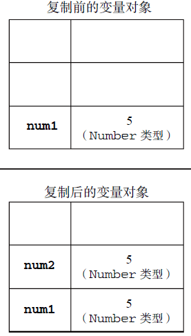
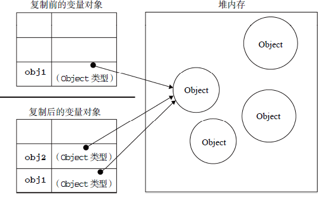

#### 1. 基本类型和引用类型

ECMAScript 变量可能包含两种不同数据类型的值：基本类型值和引用类型值，**基本类型值**指的是简单的数据段，而**引用类型值**指那些可能由多个值构成的对象

##### 1.1 动态的属性

对于引用类型的值我们可以为其添加属性和方法，也可以删除其属性和方法，但不能给基本类型的值添加属性（尽管这样不会报错，但不会生效）

##### 1.2 复制变量值

除了保存的方式不同之外，在从一个变量向另一个变量复制基本类型值和引用类型值时，也存在不同

```js
var num1 = 5;
var num2 = num1;
```

`num2`中的5 与`num1` 中的5 是完全独立的，该值只是`num1` 中5 的一个副本，此后，这两个变量可以参与任何操作而不会相互影响，下图展示了复制基本类型值的过程：



当从一个变量向另一个变量复制引用类型的值时，同样也会将存储在变量对象中的值复制一份放到为新变量分配的空间中。不同的是，这个值的副本**实际上是一个指针**，而这个**指针指向存储在堆中的一个对象**。复制操作结束后，两个变量实际上将引用同一个对象。因此，改变其中一个变量，就会影响另一个变量，如下面的例子所示

```js
var obj1 = new Object();
var obj2 = obj1;
obj1.name = "Nicholas";
alert(obj2.name); //"Nicholas"
```

`obj1`和`obj2`都指向同一个对象，当为`obj1`添加`name`属性后，可以通过`obj2`来访问这个属性，下图展示了这种关系



##### 1.3 传递参数

JS中所有函数的参数都是按值传递的，也就是说把**函数外部的值复制给函数的内部参数，就像复制变量一样**（不是把这个数直接代入进去）

在向参数传递基本类型的值时，被传递的值会被**复制给一个局部变量**（即命名参数，或者用ECMAScript 的概念来说，就是arguments 对象中的一个元素）。在向参数传递引用类型的值时，会把这个值在**内存中的地址复制给一个局部变量**，因此**这个局部变量的变化会反映在函数的外部**

**基本类型的传递为传值传递，复合类型的传递为传址传递**

```js
function addTen(num) {
    num += 10;
	return num;
}
var count = 20;
var result = addTen(count);
count//20
result//30
```

由此可见是复制变量到函数`argument`对象中了，并不是将值代入（也可以理解为局部变量）

```js
function addName(obj) {
    obj.name = "Jack";
}
var mainInfo = new Object();
addName(mainInfo);
mainInfo//{name: "Jack"}
```

由此可见是按值传递参数的，而不是将值代入，和复制变量一样（这里和上面不一样，这里函数内部是可以修改外部的，因为`obj`指向的对象和`mainInfo`为同一个，`obj`中修改对象参数，`mainInfo`也会改变），如果将`obj`指向一个新的对象，那么不会影响到`mainInfo`，和复制变量类似

```js
function addName(obj) {
    obj.name = "Jack";
    obj = new Object();
    obj.name = "Lucy";
    obj.age = "21";
}
var mainInfo = new Object();
addName(mainInfo);
mainInfo//{name: "Jack"}
```

当在函数内部重写`obj` 时，这个变量引用的就是一个局部对象了。而这个局部对象会在函数执行完毕后立即被销毁

##### 1.4 检测类型

要检测一个数据是不是基本数据类型，可使用`typeof`操作符，但在检测引用类型的值时，`typeof`用处不大。若果我们想判断某个对象是什么类型的对象，则可以用`instanceof`操作符，语法如下：

```js
variable instanceof constructor
```

如果变量是给定的引用类型（根据原型链识别），那么`instanceof`就会返回`true`，例：

```js
person instanceof Object;
colors instanceof Array;
pattern instanceof RegExp;
```

根据规定，所有引用类型的值都是`Object`的实例，因此检测一个引用类型和`Object`构造函数时，始终会返回`true`

#### 2. 执行环境及作用域

执行环境（execution context）是JS中的重要概念，每个执行环境都有一个与之关联的变量对象（variable object），环境中定义的所有变量和函数都保存在这个对象中。虽然我们编写的代码无法访问这个对象，但解析器在处理数据时会在后台使用它

全局执行环境是最外围的一个执行环境。根据ECMAScript 实现所在的宿主环境不同，表示执行环境的对象也不一样。**在Web 浏览器中，全局执行环境被认为是window 对象**，因此**所有全局变量和函数都是作为window 对象的属性和方法创建的**。**某个执行环境中的所有代码执行完毕后，该环境被销毁，保存在其中的所有变量和函数定义也随之销毁**（**全局执行环境直到应用程序退出——例如关闭网页或浏览器——时才会被销毁**）

每个函数都有自己的执行环境。当执行流进入一个函数时，函数的环境就会被推入一个环境栈中。而在函数执行之后，栈将其环境弹出，把控制权返回给之前的执行环境。ECMAScript 程序中的执行流正是由这个机制控制着。

当代码在一个环境中执行时，会创建变量对象的一个**作用域链**，作用域链的前端是当前执行代码所在的环境变量对象，下一个则是包裹此环境的外部环境。（由此可见作用域是向外搜寻的，并不会向里搜寻，所以外部无法访问局部变量）

##### 2.1 延长作用域链

以下两种情况会在作用域链的前端创建一个新的变量对象

- try-catch语句的catch块
- with语句

##### 2.2 没有块级作用域

JS没有块级作用域，不像其他语言

#### 3. 垃圾收集

JS具有自动垃圾收集机制，执行环境会负责管理代码执行过程中使用的内存。而C和C++之类的语言中，开发人员需要手工跟踪内存使用情况。垃圾收集器的原理很简单：找到那些不再继续使用的变量，然后释放其内存

##### 3.1 标记清除

JS中最常用的垃圾收集方法就是**标记清除**，当变量进入环境会被标记为“进入环境”，离开环境会别标记为"离开环境"。然后，它会去掉环境中的变量以及被环境中的变量引用的变量的标记。而在此之后再被加上标记的变量将被视为准备删除的变量，原因是环境中的变量已经无法访问到这些变量了。最后，垃圾收集器完成内存清除工作，销毁那些带标记的值并回收它们所占用的内存空间

##### **3.2** 引用计数

另一种不太常见的垃圾收集策略叫做**引用计数**，当一个值的引用次数为0的时候就说明已经无法访问这个值了，其占用的内存空间会被回收。

但是有一个严重的问题就是**循环引用**，引用次数永远不会为0。由于IE中一部分对象不是原生JS对象，例如BOM和DOM（使用C++以COM对象的形式实现，而COM使用的就是引用计数）

所以在IE9中将BOM和DOM换成了真正的JS对象。这样就避免了两种垃圾收集算法并存导致的问题，也消除了常见的内存泄漏问题

##### 3.3 管理内存

而优化内存占用的最佳方式，就是为执行中的代码只保存必要的数据。一旦数据不再有用，最好通过将其值设置为`null` 来释放其引用——这个做法叫做解除引用（dereferencing）。这一做法适用于大多数全局变量和全局对象的属性。局部变量会在它们离开执行环境时自动被解除引用