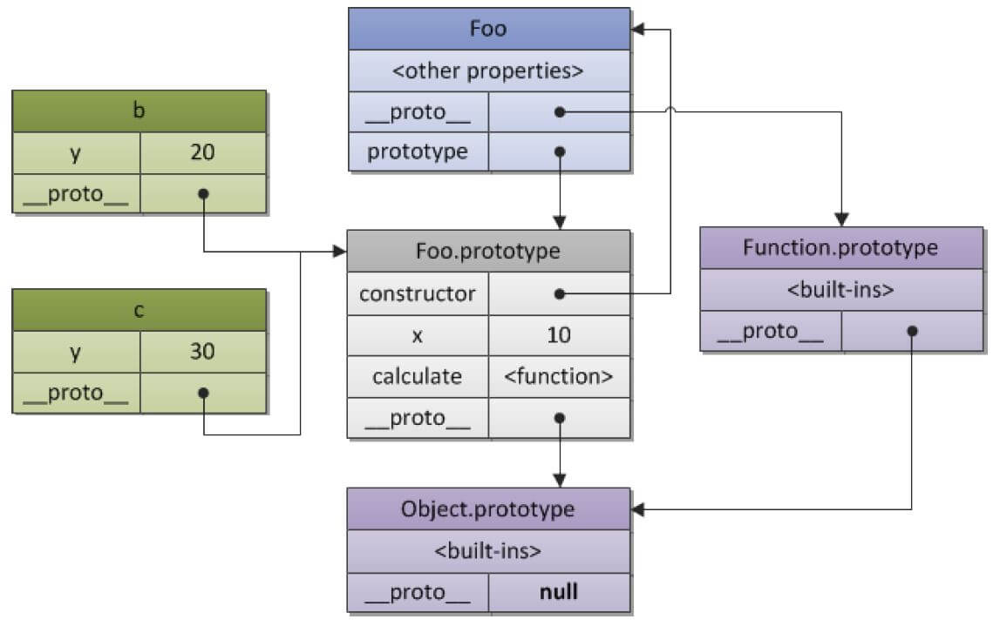
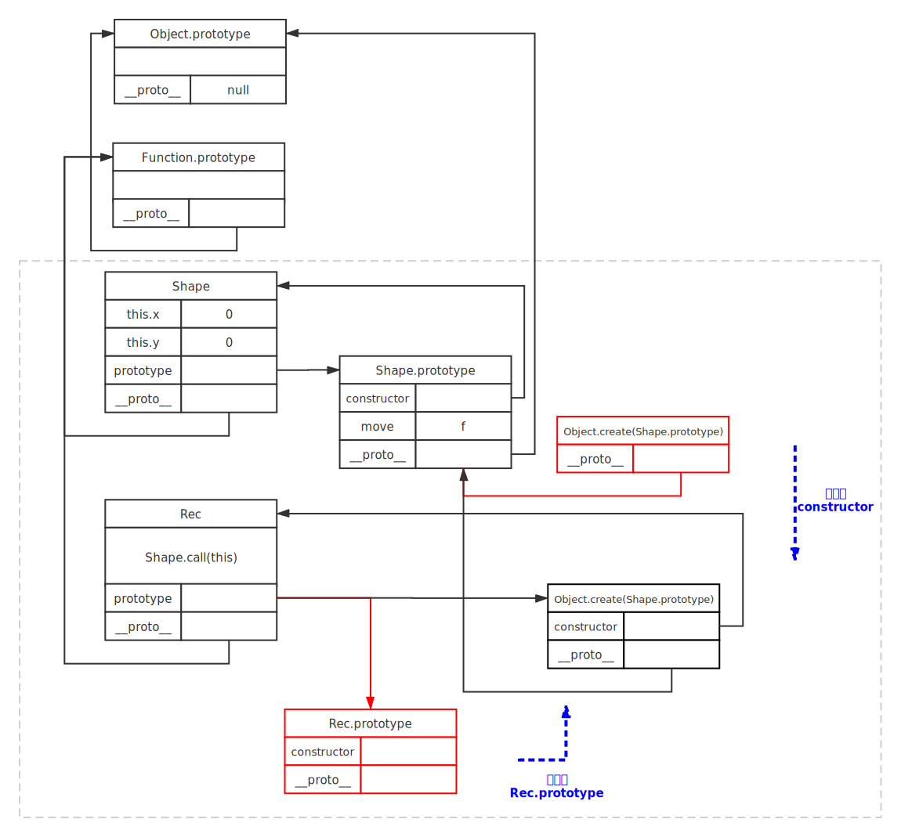

面向对象编程很重要的一方面就是对象的继承，A对象通过继承B对象，就能直接拥有B对象的所有属性和方法。这对代码的复用非常有用

大部分面向对象的编程语言，都是通过“类”（class）实现对象的继承。传统上，JavaScript 语言的继承不通过 class，而是通过“原型对象”（prototype）实现，本章介绍 JavaScript 的原型链继承。

ES6引入了class语法，详见《[ES6标准入门](http://es6.ruanyifeng.com/)》

#### 1. 原型对象概述

##### 1.1 构造函数的缺点

JavaScript 通过构造函数生成新对象，因此构造函数可以视为对象的模板。实例对象的属性和方法，可以定义在构造函数内部。

```js
function Cat (name, color) {
  this.name = name;
  this.color = color;
}
var cat1 = new Cat('大毛', '白色');
cat1.name // '大毛'
cat1.color // '白色'
```

通过构造函数为实例对象定义属性，虽然方便，但有一个缺点。同一个构造函数的多个实例之间无法共享属性，从而造成系统资源浪费

```js
function Cat(name, color) {
  this.name = name;
  this.color = color;
  this.meow = function () {
    console.log('喵喵');
  };
}
var cat1 = new Cat('大毛', '白色');
var cat2 = new Cat('二毛', '黑色');
cat1.meow === cat2.meow
// false
```

上面代码中，每新建一个实例，就会新建一个`meow`方法，没必要而且浪费资源。而`meow`方法都是同样的行为，应该共享使用。

解决这个问题就是用JS的原型对象（prototype）

##### 1.2 prototype 属性的作用

JS继承机制的设计思想就是，原型对象的所有属性和方法，都能被实例对象共享。

下面看如何为对象指定原型。JS规定每一个函数都有`prototype`属性，指向一个对象（注意：只有函数才有这个属性，其他是内部的指针`[[prototype]]`，或用`__proto__`替代）

```js
function f() {}
typeof f.prototype // "object"
```

对于普通函数来说，该属性基本无用。但对构造函数来说，生成实例的时候，该属性会自动成为实例对象的原型

```js
function Animal(name) {
  this.name = name;
}
Animal.prototype.color = 'white';
var cat1 = new Animal('大毛');
var cat2 = new Animal('二毛');
cat1.color // 'white'
cat2.color // 'white'
```

原型对象的属性不是实例对象自身的属性。只要修改原型对象，变动就立刻会体现在**所有**实例对象上

```js
Animal.prototype.color = 'yellow';
cat1.color // "yellow"
cat2.color // "yellow"
```

上述代码中，原型对象的`color`属性值变为`yellow`，两个实例对象的`color`属性立刻变了。这是因为实例对象其实没有`color`属性，都是读取原型对象的`color`属性。当实例对象使用属性或方法时，若自身没有，便会去原型对象上寻找该属性或方法（如果有，就不会去原型上找）

总结：原型对象的作用，就是定义所有实例对象共享的属性和方法。这也是它被称为原型对象的原因，而实例对象可以视作从原型对象衍生出来的子对象

**自我小结**：

构造函数返回的是一个**对象**。无论什么时候只有函数有`prototype`属性，对象只有一个内部指针`[[prototype]]`（可用`__proto__`找出）指向它的原型（而构造函数`prototype`指向的就是它的实例所指向的原型）。用字面量生成一个对象`var obj = {a:1, b:2}`，相当于用`Object`构造函数`new`出一个实例。所以`obj.__proto__`（没有`obj.prototype`）会指向`Object.prototype`，这样看来，实例和构造函数之间没什么关系，实例关系的是它的`__proto__`指向了构造函数的`prototype`。其他构造函数例如：`Function`，`Array`，`Date`，`Number Boolean String`（包装对象）都相当于实例（包装对象必须用`new`才会是实例，而`Function`和`Array`均可用字面量的方法表示）（现在理解了为什么每用一个`function`生成函数，它就是一个新的实例，所以`(function(){}) !== (function(){})`）

下面用一个例子来讲解原型，可以看到函数`Foo`的原型是`Function.prototype`，而它的`prototype`属性指向其`b`，`c`的原型

```js
function Foo(y) {
    this.y = y;
}
Foo.prototype.x = 10;
Foo.prototype.calculate = function (z) {
    return this.x + this.y + z;
};
var b = new Foo(20);
var c = new Foo(30);
b.calculate(30);//60
c.calculate(40);//80
```



##### 1.3 原型链

JS规定所有对象都有自己的原型对象（prototype）。一方面，任何一个对象都可充当其他对象的原型；另一方面，由于原型对象也是对象，所以它也有自己的原型。这样就会形成一个“原型链”（prototype chain）：对象到原型，再到原型的原型...

所有对象的原型都可以上溯到`Object.prototype`，即`Object`构造函数的`prototype`属性。所以，所有对象都继承了`Object.prototype`的属性。而`Object.prototype`的原型是`null`，没有任何属性和方法，也没有自己的原型，所以原型链的尽头就是`null`

```js
Object.getPrototypeOf(Object.prototype)
// null
```

读取对象某个属性时，JS会先寻找对象本身属性，若没有便会一级一级的向上找，属性在越上层，对性能的影响越大。要是寻找某个不存在的属性，会遍历整个原型链（更影响性能了）

举例来说，如果让构造函数的`prototype`属性指向一个数组，就意味着实例对象可以调用数组方法。

```js
var MyArray = function () {};
MyArray.prototype = new Array();
MyArray.prototype.constructor = MyArray;
var mine = new MyArray();
mine.push(1, 2, 3);
mine.length // 3
mine instanceof Array // true
```

##### 1.4 constructor 属性

`prototype`对象有一个`constructor`属性，默认指向`prototype`对象所在的构造函数（`prototype`属性只有函数才有，对象是没有的）

`prototype`上的`constructor`指向构造函数（记住那个图），`P`的`constructor`指向`Function`构造函数（因为`P`继承`Function`的`prototype`，也就继承了里面`constructor`属性）

```js
function P() {}
P.prototype.constructor === P // true
P.constructor === Function //true
```

由于`constructor`属性定义在`prototype`对象上面，意味着可以被所有实例对象继承。

```js
function P() {}
var p = new P();
p.constructor === P // true
p.constructor === P.prototype.constructor // true
p.hasOwnProperty('constructor') // false
```

`constructor`的一个作用是得知某个实例对象由哪个构造函数产生

```js
function F() {};
var f = new F();
f.constructor === F // true
f.constructor === RegExp // false
```

另一个作用是可以从一个实例对象新建另一个实例

```js
function Constr() {}
var x = new Constr();
var y = new x.constructor();
y instanceof Constr // true
```

上面代码中，`x`是构造函数`Constr`的实例，可以从`x.constructor`间接调用构造函数。这使得在实例方法中，调用自身的构造函数成为可能。

```js
Constr.prototype.createCopy = function () {
  return new this.constructor();
};
```

上面代码中，`createCopy`方法调用构造函数，新建另一个实例。

`constructor`属性表示原型对象与构造函数之间的关联关系，如果修改了原型对象，一般会同时修改`constructor`属性，防止引用的时候出错。

```js
function Person(name) {
  this.name = name;
}
Person.prototype.constructor === Person // true
Person.prototype = {
  method: function () {}
};
Person.prototype.constructor === Person // false
Person.prototype.constructor === Object // true
```

`Person.prototype`本来指向的是创建函数时候默认生成的`prototype`，现在修改了属性的指向，默认的`prototype`里的`constructor`也就没有了（还是小结的那张图原理），由于`Person`的新原型是一个普通对象，所以`Person.prototype.constructor`变成了`Object`。

所以，修改原型对象时，一般要同时修改`constructor`属性的指向。

```js
// 坏的写法
C.prototype = {
  method1: function (...) { ... },
  // ...
};
// 好的写法
C.prototype = {
  constructor: C,
  method1: function (...) { ... },
  // ...
};
// 更好的写法
C.prototype.method1 = function (...) { ... };
```

上面代码中，要么将`constructor`属性重新指向原来的构造函数，要么只在原型对象上添加方法（这样只是修改，并没有重新指向），这样可以保证`instanceof`运算符不会失真。

如果不能确定`constructor`属性是什么函数，还有一个办法：通过`name`属性，从实例得到构造函数的名称。

```js
function Foo() {}
var f = new Foo();
f.constructor.name // "Foo"
```

#### 2. instanceof 运算符

`instanceof`运算符返回一个布尔值，表示对象是否为某个构造函数的实例。

```js
var v = new Vehicle();
v instanceof Vehicle // true
```

`instanceof`会检查右边构造函数的原型对象（`prototype`）是否在左边对象的原型链上。所以下面两种写法等价

```js
v instanceof Vehicle
// 等同于
Vehicle.prototype.isPrototypeOf(v)
```

由于`instanceof`检查整个原型链，因此同一个实例对象，可能会对多个构造函数都返回`true`。

```js
var d = new Date();
d instanceof Date // true
d instanceof Object // true
```

由于任意对象（除了`null`）都是`Object`的实例，所以`instanceof`运算符可以判断一个值是否为`null`

```js
var obj = { foo: 123 };
obj instanceof Object // true
null instanceof Object // false
```

有种特殊情况，就是用`null`生成一个实例，那这样这个实例就和`Object`平级了，实例用`instanceof`就会返回`false`

```js
var obj = Object.create(null);
typeof obj//"object"
Object.create(null) instanceof Object //false
```

`instanceof`运算符只能用于对象，不适用原始类型值，可用来判断值类型

```js
var x = [1, 2, 3];
var y = {};
x instanceof Array // true
y instanceof Object // true
```

```js
var s = 'hello';
s instanceof String // false
```

上述`s`不是`String`的实例（之前的小结），除非把`s`弄成包装对象

此外，对于`undefined`和`null`，`instanceof`运算符总是返回`false`。

```js
undefined instanceof Object // false
null instanceof Object // false
```

利用`instanceof`运算符，还可以巧妙地解决，调用构造函数时，忘了加`new`命令的问题。

```js
function Fubar (foo, bar) {
  if (this instanceof Fubar) {
    this._foo = foo;
    this._bar = bar;
  } else {
    return new Fubar(foo, bar);
  }
}
```

#### 3. 构造函数的继承

让一个构造函数继承另一个构造函数，是非常常见的需求。可分两步实现，第一步构造函数继承，第二步构造函数`prototype`继承并重定向`constructor`，下图清晰的显示了之间的关系



第一步在子类的构造函数中，调用父类的构造函数

```js
function Sub(value) {
  Super.call(this);
  this.prop = value;
}
```

上面代码中，`Sub`是子类的构造函数，`this`是子类的实例。在实例上调用父类的构造函数`Super`，就会让子类实例具有父类实例的属性。

第二步，是让子类的原型指向父类的原型，这样子类就可以继承父类原型。

```js
Sub.prototype = Object.create(Super.prototype);
Sub.prototype.constructor = Sub;
Sub.prototype.method = '...';
```

上面代码中，`Sub.prototype`是子类的原型，**要将它赋值为`Object.create(Super.prototype)`，而不是直接等于`Super.prototype`。否则后面两行对`Sub.prototype`的操作，会连父类的原型`Super.prototype`一起修改掉（看图）**。

另外一种写法是`Sub.prototype`等于一个父类实例。

```js
Sub.prototype = new Super();
```

上面这种写法也有继承的效果，但是子类会具有父类实例的方法。有时，这可能不是我们需要的，所以不推荐使用这种写法。

举例来说，下面是一个`Shape`构造函数。

```js
function Shape() {
  this.x = 0;
  this.y = 0;
}
Shape.prototype.move = function (x, y) {
  this.x += x;
  this.y += y;
  console.info('Shape moved.');
};
```

我们需要让`Rectangle`构造函数继承`Shape`。

```js
// 第一步，子类继承父类的实例
function Rectangle() {
  Shape.call(this); // 调用父类构造函数
}
// 另一种写法
function Rectangle() {
  this.base = Shape;
  this.base();
}
// 第二步，子类继承父类的原型
Rectangle.prototype = Object.create(Shape.prototype);
Rectangle.prototype.constructor = Rectangle;
```

采用这样的写法以后，`instanceof`运算符会对子类和父类的构造函数，都返回`true`。

```js
var rect = new Rectangle();
rect instanceof Rectangle  // true
rect instanceof Shape  // true
```

上面代码中，子类是整体继承父类。有时只需要单个方法的继承，这时可以采用下面的写法。

```js
//单个方法继承
ClassB.prototype.print = function() {
  ClassA.prototype.print.call(this);
  // some code
}
```

上面代码中，子类`B`的`print`方法先调用父类`A`的`print`方法，再部署自己的代码。这就等于继承了父类`A`的`print`方法。

#### 4. 多重继承

JavaScript 不提供多重继承功能，即不允许一个对象同时继承多个对象。但是，可以通过变通方法，实现这个功能。

```js
function M1() {
  this.hello = 'hello';
}
function M2() {
  this.world = 'world';
}
function S() {
  M1.call(this);
  M2.call(this);
}
// 继承 M1
S.prototype = Object.create(M1.prototype);
// 继承链上加入 M2
Object.assign(S.prototype, M2.prototype);
// 指定构造函数
S.prototype.constructor = S;
var s = new S();
s.hello // 'hello'
s.world // 'world'
```

上面代码中，子类`S`同时继承了父类`M1`和`M2`。这种模式又称为 Mixin（混入）。

#### 5. 模块

随着网站逐渐变成“互联网应用程序”，嵌入网页的 JavaScript 代码越来越庞大，越来越复杂。网页越来越像桌面程序，需要一个团队分工协作、进度管理、单元测试等等……开发者必须使用软件工程的方法，管理网页的业务逻辑。

JavaScript 模块化编程，已经成为一个迫切的需求。理想情况下，开发者只需要实现核心的业务逻辑，其他都可以加载别人已经写好的模块。

但是，JavaScript 不是一种模块化编程语言，ES6 才开始支持“类”和“模块”。下面介绍传统的做法，如何利用对象实现模块的效果。

##### 5.1 基本的实现方法

模块是实现特定功能的一组属性和方法的封装。

简单的做法是把模块写成一个对象，所有的模块成员都放到这个对象里面。

```js
var module1 = new Object({
　_count : 0,
　m1 : function (){
　　//...
　},
　m2 : function (){
  　//...
　}
});
```

上面的函数`m1`和`m2`，都封装在`module1`对象里。使用的时候，就是调用这个对象的属性。

```js
module1.m1();
```

但是，这样的写法会暴露所有模块成员，内部状态可以被外部改写。比如，外部代码可以直接改变内部计数器的值。

```js
module1._count = 5;
```

##### 5.2 封装私有变量：构造函数的写法

我们可以利用构造函数，封装私有变量。

```js
function StringBuilder() {
  var buffer = [];
  this.add = function (str) {
     buffer.push(str);
  };
  this.toString = function () {
    return buffer.join('');
  };
}
```

上面代码中，`buffer`是模块的私有变量。一旦生成实例对象，外部是无法直接访问`buffer`的。但是，这种方法将私有变量封装在构造函数中，导致构造函数与实例对象是一体的，总是存在于内存之中，无法在使用完成后清除。这意味着，构造函数有双重作用，既用来塑造实例对象，又用来保存实例对象的数据，违背了构造函数与实例对象在数据上相分离的原则（即实例对象的数据，不应该保存在实例对象以外）。同时，非常耗费内存。

```js
function StringBuilder() {
  this._buffer = [];
}
StringBuilder.prototype = {
  constructor: StringBuilder,
  add: function (str) {
    this._buffer.push(str);
  },
  toString: function () {
    return this._buffer.join('');
  }
};
```

这种方法将私有变量放入实例对象中，好处是看上去更自然，但是它的私有变量可以从外部读写，不是很安全。

##### 5.3 封装私有变量：立即执行函数的写法

另一种做法是使用“立即执行函数”（Immediately-Invoked Function Expression，IIFE），将相关的属性和方法封装在一个函数作用域里面，可以达到不暴露私有成员的目的。

```js
var module1 = (function () {
　var _count = 0;
　var m1 = function () {
　  //...
　};
　var m2 = function () {
　　//...
　};
　return {
　　m1 : m1,
　　m2 : m2
　};
})();
```

使用上面的写法，外部代码无法读取内部的`_count`变量。

```js
console.info(module1._count); //undefined
```

上面的`module1`就是 JavaScript 模块的基本写法。下面，再对这种写法进行加工。

##### 5.4 模块的放大模式

如果一个模块很大，必须分成几个部分，或者一个模块需要继承另一个模块，这时就有必要采用“放大模式”（augmentation）。

```js
var module1 = (function (mod){
　mod.m3 = function () {
　　//...
　};
　return mod;
})(module1);
```

上面的代码为`module1`模块添加了一个新方法`m3()`，然后返回新的`module1`模块。

在浏览器环境中，模块的各个部分通常都是从网上获取的，有时无法知道哪个部分会先加载。如果采用上面的写法，第一个执行的部分有可能加载一个不存在空对象，这时就要采用"宽放大模式"（Loose augmentation）。

```js
var module1 = (function (mod) {
　//...
　return mod;
})(window.module1 || {});
```

与"放大模式"相比，“宽放大模式”就是“立即执行函数”的参数可以是空对象。

##### 5.5 输入全局变量

独立性是模块的重要特点，模块内部最好不与程序的其他部分直接交互。

为了在模块内部调用全局变量，必须显式地将其他变量输入模块。

```js
var module1 = (function ($, YAHOO) {
　//...
})(jQuery, YAHOO);
```

上面的`module1`模块需要使用 jQuery 库和 YUI 库，就把这两个库（其实是两个模块）当作参数输入`module1`。这样做除了保证模块的独立性，还使得模块之间的依赖关系变得明显。

立即执行函数还可以起到命名空间的作用。

```js
(function($, window, document) {
  function go(num) {
  }
  function handleEvents() {
  }
  function initialize() {
  }
  function dieCarouselDie() {
  }
  //attach to the global scope
  window.finalCarousel = {
    init : initialize,
    destroy : dieCarouselDie
  }
})( jQuery, window, document );
```

上面代码中，`finalCarousel`对象输出到全局，对外暴露`init`和`destroy`接口，内部方法`go`、`handleEvents`、`initialize`、`dieCarouselDie`都是外部无法调用的。

