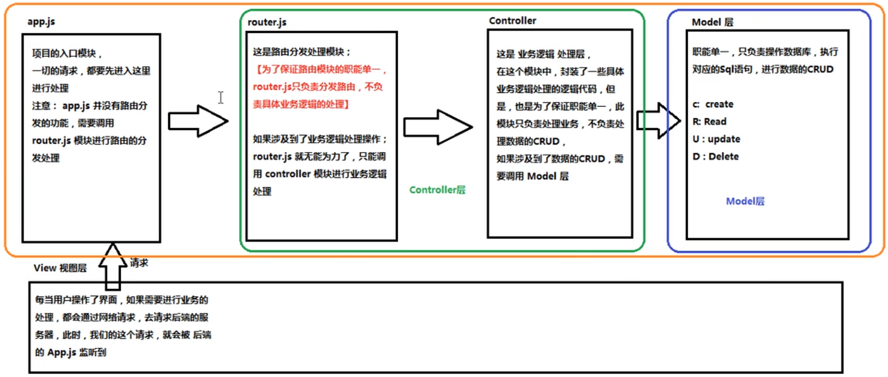
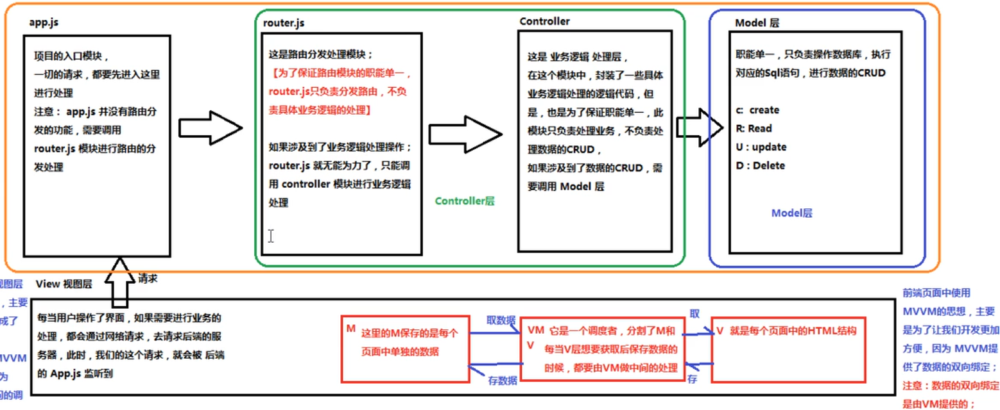

#### 1. MVC和MVVM对比

MVC是后端



MVVM是前端视图层的分层开发思想，主要把每个页面分成了M、V和VM，其中，VM是MVVM思想的核心；VM是M和V之间的调度者



在实例中体验MVVM

```html
<body>
    <!-- 这里对应的就是V -->
    <div id="app">
        <p>{{msg}}</p>
    </div>

    <script src="https://cdn.jsdelivr.net/npm/vue/dist/vue.js"></script>
    <script>
        // Vue实例对应的就是VM
        var vm = new Vue({
            el: '#app', // 等同document.getElementById('app'),Vue实例控制的区域
            data: { // data对应的就是M
                msg: 'Hello' // 不再需要手动操作DOM元素了
            }
        })
    </script>
</body>
```

#### 2. v-cloak、v-text、v-html

- `v-cloak`：解决插值表达式闪烁问题（当网速很慢时候，可能先显示`{{msg}}`，然后再显示内容）。在有插值表达式的标签上加上`v-cloak`，样式设置为`display:none`

  ```html
  <body>
      <div id="app">
          <p v-cloak>{{msg}}</p>
      </div>
  
      <script src="https://cdn.jsdelivr.net/npm/vue/dist/vue.js"></script>
      <script>
          var vm = new Vue({
              el: '#app',
              data: {
                  msg: 'Hello'
              }
          })
      </script>
  </body>
  ```

  ```css
  [v-cloak] {
      display: none;
  }
  ```

- `v-text`：和`{{}}`作用类似。区别：`v-text`没有闪烁问题；`v-text`会覆盖元素中的原本内容

  ```html
  <body>
  <div id="app">
      <p v-cloak>{{msg}}</p>
      <p v-text="msg">你好</p>
  </div>
  
      <script src="https://cdn.jsdelivr.net/npm/vue/dist/vue.js"></script>
      <script>
          var vm = new Vue({
              el: '#app',
              data: {
                  msg: 'Hello'
              }
          })
      </script>
  </body>
  ```

- `v-html`：和`v-text`类似，但他会转义html。类似`innerHTML`和`innerText`区别

#### 3. v-bind

- `v-bind`：用于绑定属性的指令。**Vue指令的`""`中视为ECMAJS代码，但是不能写DOM代码**，所以下面可以用字符串拼接。

  ```html
  <input type="text" v-bind:title="myTitle + '123'">
  
  data: {
  	myTitle: 'btn'
  }
  ```

  `v-bind:title`可简写为`:title`

#### 4. v-on

- `v-on`：用于事件绑定，方法写在`methods`。`v-on`可简写为`@`；加`.`可以添加事件修饰符

  ```html
  <body>
  <div id="app">
      <!-- 不可在“”中操作DOM -->
      		      <!-- v-on:keyup.enter="show" -->
      <input type="text" @keyup.enter="show">
  </div>
  
      <script src="https://cdn.jsdelivr.net/npm/vue/dist/vue.js"></script>
      <script>
          var vm = new Vue({
              el: '#app',
              data: {
                  msg: 'HELLO'
              },
              methods: {
                  show: function() {
                      console.log('HELLO')
                  }
              }
          })
      </script>
  </body>
  ```

- 常用的事件修饰符：
  - `.stop`：阻止冒泡
  - `.prevent`：阻止默认事件
  - `.capture`：添加事件侦听时使用事件捕获模式
  - `.self`：只有事件在该元素本身（不是子元素）触发时才回调
  - `.once`：事件只触发一次

##### 5. 跑马灯实例

总结：

1. `methods`中的全局变量放`data`中
2. 清除定时器原理还是使用插旗法，之前函数执行`clearInterval(timer)`的方法不能用了，当点击过快的时候（频率超过间隔），`timer`会停止
3. 箭头函数可以绑定回调函数中的`this`，替代了之前`var that=this`的方法
4. 疑问：回调函数中的函数怎么写在外面？`setInterval`里的`move`

```html
<body>
    <div id="app" v-cloak>
        <button @click="startMove">start</button>
        <button @click="stopMove">stop</button>
        <p>{{ msg }}</p>
    </div>
    <script src="https://cdn.jsdelivr.net/npm/vue/dist/vue.js"></script>
    <script>
        var vm = new Vue({
            el: '#app',
            data: {
                msg: '大吉大利，恭喜发财',
                timer: null,
                status: true
            },
            methods: {
                startMove() {
                    if (this.timer === null) {
                        this.timer = setInterval(() => {
                            let start = this.msg.slice(0, 1);
                            let end = this.msg.slice(1);
                            // 这里也可使用 + 
                            this.msg = end.concat(start);
                        }, 300);
                    }
                },
                stopMove() {
                    clearInterval(this.timer);
                    // 重置状态
                    this.timer = null;
                }
            },
        })
    </script>
</body>
```

#### 6. v-model

`v-model`只能应用在表单中，实现双向数据绑定，`v-bind`不会双向绑定

```html
<input type="text" v-model="msg">
```

#### 7. 为class绑定类名

- 数组

  ```html
  <div id="app" v-cloak>
      <h1 :class="['italic', 'active']">测试</h1>
  </div>
  ```

- 数组中使用三元表达式

  ```html
  <div id="app" v-cloak>
      <h1 :class="['italic', flag?'active':'']">测试</h1>
  </div>
  
  <script>
      let vm = new Vue({
          el: "#app",
          data: {
              flag: true
          }
      })
  </script>
  ```

- 数组中嵌套对象

  ```html
  <div id="app" v-cloak>
      <h1 :class="['italic', {'active':flag}]">测试</h1>
  </div>
  
  <script>
      let vm = new Vue({
          el: "#app",
          data: {
              flag: true
          }
      })
  </script>
  ```

- 直接使用对象

  ```html
  <div id="app" v-cloak>
      <h1 :class="classObj">测试</h1>
  </div>
  
  <script>
      let vm = new Vue({
          el: "#app",
          data: {
              flag: true,
              // 这里不能再使用flag
              classObj: {"active": true, "italic": true}
          }
      })
  </script>
  ```

#### 8. 绑定内联样式

- 直接书写

  ```html
  <!-- font-style写成fontStyle -->
  <h1 :style="{color:'red',fontStyle:'italic'}">测试</h1>
  
  <!-- 或者键名加引号 -->
  <h1 :style="{color:'red','font-style':'italic'}">测试</h1>
  ```

- 从`data`中引用

  ```html
  <div id="app" v-cloak>
      <h1 :style="style">测试</h1>
  </div>
  
  <!-- js -->
  let vm = new Vue({
      el: "#app",
      data: {
          style: {color:'red','font-style':'italic'}
      },
      methods: {
  
      }
  })
  ```

- 通过数组引用`data`上多个对象

  ```html
  <div id="app" v-cloak>
      <h1 :style="[style1, style2]">测试</h1>
  </div>
  
  <!-- js -->
  let vm = new Vue({
      el: "#app",
      data: {
          style1: {color:'red','font-style':'italic'},
          style2: {'text-decoration': 'underline'}
      },
      methods: {
  
      }
  })
  ```

#### 9. v-for

`v-for`的四种用法

- 迭代数组

  ```html
  <div v-for="(item,index) in list">{{item}} {{index}}</div>
  
  <!-- js -->
  data: {
  	list: [1, 2, 3]
  }
  ```

- 迭代对象中的属性

  ```html
  <div v-for="user in list">{{item.id}}</div>
  
  <!-- js -->
  list: [
      {id:1,name:'xu'},
      {id:2,name:'zhao'},
      {id:3,name:'wang'}
  ]
  ```

- 循环对象，括号内分别对应`(值,键名,索引)`

  ```html
  
  <div v-for="(value,key,index) in list">{{value}} {{key}}</div>
  
  <!-- js -->
  list: {
      id: 1,
      name: 'xu',
      gender: 'male'
  }
  ```

- 循环数字，注意：从1开始循环

  ```html
  <div v-for="count in 10">第{{count}}次循环</div>
  ```

`v-for`中`key`的使用，`key`就是用来绑定对象键和值之间的对应关系。注：`key`属性只能使用`number`或`string`；使用`v-bind`属性绑定

```html
<div v-for="item in list" :key="item.id">{{item.id}}</div>

<!-- js -->
list: [
    {id:1,name:'xu'},
    {id:2,name:'zhao'},
    {id:3,name:'wang'}
]
```

#### 10. v-if和v-show

- `v-if`：每次都会删除或创建元素。较高的切换消耗

  ```html
  <div v-if="flag">test</div>
  ```

- `v-show`：不会重新进行DOM的删除和创建操作，知识切换了`display:none`。较高的初始渲染消耗

  ```html
  <div v-show="flag">test</div>
  ```

  