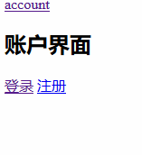

#### 1. 前端路由和后端路由

- 后端路由：所有URL地址都对应服务器上的资源，这个对应关系叫路由

- 前端路由：对于单页应用程序来说，主要通过URL中的`hash`(`#`)来实现不同页面之间的切换，`hash`有一个特点：HTTP请求中不会包含hash相关内容；所以但也程序中的页面跳转主要用`hash`实现。就像`a`链接中的锚点

#### 2. 安装vue-router

[官方文档](https://router.vuejs.org/zh/)

直接下载/CDN

```
https://unpkg.com/vue-router/dist/vue-router.js 
```

或使用NPM

> npm install vue-router

#### 3. 基本使用

路由是用来监测不同组件之间的切换

```html
<div id="app" v-cloak>
    <a href="#/login">登录</a>
    <a href="#/register">注册</a>
    <!-- vue-router提供的元素用来做占位符 -->
    <router-view></router-view>
</div>
```

```js
let login = {
    template: '<h1>登录组件</h1>'
}
let register = {
    template: '<h1>注册组件</h1>'
}
const routerObj = new VueRouter({
    // 路由匹配规则
    // 这个规则上有两个必须属性，path 和 component 。如果路由匹配到的是path则展示components属性对应的组件
    routes: [
        // component的值必须是一个组件的模板对象，不能是组件的引用名称(标签名称)
        {path: '/login',component:login},
        {path: '/register',component:register},
    ]
})
let vm = new Vue({
    el: '#app',
    data: {},
    methods: {},
    // 将路由规则对象注册到vm实例上，用来监听URL地址的变化
    router: routerObj
})
```

一直用`<a>`标签比较麻烦，并且还要加`#`。vue-router提供`<router-link>`可用来替代

```html
<div id="app" v-cloak>
    <router-link to="/login">登录</router-link>
    <router-link to="/register">注册</router-link>
    <router-view></router-view>
</div>
```

`<router-link>`默认渲染为`<a>`标签，可以使用`tag`属性更改

```html
<div id="app" v-cloak>
    <router-link to="/login" tag="span">登录</router-link>
    <router-link to="/register">注册</router-link>
    <router-view></router-view>
</div>
```

#### 4. 路由redirect重定向的使用

使用`redirect`将根路径默认指向某个组件，比如指向登录界面

```js
const routerObj = new VueRouter({
    routes: [
        {path:'/',redirect: '/login'},
        {path: '/login',component:login},
        {path: '/register',component:register},
    ]
})
```

#### 5. 设置选中的路由高亮

[API参考](https://router.vuejs.org/zh/api/#tag)

当前的路由渲染后会有一个默认的类 `.router-link-active`，可以设置对应的样式

```css
.router-link-active {
    background-color: lime;
}
```

可以通过配置`linkActiveClass`来自定义类名称

```css
.myactive {
    background-color: lime;
}
```

#### 6. 路由传参

##### 6.1 使用query方式传参

通过`this.$route.query`拿到传递的参数。无需更改路由

```html
<div id="app" v-cloak>
    <!-- 通过?传递参数，&传递多个参数 -->
    <router-link to="/login?id=10&name=zs">登录</router-link>
    <router-link to="/register">注册</router-link>
    <router-view></router-view>
</div>
```

```js
let login = {
    template: '<h1>登录组件 -- {{ $route.query.id }} -- {{ $route.query.name }}</h1>',
    // 组件的生命周期钩子函数
    created() {
        console.log(this.$route.id)
    }
}
let register = {
    template: '<h1>注册组件</h1>'
}
const routerObj = new VueRouter({
    routes: [
        {path:'/',redirect: '/login'},
        {path: '/login',component:login},
        {path: '/register',component:register},
    ]
})
let vm = new Vue({
    el: '#app',
    data: {},
    methods: {},
    router: routerObj
})
```

##### 6.2 使用params方式传参

在`router-link`中使用`/`来传递参数，在路由中使用`:id`来占位，会对应匹配

```html
<div id="app" v-cloak>
    <router-link to="/login/10/zs">登录</router-link>
    <router-link to="/register">注册</router-link>
    <router-view></router-view>
</div>
```

```js
let login = {
    template: '<h1>登录组件 -- {{ $route.params.id }} -- {{ $route.params.name }}</h1>',
    created() {
        console.log(this.$route.params)
    }
}
let register = {
    template: '<h1>注册组件</h1>'
}
const routerObj = new VueRouter({
    routes: [
        {path: '/login/:id/:name',component:login},
        {path: '/register',component:register},
    ]
})
let vm = new Vue({
    el: '#app',
    data: {},
    methods: {},
    router: routerObj
})
```

#### 7. 路由的嵌套

不能设置为平级，这样点击登录，账户界面会消失



```js
const routerObj = new VueRouter({
    routes: [{
            path: '/account',
            component: account
        },
        {
            path: '/account/login',
            component: login
        },
        {
            path: '/account/register',
            component: register
        }
    ]
})
```

应该使用`children`嵌套，子路由的`path`前面不要带`/`，否则永远以根路径开始请求，不方便用户去理解URL地址

```html
<div id="app" v-cloak>
    <router-link to="/account">account</router-link>
    <router-view></router-view>
</div>

<template id="account">
    <div>
        <h2>账户界面</h2>
        <router-link to="/account/login">登录</router-link>
        <router-link to="/account/register">注册</router-link>
        <router-view></router-view>
    </div>
</template>
```

```js
let account = {
    template: "#account"
}
let login = {
    template: '<h3>登录组件</h3>',
}
let register = {
    template: '<h3>注册组件</h3>'
}
const routerObj = new VueRouter({
    routes: [{
            path: '/account',
            component: account,
            children: [
                // 这里不要/login，/表示匹配根路径
                {path:'login', component:login},
                {path:'register', component:register}
            ]
        }
    ]
})
let vm = new Vue({
    el: '#app',
    data: {},
    methods: {},
    router: routerObj
})
```


#### 8. 路由-实现经典布局

`router-view`中通过`name`属性指定`components`中的名称

```html
<div id="app">
  <router-view></router-view>
  <div class="container">
    <!-- name后面是字符串，不是变量，别和 :name 搞混了 -->
    <router-view name="left"></router-view>
    <router-view name="main"></router-view>
  </div>
</div>
```

```js
var header = {
  template: '<h1 class="header">Header头部区域</h1>'
}
var leftBox = {
  template: '<h1 class="left">Left侧边栏区域</h1>'
}
var mainBox = {
  template: '<h1 class="main">mainBox主体区域</h1>'
}
// 创建路由对象
var router = new VueRouter({
  routes: [
    /* { path: '/', component: header },
    { path: '/left', component: leftBox },
    { path: '/main', component: mainBox } */
    {
      path: '/',
      components: {
        'default': header,
        'left': leftBox,
        'main': mainBox
      }
    }
  ]
})

// 创建 Vue 实例，得到 ViewModel
var vm = new Vue({
  el: '#app',
  data: {},
  methods: {},
  router
});
```

