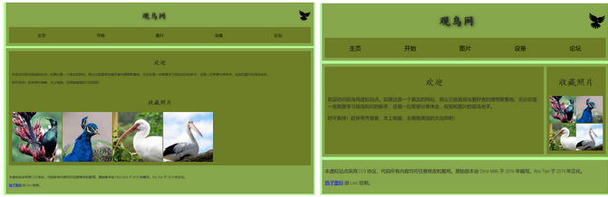
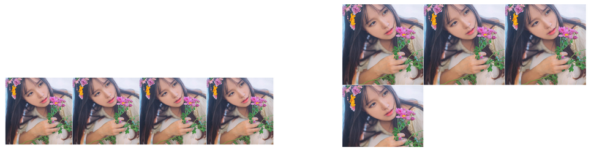
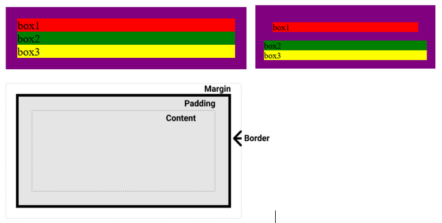
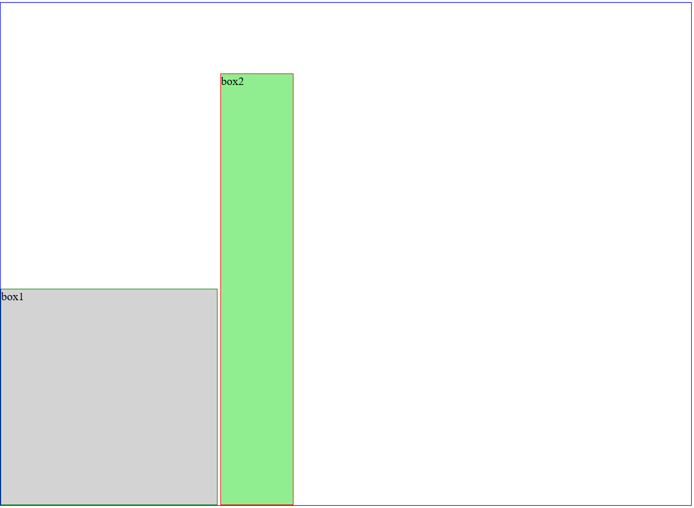

1. `<!doctype html>` 作用是告诉浏览器按照W3C标准来渲染页面。否则浏览器会用自己的模式解析标签（有标准模式和怪异模式）

2. 异步地发送任何数据被称为 AJAX

3. 对于GET方式的请求，浏览器会把http header和data一并发送出去，服务器响应200（返回数据）；而对于POST，浏览器先发送header，服务器响应100 continue，浏览器再发送data，服务器响应200 ok（返回数据）。

4. `<meta http-equiv="X-UA-Compatible" content="IE=edge">`Edge 模式通知 Windows Internet Explorer 以最高级别的可用模式显示内容，这实际上破坏了“锁定”模式。即如果你有IE9的话说明你有IE789，那么就调用高版本的那个也就是IE9

5. `<meta name="viewport" content="width=device-width, initial-scale=1.0, maximum-scale=1.0, user-scalable=0">`这行代码会强制地让手机浏览器采用它们真实可视窗口的宽度来加载网页，而不是加载缩放很小的页面，`initial-scale` 为页面初始缩放大小，`maximum-scale`为最大缩放，`user-scalable`为是否允许缩放

6. `margin`单位设置了 `em`，缩放网页实际值不变

7. `flex:100%` 可让元素独占一行

   

8. 很多网站采用`min-width:960px`模式（值为一个具体像素值），然后`width:70%`设置为一个百分比。当采用的弹性布局时，设置了`min-width`在放大（放大相当于窗口缩小）就会出现左右拉条。还有设置`max-width`为数值，`width`为百分比的也是类似道理。

9. 这个练习题布局中间 `<section>` 采用了三个 `float:left`，并且设置`width 50% 30% 20%`，之间的间距用`padding` 来设置，`margin` 为0

     

10. 父级属性 `display:flex`，通过对每个元素设置 flex 进行比例分配，这里采用的是4：1比例，然后再设置图片`max-width:100%`，使图片在方框内

   

11. 本来是四张一列的图片，通过设置代码，使得成2*2排列，width:50%保证在缩放情况下不会改变布局。（之前的代码是 `<a></a>`形式的，然后 `<a>` 设置了 `block`，设置了 `a` 变成了 `img` 的父级元素，这里 `float`也是对 a 设置的，然后对 `` 设置 `max-width:100%`）

     ```css
     display: block;
     float: left;
     width: 50%;
     ```

12. 上面的站点就设置了 `<header>` 高度，`<main>` 和 `<footer>` 没设置，最大高度为flex中最长的，方便以后添加更多内容。

13. 流布局，窗口放大，单独的一个内容放不下就转到下一行，比如图片，单词等。从左到右排序，放不下就换行。

                               

14. 要想让网页不随放大缩小二变化，直接设置绝对单位 `px`，块元素宽度为父元素100%，注意 `<p>`为块元素，类似 `<span>` `<b>` `<a>`之类的其宽度才是内容的宽度。                     

15. `inline-block`是基于`inline`，只是可以设置它的宽度和高度，具有包裹性。可以**使用`text-align`设置`inline-block`元素居中**。

   

13. 盒子里放盒子，padding 就是外盒与内盒的距离。盒子可以是block，也可以是inline；外盒设置margin是与外面盒子的距离，内盒设置margin可以控制和外盒content边界线的距离。我们之前看的大多都是因为padding是0，所以误以为是与border的距离。  

    

14. `margin` 设置为百分比时，**横向书写时参考的是父元素内容宽度（就是`box-sizing:content-box`里的`width`）**，纵向书写时参考的是父元素的高度

15. 各种布局技术中以下方法经常被用到：浮动，负边距，相对定位

16. 当父元素中的子元素设置`margin`时候，只会左右生效，上下会与外边距合并（变成父元素对外的`margin`）。就是父元素要有`padding`或者`border`（同级或者嵌套的盒元素，并且它们之间没有非空内容、`Padding`或`border`分隔发生合并）。解决办法：`border:1px solid transparent`或者用`overflow`

   

17. `<li>` 被设置为 `inline-block` 时候，中间会有空格，原因是HTML书写时的换行引起的，解决办法将`ul` 字体大小设置为 0 ，`li` 字体设置回来（经典消除空格影响的办法，双inline-block中也是这样消除的），或者HTML中不换行

18. 实现这种效果，`relative`下移，边框设为白色

   

19. 设置鼠标`hover`上的显示 `cursor:wait`

20. `vertical:align` 用于指定行内元素或者是表格的对齐方式，是设置在`inline-block`同级的，不是它的父元素。不能用于垂直对齐块元素，详细例子如下（核心代码）：

    ```html
    <div>box1</div>
    <div>box2</div>
    ```

    ```css
    body {
        width:960px;
        heigt:700px;
        display:table-cell;
        /* 设置了table-cell后具有包裹性，这里我把width设为定值了 */
        /* 要想让里面的元素垂直居中，在下面加vertical-align */
        vertical-align:bottom;
    }
    div {
        display:inline-block;
    }
    ```
    

    如果在 `div`上加上`vertical-align`则是排列这两个元素基线位置

    ```css
    div {
        display:inline-block;
        vertical-align:bottom;
    }                        
    ```
    
    
    
21. 设置了`absolute`再用`display:table-cell`就失效了（原因暂时不明）
22. PS切片时候按<kbd>shift</kbd>可以将参考线以整像素取值移动
23. 将`<a>`设置了`padding`后，点击空白地方也会进入链接，整个盒子都是链接