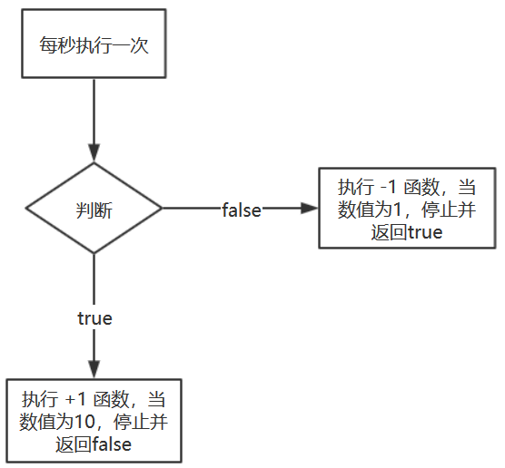

1. `var a = document.getElementById().value`这种情况判断`value`原始是否为数值用`isNaN`来判断，`isNaN(a)`等效于`isNaN(Number(a))`；还可以利用其自身不相等特性来判断 `Number(a) === Number(a)`。

   ?> 我用的`Number(a) !== NaN`来判断不对，因为`NaN !== NaN`；用`parseInt`也不对，而且 `'123abc'`会被转换为`123`；`typeof parseFloat(a) === "number"`也不对，因为`NaN`的数据类型为`number`（同时说明了使用了`paseInt`或者`Number`函数后，数据类型一定是 `number`了）
   
   > NaN (Not a number)

2. 如果`<input>`的 `type`属性设置为了`number`，当数据不为 number 类型时候，JS中`document.getElementById`只能获得一个空字符串，这样在JS中就很好判断数据类型了。

   如果`<input>`的`type`属性设为`text`，那就要用`isNaN`判断一下是否为数字，但是`isNaN`也有缺点，也就是`Number`转换的问题，`“”`，`null`，`true`，`false`这些会转为数值。在我们这种情况下只需要考虑空格字符串的问题（因为`text`会将所有输入的数值转为字符串，`null`输入就是`"null"`再通过Number转换，结果仍是`NaN`，只要敲入空格和不输入任何东西才会返回`0`）

3. JS中判断是否为整数类型方法

   - `return obj%1 === 0`使用取余运算符判断。任何整数都会被1整数，余数为0（使用前要用typeof判断数据类型，`“”`, `“3”`, `true`, `[]`都会被转化为整数）
   - `Math.round`、`Math.ceil`、`Math.floor(obj) === obj`利用整数取整后仍为自己
   - `parseInt(obj,10) === obj`
   - `(obj | 0) === obj`利用二进制或运算符，只对整数有效，小数部分会被舍去，有取整的效果，但是不适用超过32位的数字
   - `Number.isInteger(obj)`此为ES6提供的方法

4. `parseInt`接受的第二个值是将意思是将第一个值视为几进制，然后再转为十进制。

5. 十进制转为二进制用`toString`，`obj.toString(2)`

6. **已解决**：为什么在HTML中调用函数用 `onclick="f()"`，在JS中用`doucument.getElementById("").onclick=f`。因为`()`具有调用作用。如果是`doucument.getElementById("").onclick=f()`打开页面就会执行函数。`f`是一个函数，`f()`表明执行这个函数。

   `setTimeout`是因为其有两种写法，使用函数或者js字符串代码（像`eval`那样）

7. ```js
   function f(section) {
       let a = document.getElementById(section);
   }
   ```

   注意这里，section参数代表的是"ID"字符串，是变量，再加引号就不对了

8. ```js
   function findAllHtmlSpanInOneSection(sectionId) {
       let section = document.getElementById(sectionId),
           span = section.getElementsByTagName("span");
       for (let i=0; i<span.length; i++) {
           if (span[i].innerHTML === "HTML") {
               return span[i];
           }
       }
   }
   ```

   注意这里，这里只会显示`span[0]`的值，因为函数执行`return`后就停止了，后面的代码或者循环不会执行

9. `querySelector`可能不使用于带有参数的函数

   ```js
   function f(x) {
       //会发生错误
   	let node = document.querySelector(#x)
   }
   ```

10. 获取时最好获取对象引用，如果获取值的话则是绝对引用，不会变，例：

    ```js
    //这种方法获取的就是引用，值会自动更新
    var myContent = document.getElementById("text");
    function () {
        console.log(myContent.value);
    }
    
    //这种方法获取的就是值，不会更新（除非把var放函数内声明，这样每次调用都会执行一次）
    var myContent = document.getElementById("text").value;
    function () {
        console.log(myContent);
    }
    ```

11. 用`document.getElementsByTagName`获取的是一数组，不能直接在后面加`onclick`，无效。

12. 让元素隐藏可以用`visibility:hidden`，还可以用 `display:none`

13. 用`event.target`来获取目标元素，这样我就不用`getElementById`了

14. 浏览器从上而下解析，确保引用时对象已经加载；`script`放`head`里面是无法使用`getElementById`的，获取不到id，必须放在`</body>`前面；如果必须放头部，则用`window.onload = function () {代码}`

15. 实现秒针计数（用取余）

    ```js
    x += 1;
    y = x % 60;
    ```

16. `setTimeout`无限循环

    ```js
    function x () {
    	var x += 1;
    	setTimeout("x()", 1000);
    }
    ```

    停止循环，把`setTimeout`赋值给一个变量（变量要在函数外先声明，在内部的话外部函数无法调用），`clearTimeout(变量名)`

17. 有时候一个按钮对应一个函数，多次点击按钮会执行很多个相同函数，让函数只运行一个可用`flag`方法

    ```
    
    ```

18. 函数名和变量名不要一样。

19. 为什么调用时候有`setTimeout("x()",1000)`和`setTimeout(x,1000)`：有两种写法，前面一种是类似`eval`写法，就像`onclick="f()"`一样。定义是定义，并不会调用，例如：

    ```js
    obj.onclick = function () {
    	//...
    }
    //相当于 
    function f() {
        //...
    }
    obj.onclick = f;
    ```

    要想定义就立即调用（IIFE）`(function () {})();`或者`(function () {}());`

20. 让函数在`setTimeout`时候重复点击只执行一次

    ```js
        //如果按了很多次调用，那么strCount会执行很多个，计数速度加快。用flag解决；
        var myCount = document.getElementById("count");
        var x = 0,
            flag = true,
            staCou;
        function strCount() {
            flag = false;
            x += 1;
            myCount.value = x;
            staCou = setTimeout("strCount()", 1000);
        }
        function res() {
            if(flag) {
                strCount();
            }
        }
        function stoCount() {
            clearTimeout(staCou);
            flag = true;
        }
        // 自加 赋值 调用() 自加 赋值 调用
    ```

21. 通过用 `obj.style.属性名称`来实时获取对象状态，然后用语句进行判断

22. 编程的时候先理清整个思路，把基本框架敲出来再细节，例：

    **需求**：实现一个循环，每隔一秒，从1数到10，再从10数到1，反复

    **分析**：循环（想到`for` `setTimeout` `setInterval`）,每隔一秒（说明定时，不能用`for`）`setTimeout`用调用自身的方法可实现`setInterval`功能，两种方法均列写基本思路如图所示，接下来就是`setInterval`实现

     

<p style='color:red'>回顾一下前面的知识，看看别人的代码，关于`className`，点一下实现这个效果，点一下实现另一个效果是如何实现的。多看看别人的优秀代码是如何实现的<p>

23. 需求：动态改变`transform: rotateY(xdeg);`的值，用字符拼接法来完成

    ```js
    obj.style.transform = "rotateY( + x + "deg)";
    ```

24. 函数也可以自定属性，它就是构造函数的实例

    ```js
    function f() {
    	f.count += 1;
    }
    f.count = 0;
    ```

    上述代码实现每次调用`f`，`count`就会加1

25. `call`方法的原理如下

    ```js
    f1.call(obj2);
    Function.prototype.myCall = function(argument) {
        var inObj = argument;
        inObj.fn = this;//这里就是f1，call被调用的环境
        var result = inObj.fn();
        delete inObj.fn;
        return result;
        //先将计算结果赋给变量，然后删除属性，返回变量
    }
    ```

26. 当我需要判断两个选择框均为数字时候，应该（我之前写错了，我把`||`写成了`&&`）

    ```js
    !(isNaN(numA.value) || isNaN(numB.value))
    ```

27. [Get和Post方法区别](https://www.runoob.com/tags/html-httpmethods.html)

28. 把可能出错的代码放在`try...catch`中即可捕获错误

    ```js
    try {
        //some code
    }catch(e) {
        alert("失败");
    }
    ```

29. 添加类名：

    ```js
    el.classList.add('classname');
    ```

    