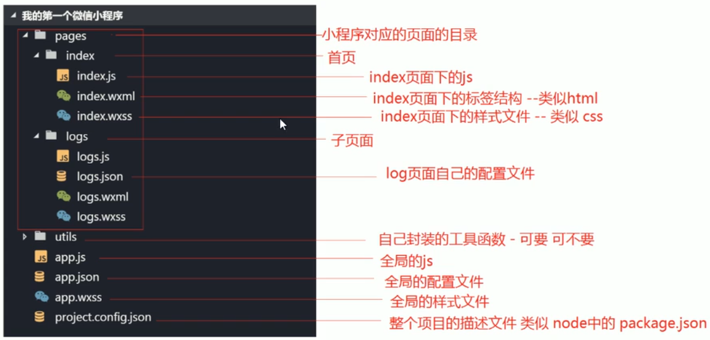
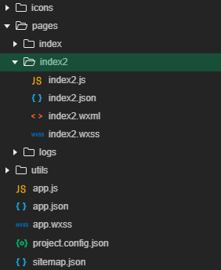

[官方文档](https://developers.weixin.qq.com/miniprogram/dev/framework/)

#### 1. 准备工作

##### 1. 注册账号

先去微信平台注册账号：[微信公众平台|小程序](https://mp.weixin.qq.com/cgi-bin/wx)

##### 2. 获取APPID

[我的ID](https://mp.weixin.qq.com/wxamp/devprofile/get_profile?token=1808593557&lang=zh_CN)

##### 3. 开发工具

[下载](https://developers.weixin.qq.com/miniprogram/dev/devtools/download.html)微信小程序开发工具

#### 2. 小程序和传统web对比

|      | 传统web    | 微信小程序 |
| ---- | ---------- | ---------- |
| 结构 | HTML       | WXML       |
| 样式 | CSS        | WXSS       |
| 逻辑 | Javascript | Javascript |
| 配置 | /          | JSON       |

#### 3. 基本目录



`project.config.json`类似于

#### 4. 配置介绍

一个小程序包括两种基本的配置文件，一种是全局的`app.json`和页面自己的`page.json`。**注意：配置文件中不能出现注释**

##### 4.1 全局配置app.json

`app.json`是当前小程序的全局配置，包括了小程序的所有页面路径、界面表现、网络超时事件、底部tab等

```json
{
  "pages": [
    "pages/index/index",
    "pages/logs/logs"
     // 在这里添加路径,开发工具会自动添加
  ],
  "window": {
    "backgroundTextStyle": "light",
    "navigationBarBackgroundColor": "#fff",
    "navigationBarTitleText": "WeChat",
    "navigationBarTextStyle": "black"
  },
  "style": "v2",
  "sitemapLocation": "sitemap.json"
}
```

- `"window"`：全局的默认窗口表现，如导航栏颜色等。具体配置查看[官方文档](https://developers.weixin.qq.com/miniprogram/dev/reference/configuration/app.html)

- `tabBar`：底部的`tab`栏表现，还有很多配置项，[具体查看官方文档](https://developers.weixin.qq.com/miniprogram/dev/reference/configuration/app.html)

  ```json
  {
    "pages": [
      // 默认显示页为第一个路径
      "pages/index/index",
      "pages/logs/logs"
    ],
    "window": {
      // 下拉刷新颜色
      "backgroundTextStyle": "light",
      // 导航栏背景颜色
      "navigationBarBackgroundColor": "#00b26a",
      // 导航栏名称
      "navigationBarTitleText": "小程序",
      // 导航栏字体颜色
      "navigationBarTextStyle": "white",
      // 是否下拉刷新
      "enablePullDownRefresh": true
    },
    "tabBar": {
      // tabBar字体颜色(Hex)
      "color": "#e21918",
      // 选中后的字体颜色
      "selectedColor": "#e21918",
      // tabBar背景颜色
      "backgroundColor": "#0094ff",
      "list": [
        {
          // tabBar路径
          "pagePath": "pages/index/index",
          // 名称
          "text": "首页",
          // 图标路径
          "iconPath": "icons/main.png",
          // 选中后的图标
          "selectedIconPath": "icons/main.png"
        },
        {
          "pagePath": "pages/logs/logs",
          "text": "日志",
          "iconPath": "icons/log.png",
          "selectedIconPath": "icons/log.png"
        }
      ]
    },
    "style": "v2",
    "sitemapLocation": "sitemap.json"
  }
  ```

还有一些其他的配置项，用到的时候再去查[文档](https://developers.weixin.qq.com/miniprogram/dev/reference/configuration/app.html)

##### 4.2 page.json

页面配置只能设置`app.json`中部分`window`配置项的内容，会覆盖`app.json`的`window`内容。可以独立定义每个页面的一些属性，如顶部颜色，是否允许下拉刷新等等

在`app.json`的`pages`中添加

```
"pages/index2/index2"
```

会自动生成一个新的目录



在`index2.json`中配置，直接写`window`中的内容即可。[官方文档](https://developers.weixin.qq.com/miniprogram/dev/reference/configuration/page.html)

```json
// 配置内容和window一样
{
  "navigationBarTitleText": "页面2",
  "navigationBarBackgroundColor": "#ccc"
}
```

