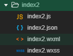

WXSS（weixin style sheets）是一套样式语言，用于描述WXML的组件样式，与CSS相比，WXSS扩展的性能有：尺寸单位、样式导入

WXSS无需手动引入，小程序会自动引入。就比如这里`index2.wxml`会自动引入`index.wxss`



#### 1. 尺寸单位

[官方文档](https://developers.weixin.qq.com/miniprogram/dev/framework/view/wxss.html)

rpx（responsive pixel）：可以根据屏幕的宽度自适应，规定屏幕宽为750rpx

如在 iPhone6 上，屏幕宽度为375px，共有750个物理像素，则750rpx = 375px = 750物理像素，1rpx = 0.5px = 1物理像素

| 设备         | rpx换算px (屏幕宽度/750) | px换算rpx (750/屏幕宽度) |
| ------------ | ------------------------ | ------------------------ |
| iPhone5      | 1rpx = 0.42px            | 1px = 2.34rpx            |
| iPhone6      | 1rpx = 0.5px             | 1px = 2rpx               |
| iPhone6 Plus | 1rpx = 0.552px           | 1px = 1.81rpx            |

**建议：** 开发微信小程序时设计师可以用 iPhone6 作为视觉稿的标准

#### 2. 样式的导入

使用`@import`语句可以导入外联样式表，`@import`后跟需要导入的外联样式表的相对路径，用`;`表示语句结束

```css
/** app.wxss **/
@import "common.wxss";
.middle-p {
  padding:15px;
}
```

#### 3. 内联样式

框架组件上支持使用 style、class 属性来控制组件的样式

```html
<!-- 绑定数据 -->
<view style="color:{{color}};" />
<!-- 普通写法和html中一样 -->
<view style="font-size: 100rpx">

<view class="normal_view" />
```

#### 4. 选择器

目前支持的选择器

| 选择器           | 样例             | 样例描述                                       |
| ---------------- | ---------------- | ---------------------------------------------- |
| .class           | `.intro`         | 选择所有拥有 class="intro" 的组件              |
| #id              | `#firstname`     | 选择拥有 id="firstname" 的组件                 |
| element          | `view`           | 选择所有 view 组件                             |
| element, element | `view, checkbox` | 选择所有文档的 view 组件和所有的 checkbox 组件 |
| ::after          | `view::after`    | 在 view 组件后边插入内容                       |
| ::before         | `view::before`   | 在 view 组件前边插入内容                       |

#### 5. 全局样式和局部样式

定义在app.wxss中的样式为全局样式，作用在每一个页面。在page的wxss文件中定义的样式为局部样式，只作用在对应的页面，会覆盖app.wxxs中相同的选择器


#### 6. 第三方样式库

WeUI

iView Weapp

Vant Weapp