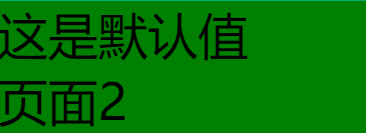

#### 1. 创建自定义组件

> 类似于页面，一个自定义组件由`json` `wxml` `wxss` `js` 4个文件组成

就是自定义标签，[官方文档](https://developers.weixin.qq.com/miniprogram/dev/framework/custom-component/)

##### 1.1 声明组件

在项目目录下新建文件夹`components`，并在里面新建文件夹，在新建文件夹上右键新建component，将自动生成4个内容

`component`中的`*.json`文件内容

```json
{
  // 声明组件
  "component": true,
  // 可引用其他组件
  "usingComponents": {}
}
```

`component`中的`*.js`文件内容。就是一些属性，数据和方法等

```js
Component({
  /**
   * 组件的属性列表
   */
  properties: {

  },

  /**
   * 组件的初始数据
   */
  data: {

  },

  /**
   * 组件的方法列表
   */
  methods: {

  }
})
```

##### 1.2 编辑组件

在`wxml`文件中编写组件模板，在`wxss`文件中加入组件样式，写法与页面写法类似。这里的`<slot>`就是用来放标签之间的数据的

```html
<!-- slot动态插入数据 -->
<view class="my_header">
  {{cData}}
  <view>
    <slot></slot>
  </view>
</view>
```

```css
.my_header {
  font-size: 50px;
  background-color: green;
}
```

```js
Component({
  /**
   * 组件的属性列表
   */
  // 这里可以设置数据的相关属性
  properties: {
    cData: {
      value: "这是默认值",
      type: String
    }
  },

  /**
   * 组件的初始数据
   */
  data: {

  },

  /**
   * 组件的方法列表
   */
  methods: {

  }
})
```

##### 1.3 使用组件

若要使用组件，则要在对应页面的`json`文件中写入

```json
{
  "usingComponents": {
    // "组件名": "组件路径"
    "component-tag-name": "path/to/the/custom/component"
  }
}
```

上述文件引用应这么写

```json
{
  "usingComponents": {
    "myHeader": "../../components/myHead/myHead"
  }
}
```

对应的页面文件中引用

```html
<view>
  <myHeader>页面2</myHeader>
</view>
```

小程序显示如下



