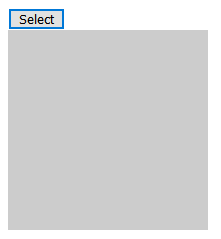

#### 1. event对象和事件冒泡

- 让全网页点击生效，用`document.onclick`（`body.onclick`不行，其高度是内容高度）

- 获取事件对象

  ```js
  //兼容性写法
  var oEvent = ev || event;
  ```

- 冒泡小例子

  ```js
  //实现点击其他地方选项收起功能
  var oBtn = document.getElementsByTagName('button')[0];
  var oDiv = document.getElementsByTagName('div')[0];
  oBtn.onclick = function(ev) {
      var oEvent = ev || event;
      oDiv.style.display = 'block';
      //阻止冒泡
      oEvent.cancelBubble = true;
  }
  document.onclick = function(ev) {
      var oEvent = ev || event;
      oDiv.style.display = 'none';
  }
  ```

  

#### 2. 鼠标事件

