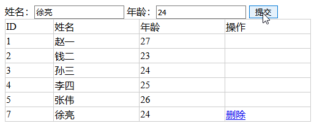
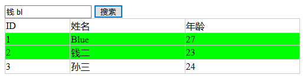

#### 1. 表格应用-1

##### 1.1 获取

早期表格用的很多，JS语言就添加了表格的便捷操作 `tBodies`, `tHead`, `tFoot`, `rows`, `cells`

```js
oTab.tBodies[0].rows[1].cells[1].innerHTML;
//等效于
oTab.getElementsByTagName('tbody')[0].getEL
ementsByTagName('tr')[1].getElementsByTagName('rd')[1].innerHTML;
```

##### 1.2 隔行变色 + 鼠标移入高亮

```js
var oTab = document.getElementById('tab1');
// 全局变量,到函数里赋值;定时器好像也用到了
var oldColor = '';
//这里可以不加tBodies,但是会包括tHead, tFoot的rows
for (var i = 0; i < oTab.tBodies[0].rows.length; i++) {
    if (i % 2) {
        oTab.tBodies[0].rows[i].style.background = '#ddd';
    }
    else {
        //
    }
    oTab.tBodies[0].rows[i].onmouseover = function() {
        //这是关键,移入之前的颜色存储
        oldColor = this.style.background;
        this.style.background = 'green';
    }
    oTab.tBodies[0].rows[i].onmouseout = function() {
        this.style.background = oldColor;
    }
}
```


##### 1.3 表格的添加和删除

一个`id`只用一次，就算删除了，那个`id`也不再使用了。

问题：对于新添加的节点，之前的程序如何对它进行渲染？（已解决：在添加事件触发时候重新渲染，把代码放事件里）

```html
<label>姓名：<input type="text" id="name"></label>
<label>年龄：<input type="text" id="age"></label>
<input type="button" value="提交" id="submit">

<table id="tab1">
    <thead>
        <td>ID</td>
        <td>姓名</td>
        <td>年龄</td>
        <td>操作</td>
    </thead>
    <tbody>
        <tr>
        	<td>...</td>
        </tr>
    <!-- some code -->
    </tbody>
</table>
```

```js
var oTab = document.getElementById('tab1');
var oSubmit = document.getElementById('submit'),
    oName = document.getElementById('name'),
    oAge = document.getElementById('age');
// length和计数
var count = oTab.tBodies[0].rows.length + 1;

oSubmit.onclick = function () {
    var oTr = document.createElement('tr');

    var oTd1 = document.createElement('td');
    // 这种方式有问题,会出现id重用现象
    // oTd1.innerHTML = oTab.tBodies[0].rows.length + 1;

    // 这不对,count的值并没有增加,要用自加
    // oTd1.innerHTML = count + 1;
    oTd1.innerHTML = count++;
    oTr.appendChild(oTd1);

    var oTd2 = document.createElement('td');
    oTd2.innerHTML = oName.value;
    oTr.appendChild(oTd2);

    var oTd3 = document.createElement('td');
    oTd3.innerHTML = oAge.value;
    oTr.appendChild(oTd3);

    var oTd4 = document.createElement('td');
    oTd4.innerHTML = "<a href='javascript:;'>删除</a>";
    oTr.appendChild(oTd4);

    oTab.tBodies[0].appendChild(oTr);

    var aA = document.getElementsByTagName('a');
    for (i = 0; i < aA.length; i++) {
        aA[i].onclick = function() {
            this.parentNode.parentNode.remove();
        }
    }
}
```



#### 2. 表格应用-2

##### 2.1 表格简单搜索

- 基础版本——字符串比较
- 忽略大小写——大小写转换，`toLowerCase()/toUpperCase()`
- 模糊搜索——`search`的使用
- 多关键词——`split`
- 高亮显示、筛选（筛选通过`display:none`来更改）

```html
<input type="text" id="name">
<input type="button" value="搜索" id="btn">
<table id="tab">
    <thead>
        <td>ID</td>
        <td>姓名</td>
        <td>年龄</td>
    </thead>
    <tbody>
        <tr>
            <td>1</td>
            <td>Blue</td>
            <td>27</td>
        </tr>
		<!-- ... -->
    </tbody>
</table>
```

```js
var oName = document.getElementById('name'),
    oBtn = document.getElementById('btn'),
    oTab = document.getElementById('tab');
oBtn.onclick = function () {
    for (var i = 0; i < oTab.tBodies[0].rows.length; i++) {
        // 这里我写成了cell[2]
        //添加toLowerCase()可以不区分大小写搜索
        var sTab = oTab.tBodies[0].rows[i].cells[1].innerHTML.toLowerCase();
        var sTxt = oName.value.toLowerCase();
		//多关键词搜索
        var arr = sTxt.split(' ');
        // 颜色重置,从else中拿出来
        oTab.tBodies[0].rows[i].style.background = '';
        for (var j = 0; j < arr.length; j++) {
            //search模糊搜索
            if (sTab.search(arr[j]) !== -1) {
                oTab.tBodies[0].rows[i].style.background = 'lime';
            }
        }
    }
}
```



#### 3. 表格应用-3

##### 3.1 表格排序

先从简单的开始，思考如何排序`<ul>`：

1. 将类数组转为数组
2. 使用`sort()`方法排序
3. 排好序的数组`appendChild()`到`<ul>`

```html
<button id="btn">排序</button>
<ul id="ul">
    <li>20</li>
    <li>30</li>
    <li>16</li>
    <li>89</li>
    <li>62</li>
    <li>9</li>
</ul>
```

```js
var oUl = document.getElementById('ul1'),
    oBtn = document.getElementById('btn');
oBtn.onclick = function () {
    oUl.appendChild(oUl.children[0]);
    var aLi = document.getElementsByTagName('li');
    var arr = [];
    // 将类数组转为数组更快捷方法是用prototype
    // var arr = Array.prototype.slice.call(aLi);
    for (var i = 0; i < aLi.length; i++) {
        arr.push(aLi[i])
    }
    arr.sort(function (n1, n2) {
        return parseInt(n1.innerHTML) - parseInt(n2.innerHTML);
    })
    for (var i = 0; i < arr.length; i++) {
        // appendChild特性,删除原来的元素,追加到新父元素
        oUl.appendChild(arr[i]);
    }
}
```

数组排序也是类似

```html
<button id="btn">排序</button>
<table id="tab">
    <thead>
        <th>ID</th>
        <th>姓名</th>
    </thead>
    <tbody>
        <tr>
            <td>2</td>
            <td>小王</td>
        </tr>
		<!-- ... -->
    </tbody>
</table>
```

```js
var oBtn = document.getElementById('btn');
var oTab = document.getElementById('tab');
function sortTab() {
    // 转为数组
    var arr = Array.prototype.slice.call(oTab.tBodies[0].rows);
    //排序
    arr.sort(function (tr1, tr2) {
        var n1 = parseInt(tr1.cells[0].innerHTML);
        var n2 = parseInt(tr2.cells[0].innerHTML);
        return n1 - n2;
    });
    //追加
    for (var i = 0; i < arr.length; i++) {
        oTab.tBodies[0].appendChild(arr[i]);
    }
}
oBtn.onclick = sortTab;
```

#### 4. 表单应用-1

```html
<!-- 基本形式 -->
<form id="form1" action="#">
    <label>用户名：<input type="text" name="user"></label>
    <label>密码：<input type="password" name="password"></label>
    <input type="submit" value="提交">
</form>
```

`action`——提交到哪

表单事件：

- `onsubmit`——提交时发生

- `onreset`——重置时发生

表单中`id`用于JS中获取元素，而`name`则用于后台

#### 5. 表单应用-2

表单内容验证(到后面讲事件再详说)：

- 在输入阶段就验证用户输入，例：阻止事件
- 在失去焦点时验证，例：`onkeyup`, `onblur`
- 提交时验证，例：`onsubmit`
- 后台数据检查（必须检查）


