1. `<!doctype html>` 作用是告诉浏览器按照W3C标准来渲染页面。否则浏览器会用自己的模式解析标签（有标准模式和怪异模式）

2. 异步地发送任何数据被称为 AJAX

3. 对于GET方式的请求，浏览器会把http header和data一并发送出去，服务器响应200（返回数据）；而对于POST，浏览器先发送header，服务器响应100 continue，浏览器再发送data，服务器响应200 ok（返回数据）。

4. `<meta http-equiv="X-UA-Compatible" content="IE=edge">`Edge 模式通知 Windows Internet Explorer 以最高级别的可用模式显示内容，这实际上破坏了“锁定”模式。即如果你有IE9的话说明你有IE789，那么就调用高版本的那个也就是IE9

5. `<meta name="viewport" content="width=device-width, initial-scale=1.0, maximum-scale=1.0, user-scalable=0">`这行代码会强制地让手机浏览器采用它们真实可视窗口的宽度来加载网页，而不是加载缩放很小的页面，`initial-scale` 为页面初始缩放大小，`maximum-scale`为最大缩放，`user-scalable`为是否允许缩放

6. `margin`单位设置了 `em`，缩放网页实际值不变

7. `flex:100%` 可让元素独占一行

   

8. 很多网站采用`min-width:960px`模式（值为一个具体像素值），然后`width:70%`设置为一个百分比。当采用的弹性布局时，设置了`min-width`在放大（放大相当于窗口缩小）就会出现左右拉条。还有设置`max-width`为数值，`width`为百分比的也是类似道理。

9. 这个练习题布局中间 `<section>` 采用了三个 `float:left`，并且设置`width 50% 30% 20%`，之间的间距用`padding` 来设置，`margin` 为0

    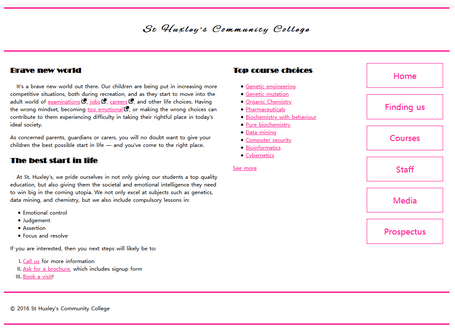 

10. 父级属性 `display:flex`，通过对每个元素设置 flex 进行比例分配，这里采用的是4：1比例，然后再设置图片`max-width:100%`，使图片在方框内

   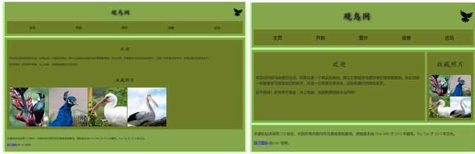

11. 本来是四张一列的图片，通过设置代码，使得成2*2排列，width:50%保证在缩放情况下不会改变布局。（之前的代码是 `<a></a>`形式的，然后 `<a>` 设置了 `block`，设置了 `a` 变成了 `img` 的父级元素，这里 `float`也是对 a 设置的，然后对 `` 设置 `max-width:100%`）

     ```css
     display: block;
     float: left;
     width: 50%;
     ```

12. 上面的站点就设置了 `<header>` 高度，`<main>` 和 `<footer>` 没设置，最大高度为flex中最长的，方便以后添加更多内容。

13. 流布局，窗口放大，单独的一个内容放不下就转到下一行，比如图片，单词等。从左到右排序，放不下就换行。

                               

14. 要想让网页不随放大缩小二变化，直接设置绝对单位 `px`，块元素宽度为父元素100%，注意 `<p>`为块元素，类似 `<span>` `<b>` `<a>`之类的其宽度才是内容的宽度。         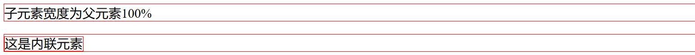            

15. `inline-block`是基于`inline`，只是可以设置它的宽度和高度，具有包裹性。可以**使用`text-align`设置`inline-block`元素居中**。

   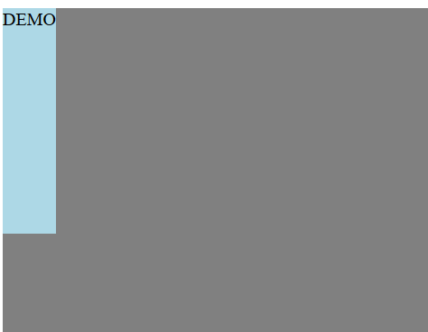

13. 盒子里放盒子，padding 就是外盒与内盒的距离。盒子可以是block，也可以是inline；外盒设置margin是与外面盒子的距离，内盒设置margin可以控制和外盒content边界线的距离。我们之前看的大多都是因为padding是0，所以误以为是与border的距离。  

    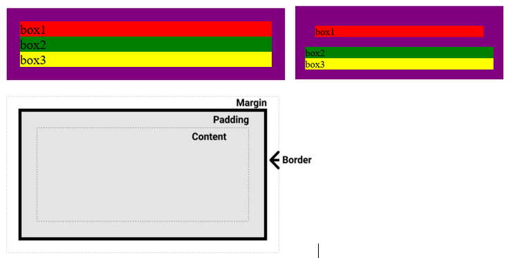

14. `margin` 设置为百分比时，**横向书写时参考的是父元素内容宽度（就是`box-sizing:content-box`里的`width`）**，纵向书写时参考的是父元素的高度

15. 各种布局技术中以下方法经常被用到：浮动，负边距，相对定位

16. 当父元素中的子元素设置`margin`时候，只会左右生效，上下会与外边距合并（变成父元素对外的`margin`）。就是父元素要有`padding`或者`border`（同级或者嵌套的盒元素，并且它们之间没有非空内容、`Padding`或`border`分隔发生合并）。解决办法：`border:1px solid transparent`或者用`overflow`（属于外边距合并的一种，[详见MDN](https://developer.mozilla.org/zh-CN/docs/Web/CSS/CSS_Box_Model/Mastering_margin_collapsing)）

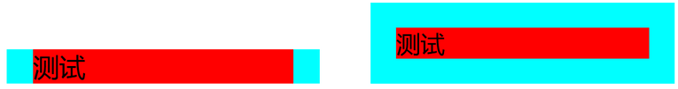

17. `<li>` 被设置为 `inline-block` 时候，中间会有空格，原因是HTML书写时的换行引起的，解决办法将`ul` 字体大小设置为 0 ，`li` 字体设置回来（经典消除空格影响的办法，双inline-block中也是这样消除的），或者HTML中不换行

18. 实现这种效果，`relative`下移，边框设为白色

   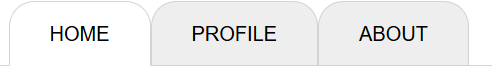

19. 设置鼠标`hover`上的显示 `cursor:wait`

20. `vertical:align` 用于指定行内元素或者是表格的对齐方式，是设置在`inline-block`同级的，不是它的父元素。不能用于垂直对齐块元素，详细例子如下（核心代码）：

    ```html
    <div>box1</div>
    <div>box2</div>
    ```

    ```css
    body {
        width:960px;
        heigt:700px;
        display:table-cell;
        /* 设置了table-cell后具有包裹性，这里我把width设为定值了 */
        /* 要想让里面的元素垂直居中，在下面加vertical-align */
        vertical-align:bottom;
    }
    div {
        display:inline-block;
    }
    ```
    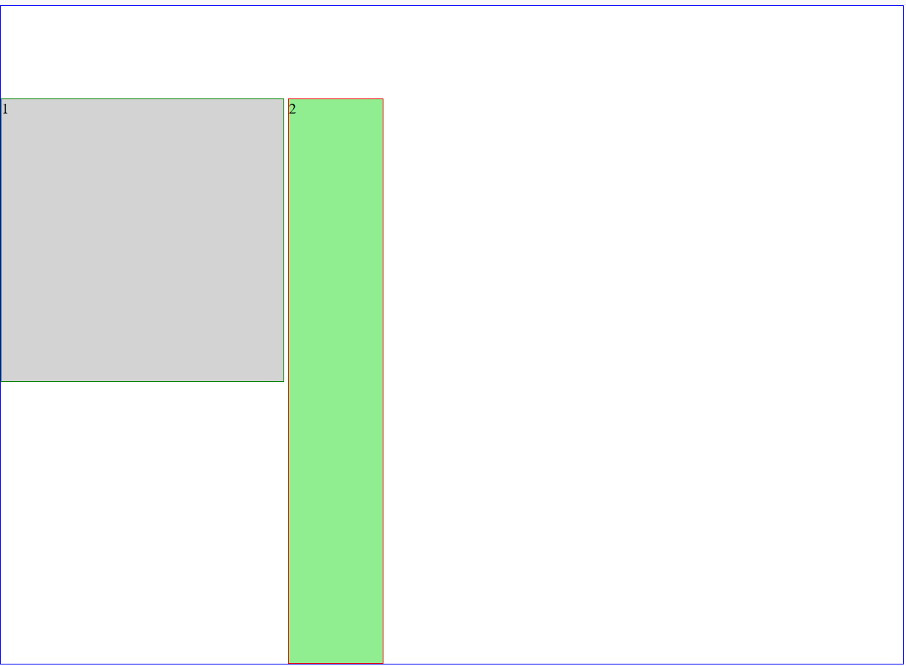

    如果在 `div`上加上`vertical-align`则是排列这两个元素基线位置

    ```css
    div {
        display:inline-block;
        vertical-align:bottom;
    }                        
    ```
    
    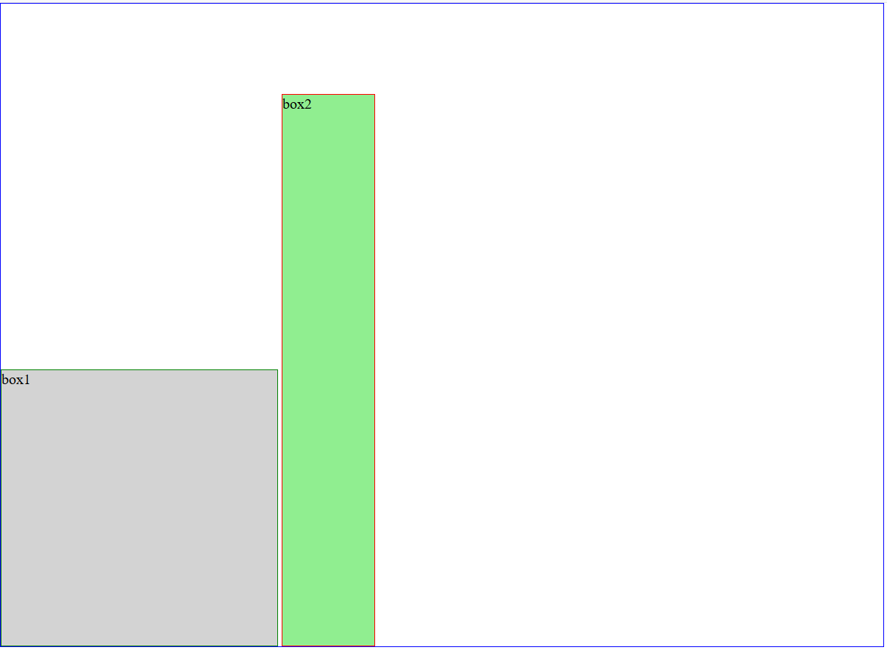
    
21. 设置了`absolute`再用`display:table-cell`就失效了（原因暂时不明）

22. PS切片时候按<kbd>shift</kbd>可以将参考线以整像素取值移动

23. 将`<a>`设置了`padding`后，点击空白地方也会进入链接，整个盒子都是链接

24. 选择器的使用：如果想`hover`一个整体，让一个局部发生变化，可以这样设置（例如我那个小猫图）

    ```css
    .class1:hover .class2 {
    
    }
    ```

25. CSS3动画中，为了避免鼠标离开时动画会比较生硬，可以这么写

    ```css
    //鼠标离开时过渡
    div {
    	transition: all 1s;
    }
    鼠标hover时过渡
    div:hover {
    	transition: all 1s;
    }
    ```

26. `perspective`属性两种写法：如果只有一个子元素，没区别；若有多个子元素时，则不同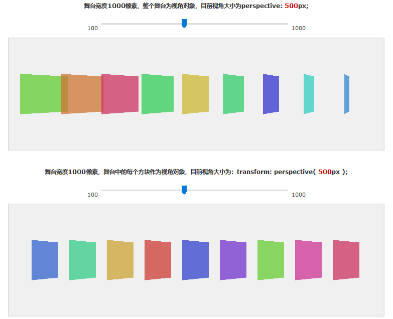

    ```css
    /* 一种是写在父元素上 */
    .stage {
        perspective: 600px;
}
    /* 一种写在子元素上 */
    #stage .box {
        transform: perspective(600px) rotateY(45deg);
    }
    ```

27. 技巧：让子元素填满父元素（当父元素未指定宽高时候）

    ```css
    position: absolute;
    left: 0;
    right: 0;
    top: 0;
    bottom: 0;
    ```

28. 让`height`与`width`成比例，利用`padding-bottom`（`padding-top`）的值根据父元素`width`来定原理

    ```css
    width: 80%;
    padding-bottom: 20%;
    /*4:1容器*/
    ```

    `margin-top`百分比也是按照父元素的宽度

29. 元素`absolute`后居中办法

    ```html
    <div class="container">
        <div class="box1">
            box1
        </div>
    </div>
    ```

    ```css
    .container {
        width: 480px;
        height: 480px;
        border: 1px solid black;
        position: relative;
    }
    .box1 {
        width: 70%;
        height: 60%;
        border: 1px solid black;
        position: absolute;
        /* 重点：先向左或右移动50%，然后负margin对应方向此元素宽度的一半 */
        left: 50%;
        margin-left: -35%;
    }
    ```

30. 给元素覆盖上阴影效果（还可以用新特性，滤镜效果 f`ilter: brightness(50%);` ）

    ```css
    /* 核心代码 */
    div::after {
        content: "";
        width: 100%;
        height: 100%;
        /* 这里还可以用bg:raba() */
        background-color: black;
        opacity: 0.5;
    }
    div:hover::after {
        opacity: 0;
    }
    /* 伪类相当于给元素加了一个class */
    ```

31. 两个类选择器并在一起，表示选择同时具有这两个类的元素。下面的代码选择的就是第一个`div`

    ```html
    <div class="token class1">
        test1
    </div>
    <div class="token">
        test2
    </div>
    ```

    ```css
    .token.class1 {
        /* some style */
    }
    ```

32. 制作一个好看的选择框

    ```css
    input[type="text"] {
        outline: 0;
        border: 1px solid grey;
        border-radius: 3px;
    }
    input[type="text"]:focus {
        box-shadow: 0 0 5px #66afe9;
        border: 1px solid #66afe9;
        transition: box-shadow 0.2s;
    }
    ```

33. CSS伪类`:target`用法，还可以`#news1:target`单独设置他的样式

    ```html
    <!DOCTYPE html>
    <html>
    <head>
    <style>
    :target
    {
    border: 2px solid #D4D4D4;
    background-color: #e5eecc;
    }
    </style>
    </head>
    <body>
    <h1>这是标题</h1>
    <p><a href="#news1">跳转至内容 1</a></p>
    <p><a href="#news2">跳转至内容 2</a></p>
    <p>请点击上面的链接，:target 选择器会突出显示当前活动的 HTML 锚。</p>
    <p id="news1"><b>内容 1...</b></p>
    <p id="news2"><b>内容 2...</b></p>
    <p><b>注释：</b> Internet Explorer 8 以及更早的版本不支持 :target 选择器。</p>
    </body>
    </html>
    ```

34. `vh`单位表示`1%`视窗高度，`vw`单位表示`1%`视窗宽度（`vw`，`vh`包含滚动条，`100%`指窗口可用内容，不包含滚动条）

    ```css
    /* 占满窗口 */
    width: 100vw;
    heigth:100vh;
    ```

    想让页面始终占满，也可以用（注意`width`只是`content`宽度就行了）

    ```css
    html {
    	width:100%;
    	height:100%:
    }
    ```

35. 选择器`:not()`，选择范围内除这个外

    ```css
    p:hover:not(.active) {
    	background: green;
    }
    /* hover在p上时候都应用绿色,除了类名为.active的p */
    ```

36. 解决浮动后右边文字空隙设置的问题（灵感来源下拉菜单导航栏）

    ```html
    <div class="container">
        <div class="float">float</div>
        <div class="content">content</div>
    </div>
    ```

    ```css
    .container {
        overflow: auto;
    }
    .float {
    	float: left;
    	padding: 14px 16px;
    }
    .content {
    	/* 利用inline-block包裹性,就可以设置padding和margin了
        否则一般情况,需要计算右边float宽度,很麻烦*/    
        display: inline-block;
        padding: 14px 16px;
    }
    ```
    
    未使用`inline-block`的时候，可以看到，设置`margin`和`padding`是很麻烦的
    
    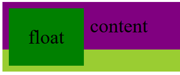
    
    使用`inline-block`之后，利用`inline`的包裹性，设置`padding`和`margin`很方便
    
    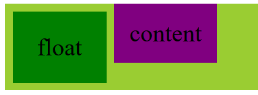

37. `absolute`脱离文档流后，若不设置其位置属性（`top`等），其位置还在原来的位置，并不会定位到原点。例子见*导航栏*中下拉菜单

38. 实现微信小图标分享[w3school](https://www.w3schools.com/css/css_icons.asp)

39. CSS画三角形，利用的就是相邻`border`产生的斜线

    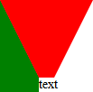

    ```css
    /* 画倒三角 */
    #triangle-down {
        width: 0;
        height: 0;
        border-left: 50px solid transparent;
        border-right: 50px solid transparent;
        border-top: 100px solid red;
    }
    ```

    ```css
    /* 画朝左三角 */
    #triangle-left {
        width: 0;
        height: 0;
        border-top: 50px solid transparent;
        border-right: 100px solid red;
        border-bottom: 50px solid transparent;
    ```

40. `top`、`left`等定位是**相对于整个box而言**，而不是其内容content区域，例如：父元素设置`padding`，子元素`absolute`后设置`top:0`，那就直接靠到盒子边界上了

41. `::after`和`::before`使用`position`后其相对定位是最近的具有定位的元素，伪类相当于子代

    ```html
    <div class="wrap">
        <div>absolute</div>
    </div>
    ```

    ```css
    .wrap {
        position: relative;
    }
    .wrap div {
        position: absolute;
        top: 20px;
        left: 20px;
        padding: 10px;
    }
    .wrap div::before {
        content: "";
        position: absolute;
        border: 5px solid orange;
        top: 0;
    }
    ```

    可以看到，`<div>`上的`::before`相当于其子代（本来就是`div`子代，联想DOM text节点，只是普通文字节点我们无法选中），其相对于`<div>`定位了

    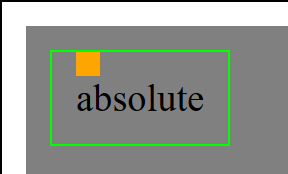

42. `<label>`、`<input>`、`<select>`都是行内元素

43. 让所有行内元素在一行，用`white-space: nowrap`