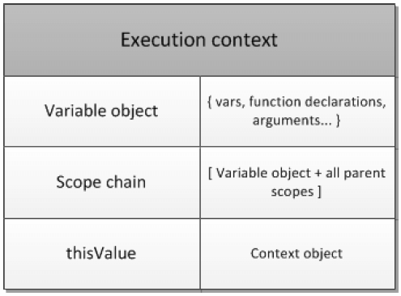
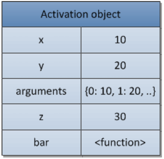
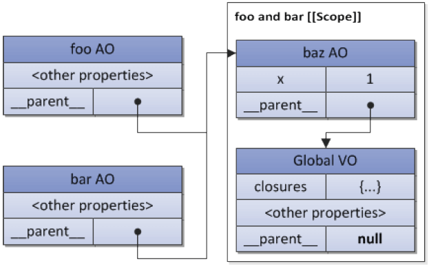

了解闭包前先来了解一些概念

##### 1.执行上下文

有三种类型的ECMAScript代码：全局代码，函数代码和eval代码。

一个执行上下文可以抽象为一个简单的对象。每一个执行上下文拥有一些属性（上下文状态）用来跟踪和相关的代码执行过程。如下图：



##### 2.变量对象

变量对象是与执行上下文相关的数据作用域。其中存储了在上下文中定义的变量和函数声明。注意：函数表达式不包含在变量对象中

```js
var foo = 10;
function bar() {} // function declaration, FD
(function baz() {}); // function expression, FE
console.log(
	this.foo === foo, // true
    window.bar === bar //true
);
console.log(baz); //ReferenceError, 'baz' is not defined
```

之后，全局上下文的变量对象（variable object，简称VO）将会拥有如下属性：


函数baz是一个函数表达式，没有被包含在变量对象之中。所以会出错

##### 3.活动对象

当一个函数被caller所触发（被调用），一个叫做*活动对象（activation object）*的特殊对象将会被创建；*活动对象*中包含形参和`arguments`对象（实际是对形参的映射）。活动对象之后会作为函数的上下文的变量对象来使用

```js
function foo(x, y) {
    var z = 30;
    function bar() {} // FD
    (function baz() {});// FE
}
```



##### 4.闭包

```js
function baz() {
    var x = 1;
    return {
        foo: function foo() { return ++x; },
        bar: function bar() { return --x; }
    };
}
var closures = baz();
console.log(
    closures.foo(), // 2
    closures.bar() // 1
);
```



上面`closures.bar()`为`1`的原因就所有这些函数拥有同一个[[Scope]]，这个属性中的循环计数器的值是最后一次所赋的值

```js
var data = [];
for (var k = 0; k < 3; k++) {
    data[k] = function () {
        console.log(k);
    };
}
data[0](); // 3, but not 0
data[1](); // 3, but not 1
data[2](); // 3, but not 2
```

其中一种解决方案是在作用域链中提供一个额外的对象。比如使用一个匿名函数：

```js
// 相当于每个data[k]对应一个函数
var data = [];
for (var k = 0; k < 3; k++) {
    data[k] = (function (x) {
        return function () {
            console.log(x);
        };
    })(k); // pass "k" value
}
// now it is correct
data[0](); // 0
data[1](); // 1
data[2](); // 2
```

